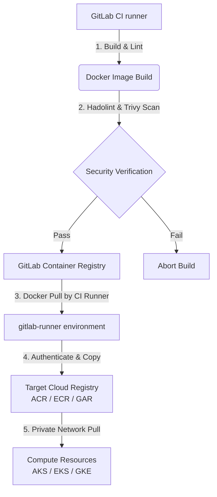

# 💃 Senorita Outages: The Dramatic Multi-Cloud DevOps Monorepo

Welcome to **Senorita Outages**, the most dramatic, high-performance, and feature-packed multi-cloud monorepo on GitHub. 

This repository is a cinematic blockbuster of DevOps and DevSecOps engineering—bringing action, suspense, and ultimate reliability to your cloud deployments. Designed as a production-grade blueprint, it provides end-to-end infrastructure-as-code (Terraform), secure CI/CD pipelines (GitLab), containerized application runtimes (Fastify), and robust deployment manifests across **Microsoft Azure**, **Amazon Web Services (AWS)**, and **Google Cloud Platform (GCP)**.

> [!IMPORTANT]
> If you can handle a Bollywood masala thriller, you can easily manage high-availability container clusters and zero-trust private networks! This repository is fully isolated inside private VNets/VPCs, utilizing Private Endpoints, Centralized Firewalls, and System-Assigned Managed Identities.

---

## 🗺️ Monorepo Directory Layout

```text
.
├── README.md                           # Master guide, cloud comparisons, and getting started
├── gemini.md                           # AI prompt guide & Entra ID token exchange flows
├── agent.md                            # Coding standards, security check, and agent rules
├── docs/                               # Architecture HLDs & Decisions
│   ├── azure-hld.md                    # Azure network spoke routing, Key Vault, VM, and logs
│   ├── aws-hld.md                      # AWS VPC, multi-AZ, EKS nodes, and Cognito specs
│   ├── gcp-hld.md                      # GCP private subnets, PSC db links, and Identity platform
│   ├── network-security.md             # Egress domain whitelists, firewalls, and Private DNS
│   ├── compute-decision-matrix.md      # Matrix comparison: "When to use what compute"
│   ├── masala-ops.md                   # MasalaOps: Dramatic cinematic Cloud learning guide
│   ├── images/                         # Generated high-resolution blueprints
│   │   ├── repo_banner.png             # Wide thematic repository banner
│   │   ├── azure_architecture.png      # Azure network architecture
│   │   ├── azure_vm_runner_flow.png    # Azure VM Runner flow
│   │   ├── aws_architecture.png        # AWS VPC architecture
│   │   ├── gcp_architecture.png        # GCP VPC architecture
│   │   ├── demo_deployment_flow.png    # Container application flow
│   │   └── compute_decision_tree.png   # Compute decision flowchart
│   └── eraser/                         # Eraser.io Diagram-as-Code DSL text files
│       ├── azure-architecture.txt
│       ├── aws-architecture.txt
│       ├── gcp-architecture.txt
│       ├── demo-deployment-flow.txt
│       ├── compute-decision-tree.txt
│       └── agent-engine-flow.txt
├── terraform/                          # Infrastructure provisioning (IaC)
│   ├── azure/                          # VNet, VM Runner, AKS, ACR, Log Analytics, KV, Blob (main.tf, outputs.tf)
│   ├── aws/                            # VPC, EKS, ECS, Cognito, RDS Postgres, ElastiCache Redis
│   └── gcp/                            # VPC, GKE, Cloud Run, Cloud SQL, Memorystore Redis, Cloud Trace APIs
├── cicd/                               # Pipelines and sync logic
│   ├── gitlab-ci/
│   │   ├── templates/                  # Reusable build, test, and deploy steps
│   │   │   ├── build-push-sync.yml     # Trivy container scans & registry mirroring
│   │   │   ├── tf-lifecycle.yml        # IaC validate, plan, and manual applies
│   │   │   └── k8s-deploy.yml          # Kube-linter & kubectl apply
│   │   └── .gitlab-ci.yml              # Root pipelines coordinating the build flows
│   └── scripts/
│       └── sync-registry.sh            # Safe container mirroring script using skopeo/docker
├── manifests/                          # Runtime deployment specs
│   ├── azure/                          # Ingress definitions & ACA YAML templates
│   ├── aws/                            # EKS deployment YAMLs & ECS task JSONs
│   └── gcp/                            # GKE service routing & Cloud Run service YAMLs
├── demo-app/                           # Multi-cloud Node.js + Fastify demo project
│   ├── package.json
│   ├── server.js                       # Connects to PG DB + Redis caching, serves APIs
│   ├── Dockerfile                      # Production multi-stage non-root build
│   └── public/
│       └── index.html                  # Responsive glassmorphic dashboard UI
└── agent-engine/                       # AI Agent Engine (Fastify + OpenTelemetry)
    ├── package.json
    ├── server.js                       # Telemetry tracing spans, Redis context, GCS bucket
    ├── Dockerfile                      # Production multi-stage runner
    └── README.md                       # Tracing setup and env parameters
```

---

## 🎬 MasalaOps: Dramatic Cloud Learning

Are database connections failing? Or are your pipelines throwing errors? Learn how to debug cloud setups using our cinematic guide:
👉 **[docs/masala-ops.md](docs/masala-ops.md)**

*   **Sudo access:** *"Access privileges mein toh hum tumhare root admin lagte hain, command prefix hai `sudo`!"*
*   **Failed Commits:** *"Commit pe commit, commit pe commit... par build phir bhi pipeline error!"*
*   **Mogambo Green:** *"GitLab pipeline green hua, Mogambo khush hua!"*

---

## 🔒 DevOps & DevSecOps Strategy (Image Sync Pattern)

Rather than building container images directly in our target cloud environments (which requires exposing cloud registry credentials or executing docker-in-docker in multiple places), this repo implements the **GitLab-to-Cloud Mirroring Pattern**:



### Key Advantages:
1.  **Uniform Build & Scan Policy:** All images undergo vulnerabilities scanning (via Trivy) and linting in one unified GitLab runner stage.
2.  **Minimized Credentials Footprint:** Cloud credentials are only needed by the Sync job (or via OIDC) and are never exposed during the compilation or build processes.
3.  **Local Network Pulls:** AKS/EKS/GKE pull images from their local cloud registries via private endpoints, saving egress bandwidth cost and improving startup times.

---

## 📦 App Deployments & Local Testing

### 1. Demo Application (Fastify + PG + Redis Cache)
*   Located under `/demo-app`.
*   Includes a beautiful glassmorphic client interface showing connection states.
*   Run locally:
    ```bash
    cd demo-app
    # Create .env with DATABASE_URL and REDIS_URL
    npm install
    npm start
    ```

### 2. AI Agent Engine (Fastify + OpenTelemetry + Cloud Trace + GCS Bucket)
*   Located under `/agent-engine`.
*   Uses OpenTelemetry tracing SDK to monitor agent executions and logs workspaces to a secure Cloud Storage bucket.
*   Run locally:
    ```bash
    cd agent-engine
    # Set ENABLE_TRACING=true, REDIS_HOST, and AGENT_WORKSPACE_BUCKET
    npm install
    npm start
    ```

---

## 🚀 Getting Started

1.  **Infrastructure Provisioning:**
    *   Navigate to your cloud of choice: e.g. `cd terraform/azure`
    *   Initialize: `terraform init`
    *   Configure workspace details in `terraform.tfvars`.
    *   Run: `terraform apply`
2.  **Configure GitLab CI/CD:**
    *   Commit this repo to GitLab.
    *   Configure GitLab variables for Cloud OIDC authentication. See details in `cicd/gitlab-ci/templates/`.
3.  **Deployment manifests:**
    *   Apply Kubernetes manifests: e.g. `kubectl apply -f manifests/azure/`
