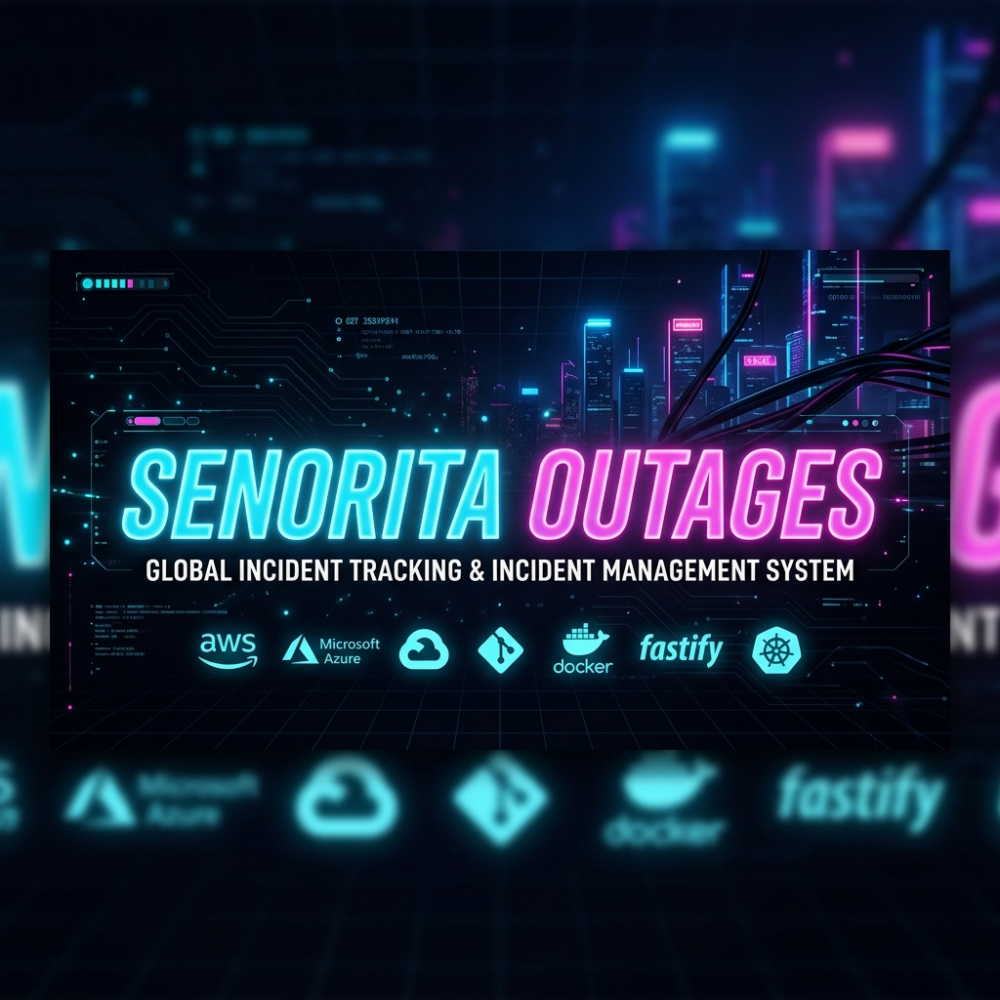
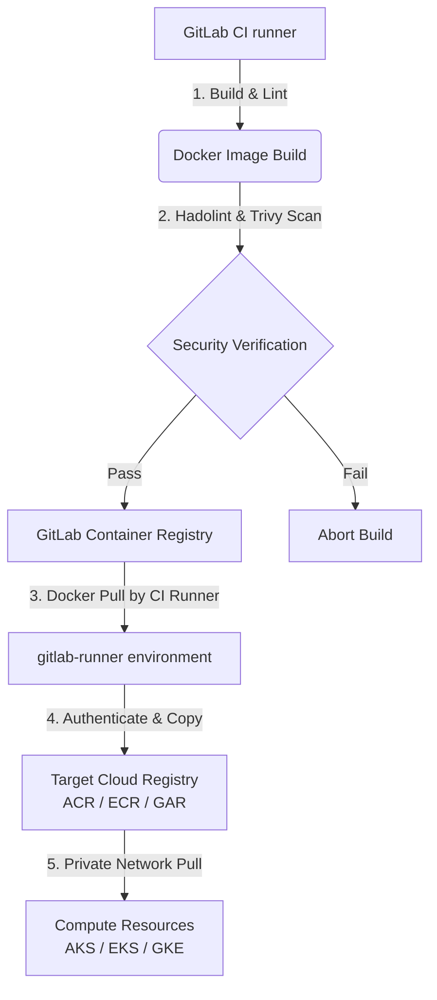

# 💃 Senorita Outages: Multi-Cloud DevOps Monorepo

Welcome to **Senorita Outages**, the ultimate end-to-end multi-cloud DevOps, DevSecOps, and AI Agent deployment monorepo. This repository contains complete infrastructure blueprints (Terraform), CI/CD pipelines (GitLab), containerized application engines (Fastify), and deployment manifests for **Microsoft Azure**, **AWS**, and **GCP**.

> [!NOTE]
> This repository is structured as a monorepo, separating infrastructure, CI/CD logic, and deployment manifests by cloud provider. It implements rigorous network isolation, DNS mapping, SSO configurations, and a secure build-push-sync container registry pipeline.

---

## 🗺️ Monorepo Directory Layout

```text
.
├── README.md                           # Master guide, cloud comparisons, and getting started
├── gemini.md                           # AI prompt guide & Entra ID token exchange flows
├── agent.md                            # Coding standards, security check, and agent rules
├── docs/                               # Architecture HLDs & Decisions
│   ├── azure-hld.md                    # Azure network spoke routing, Key Vault, VM, and logs
│   ├── aws-hld.md                      # AWS VPC, multi-AZ, EKS nodes, and Cognito specs
│   ├── gcp-hld.md                      # GCP private subnets, PSC db links, and Identity platform
│   ├── network-security.md             # Egress domain whitelists, firewalls, and Private DNS
│   ├── compute-decision-matrix.md      # Matrix comparison: "When to use what compute"
│   ├── masala-ops.md                   # MasalaOps: Dramatic cinematic Cloud learning guide
│   ├── images/                         # Generated high-resolution blueprints
│   │   ├── repo_banner.png             # Repository horizontal banner
│   │   ├── azure_architecture.png      # Azure network architecture
│   │   ├── azure_vm_runner_flow.png    # Azure VM Runner flow
│   │   ├── aws_architecture.png        # AWS VPC architecture
│   │   ├── gcp_architecture.png        # GCP VPC architecture
│   │   ├── demo_deployment_flow.png    # Container application flow
│   │   └── compute_decision_tree.png   # Compute decision flowchart
│   └── eraser/                         # Eraser.io Diagram-as-Code DSL text files
│       ├── azure-architecture.txt
│       ├── aws-architecture.txt
│       ├── gcp-architecture.txt
│       ├── demo-deployment-flow.txt
│       ├── compute-decision-tree.txt
│       └── agent-engine-flow.txt
├── terraform/                          # Infrastructure provisioning (IaC)
│   ├── azure/                          # VNet, VM Runner, AKS, ACR, Log Analytics, KV, Blob (main.tf, outputs.tf)
│   ├── aws/                            # VPC, EKS, ECS, Cognito, RDS Postgres, ElastiCache Redis
│   └── gcp/                            # VPC, GKE, Cloud Run, Cloud SQL, Memorystore Redis, Cloud Trace APIs
├── cicd/                               # Pipelines and sync logic
│   ├── gitlab-ci/
│   │   ├── templates/                  # Reusable build, test, and deploy steps
│   │   │   ├── build-push-sync.yml     # Trivy container scans & registry mirroring
│   │   │   ├── tf-lifecycle.yml        # IaC validate, plan, and manual applies
│   │   │   └── k8s-deploy.yml          # Kube-linter & kubectl apply
│   │   └── .gitlab-ci.yml              # Root pipelines coordinating the build flows
│   └── scripts/
│       └── sync-registry.sh            # Safe container mirroring script using skopeo/docker
├── manifests/                          # Runtime deployment specs
│   ├── azure/                          # Ingress definitions & ACA YAML templates
│   ├── aws/                            # EKS deployment YAMLs & ECS task JSONs
│   └── gcp/                            # GKE service routing & Cloud Run service YAMLs
├── demo-app/                           # Multi-cloud Node.js + Fastify demo project
│   ├── package.json
│   ├── server.js                       # Connects to PG DB + Redis caching, serves APIs
│   ├── Dockerfile                      # Production multi-stage non-root build
│   └── public/
│       └── index.html                  # Responsive glassmorphic dashboard UI
└── agent-engine/                       # AI Agent Engine (Fastify + OpenTelemetry)
    ├── package.json
    ├── server.js                       # Telemetry tracing spans, Redis context, GCS bucket
    ├── Dockerfile                      # Production multi-stage runner
    └── README.md                       # Tracing setup and env parameters
```

---

## ☁️ Multi-Cloud Feature Comparison Matrix

| Architectural Component | Microsoft Azure | Amazon Web Services (AWS) | Google Cloud Platform (GCP) |
| :--- | :--- | :--- | :--- |
| **Managed Kubernetes** | Azure Kubernetes Service (AKS) | Elastic Kubernetes Service (EKS) | Google Kubernetes Engine (GKE) |
| **Serverless Containers** | Azure Container Apps (ACA) | AWS ECS with Fargate | Google Cloud Run |
| **PaaS Web Hosting** | Azure App Service | AWS Elastic Beanstalk | Google App Engine / Cloud Run |
| **Serverless Functions** | Azure Functions | AWS Lambda | Google Cloud Functions |
| **Container Registry** | Azure Container Registry (ACR) | Elastic Container Registry (ECR) | Artifact Registry (GAR) |
| **In-Memory Cache** | Azure Cache for Redis | Amazon ElastiCache (Redis) | Memorystore for Redis |
| **Managed Relational DB** | PostgreSQL Flexible Server | Amazon RDS for PostgreSQL | Cloud SQL for PostgreSQL |
| **Private Connectivity** | Private Link & Private Endpoints | VPC Interface Endpoints | Private Service Connect / Peering |
| **Enterprise Identity SSO** | Microsoft Entra ID (App Reg) | AWS Cognito User Pools | Google Cloud Identity Platform |
| **Firewall & Security** | Azure Firewall / App Gateway | AWS Network Firewall / ALB | Cloud Armor / Cloud NAT |

---

## 🔒 DevOps & DevSecOps Strategy (Image Sync Pattern)

Rather than building container images directly in our target cloud environments (which requires exposing cloud registry credentials or executing docker-in-docker in multiple places), this repo implements the **GitLab-to-Cloud Mirroring Pattern**:



---

## 🚀 Getting Started

1.  **Infrastructure Provisioning:**
    *   Navigate to your cloud of choice: e.g. `cd terraform/azure`
    *   Initialize: `terraform init`
    *   Configure workspace details in `terraform.tfvars`.
    *   Run: `terraform apply`
2.  **Configure GitLab CI/CD:**
    *   Commit this repo to GitLab.
    *   Configure GitLab variables for Cloud OIDC authentication. See details in `cicd/gitlab-ci/templates/`.
3.  **Deployment manifests:**
    *   Apply Kubernetes manifests: e.g. `kubectl apply -f manifests/azure/`

---

## 📦 App Deployments & Local Testing

### 1. Demo Application (Fastify + PG + Redis Cache)
*   Located under `/demo-app`.
*   Includes a beautiful glassmorphic client interface showing connection states.
*   Run locally:
    ```bash
    cd demo-app
    # Create .env with DATABASE_URL and REDIS_URL
    npm install
    npm start
    ```

### 2. AI Agent Engine (Fastify + OpenTelemetry + Cloud Trace + GCS Bucket)
*   Located under `/agent-engine`.
*   Uses OpenTelemetry tracing SDK to monitor agent executions and logs workspaces to a secure Cloud Storage bucket.
*   Run locally:
    ```bash
    cd agent-engine
    # Set ENABLE_TRACING=true, REDIS_HOST, and AGENT_WORKSPACE_BUCKET
    npm install
    npm start
    ```
