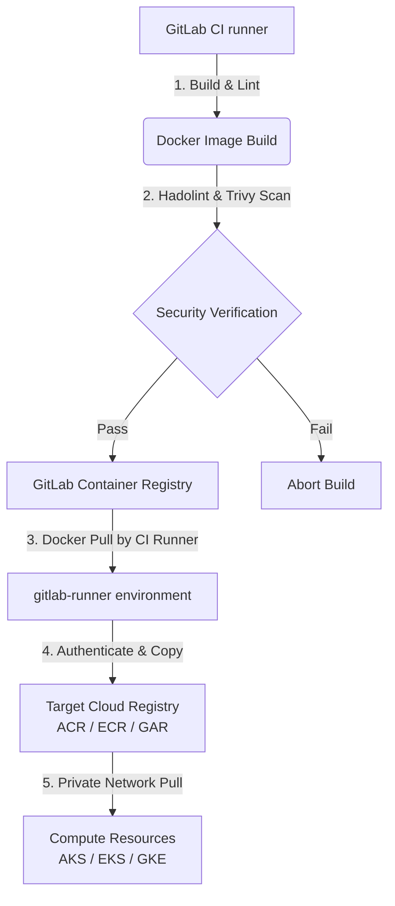
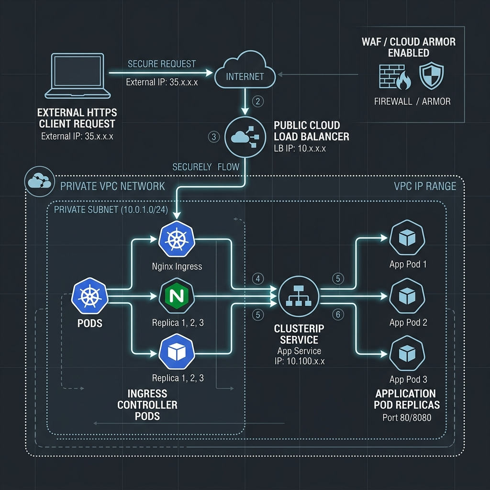
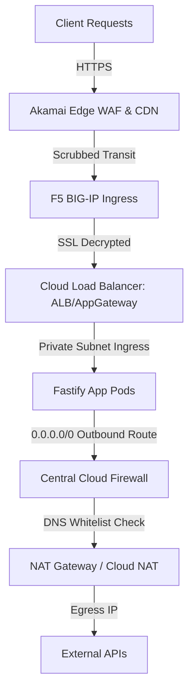

# 💃 Senorita Outages: The Dramatic Multi-Cloud DevOps Monorepo

Welcome to **Senorita Outages**, the most dramatic, high-performance, and feature-packed multi-cloud monorepo on GitHub. 

This repository is a cinematic blockbuster of DevOps and DevSecOps engineering—bringing action, suspense, and ultimate reliability to your cloud deployments. Designed as a production-grade blueprint, it provides end-to-end infrastructure-as-code (Terraform), secure CI/CD pipelines (GitLab), containerized application runtimes (Fastify), and robust deployment manifests across **Microsoft Azure**, **Amazon Web Services (AWS)**, and **Google Cloud Platform (GCP)**.

> [!IMPORTANT]
> If you can handle a Bollywood masala thriller, you can easily manage high-availability container clusters and zero-trust private networks! This repository is fully isolated inside private VNets/VPCs, utilizing Private Endpoints, Centralized Firewalls, and System-Assigned Managed Identities.

---

## 🗺️ Monorepo Directory Layout

```text
.
├── README.md                           # Master guide, cloud comparisons, and getting started
├── gemini.md                           # AI prompt guide & Entra ID token exchange flows
├── agent.md                            # Coding standards, security check, and agent rules
├── senorita-outages.code-workspace     # VS Code Workspace file with Masala theme highlights
├── docs/                               # High-Level Design (HLD) files & architecture diagrams
│   ├── azure-hld.md                    # Azure network spoke routing, Key Vault, VM, and logs
│   ├── aws-hld.md                      # AWS VPC, multi-AZ, EKS nodes, and Cognito specs
│   ├── gcp-hld.md                      # GCP private subnets, PSC db links, and Identity platform
│   ├── network-security.md             # Egress domain whitelists, firewalls, and Private DNS
│   ├── compute-decision-matrix.md      # Matrix comparison: "When to use what compute"
│   ├── masala-ops.md                   # MasalaOps: Dramatic cinematic Cloud learning guide
│   ├── vpc-guide.md                    # VPC Mapping Guide: AWS vs Azure vs GCP networking
│   ├── vpc-and-firewalls.md            # HLD: VPC isolation rationale, ALB vs NLB, Cloud Firewalls
│   ├── secrets-management.md           # HLD: Key Vault / Secrets Manager with Managed Identity SDK
│   ├── gitlab-workers-and-environments.md # HLD: GitLab runners, manual gates, multi-environment states
│   ├── agent-adk-memory-banks.md       # HLD: ADK Agent Architecture, short/long-term memory banks
│   ├── azure-connection-guide.md       # Guide: Connect GitLab to AKS using OIDC & Key Vault access rules
│   ├── edge-security-and-multicloud-demo.md # Guide: Akamai Edge WAF & F5 BIG-IP Ingress to Multi-Cloud Fastify App
│   ├── deploy-website-on-cloud-run.md  # Guide: Containerize and deploy static websites on Google Cloud Run
│   ├── serverless-functions-guide.md   # Guide: AWS Lambda, Azure Functions & GCP Cloud Functions — use cases + code
│   ├── azure-ai-foundry/               # Workspace: Azure AI Foundry deployment, models, security
│   │   └── README.md                   # AI Foundry model endpoints, prompt flow orchestration guide
│   ├── kubernetes-and-docker/          # Workspace: Container and orchestration master references
│   │   └── README.md                   # Docker caching, layers, non-root, and K8s control plane guide
│   ├── images/                         # Generated high-resolution blueprints
│   │   ├── azure_architecture.png      # Azure network architecture
│   │   ├── azure_vm_runner_flow.png    # Azure VM Runner flow
│   │   ├── aws_architecture.png        # AWS VPC architecture
│   │   ├── gcp_architecture.png        # GCP VPC architecture
│   │   ├── demo_deployment_flow.png    # Container application flow
│   │   ├── compute_decision_tree.png   # Compute decision flowchart
│   │   ├── vpc_ingress_loadbalancer_flow.png # VPC Ingress Load Balancer flow
│   │   └── vpc_firewall_loadbalancer_deepdive.png # VPC Firewall Ingress/Egress deep dive
│   └── eraser/                         # Eraser.io Diagram-as-Code DSL text files
│       ├── azure-architecture.txt
│       ├── aws-architecture.txt
│       ├── gcp-architecture.txt
│       ├── demo-deployment-flow.txt
│       ├── compute-decision-tree.txt
│       ├── agent-engine-flow.txt
│       ├── vpc-ingress-flow.txt
│       └── vpc-firewall-deepdive.txt
├── terraform/                          # Infrastructure provisioning (IaC)
│   ├── azure/                          # VNet, VM Runner, AKS, ACR, Log Analytics, KV, Blob (main.tf, outputs.tf)
│   ├── aws/                            # VPC, EKS, ECS, Cognito, RDS Postgres, ElastiCache Redis
│   └── gcp/                            # VPC, GKE, Cloud Run, Cloud SQL, Memorystore Redis, Cloud Trace APIs
├── cicd/                               # Pipelines and sync logic
│   ├── gitlab-ci/
│   │   ├── automated-pipelines/        # Lint, Validate, and Trivy scans yml templates
│   │   ├── manual-pipelines/           # Manual approval gate deploy templates
│   │   ├── runner-setup/               # GitLab runner VM setup README and config.toml
│   │   └── .gitlab-ci.yml              # Root pipelines importing sub-folders
│   └── scripts/
│       ├── sync-registry.sh            # Safe container mirroring script using skopeo/docker
│       └── pre-commit.sh               # Git pre-commit validator (Hadolint, TF format, yamllint)
├── manifests/                          # Runtime deployment specs
│   ├── azure/                          # Ingress, ACA, and Agent Engine ACA templates
│   ├── aws/                            # EKS deployment YAMLs & ECS task JSONs
│   ├── gcp/                            # GKE services, GKE deploys, and Agent Engine Cloud Run YAMLs
│   ├── kubernetes-templates/           # Standard Namespace, ConfigMap, Secrets, Service, Ingress blueprints
│   └── argocd/                         # GitOps Application & AppProject manifests and setup guides
├── demo-app/                           # Multi-cloud Node.js + Fastify demo project
│   ├── package.json
│   ├── server.js                       # Connects to PG DB + Redis caching, serves APIs
│   ├── Dockerfile                      # Production multi-stage non-root build
│   └── public/
│       └── index.html                  # Responsive glassmorphic dashboard UI
├── demo-projects/                      # Standardized project templates by cloud service
│   ├── azure-function-app/             # Serverless Azure Function running Fastify HTTP trigger
│   ├── gcp-cloud-run-app/              # Serverless GCP Cloud Run container running Fastify
│   └── aws-ecs-fargate-app/            # Microservice task container running Fastify
└── agent-engine/                       # AI Agent Engine (Fastify + OpenTelemetry)
    ├── package.json
    ├── server.js                       # Telemetry tracing spans, Redis context, GCS bucket
    ├── Dockerfile                      # Production multi-stage runner
    └── README.md                       # Tracing setup and env parameters
```

---

## 🎬 MasalaOps: Dramatic Cloud Learning

Are database connections failing? Or are your pipelines throwing errors? Learn how to debug cloud setups using our cinematic guide:
👉 **[docs/masala-ops.md](docs/masala-ops.md)**

*   **Sudo access:** *"Access privileges mein toh hum tumhare root admin lagte hain, command prefix hai `sudo`!"*
*   **Failed Commits:** *"Commit pe commit, commit pe commit... par build phir bhi pipeline error!"*
*   **Mogambo Green:** *"GitLab pipeline green hua, Mogambo khush hua!"*

---

## 🔒 DevOps & DevSecOps Strategy (Image Sync Pattern)

Rather than building container images directly in our target cloud environments (which requires exposing cloud registry credentials or executing docker-in-docker in multiple places), this repo implements the **GitLab-to-Cloud Mirroring Pattern**:



### Key Advantages:
1.  **Uniform Build & Scan Policy:** All images undergo vulnerabilities scanning (via Trivy) and linting in one unified GitLab runner stage.
2.  **Minimized Credentials Footprint:** Cloud credentials are only needed by the Sync job (or via OIDC) and are never exposed during the compilation or build processes.
3.  **Local Network Pulls:** AKS/EKS/GKE pull images from their local cloud registries via private endpoints, saving egress bandwidth cost and improving startup times.

---

## 📦 App Deployments & Local Testing

### 1. Demo Application (Fastify + PG + Redis Cache)
*   Located under `/demo-app`.
*   Includes a beautiful glassmorphic client interface showing connection states.
*   Run locally:
    ```bash
    cd demo-app
    # Create .env with DATABASE_URL and REDIS_URL
    npm install
    npm start
    ```

### 2. AI Agent Engine (Fastify + OpenTelemetry + Cloud Trace + GCS Bucket)
*   Located under `/agent-engine`.
*   Uses OpenTelemetry tracing SDK to monitor agent executions and logs workspaces to a secure Cloud Storage bucket.
*   Run locally:
    ```bash
    cd agent-engine
    # Set ENABLE_TRACING=true, REDIS_HOST, and AGENT_WORKSPACE_BUCKET
    npm install
    npm start
    ```

---

## ☸️ Standardized Kubernetes Deployments & Ingress Routing

Workload deployments in private networks require layered routing and secure credential injections. Clean templates are available under `/manifests/kubernetes-templates`.

### 1. Workload Orchestration & Credential Injections
*   **Isolated Namespaces:** WORKLOADS are deployed inside dedicated namespaces (`namespace.yaml`) to isolate networking and RBAC.
*   **ConfigMaps (`configmap.yaml`):** Store non-sensitive keys (hosts, ports, logs).
*   **Secrets (`secret.yaml`):** Sensitive parameters must be **Base64 encoded** to be injected into pods:
    *   *To base64 encode:* `echo -n 'password' | base64` (e.g. `ZGJhZG1pbg==` for `dbadmin`).
    *   *To base64 decode:* `echo -n 'ZGJhZG1pbg==' | base64 --decode`.

### 2. VPC Load Balancer Routing Flow
The following diagram details how an HTTPS client request maps into the isolated container pods via Load Balancers and Ingress Controllers:



1.  **Ingress Gateway:** Requests are validated by a public Load Balancer carrying WAF protections.
2.  **Private Network Pass:** Traffic is forwarded into the private subnet, targeting the internal **Ingress Controller** Pods.
3.  **Ingress Rule Matching (`ingress.yaml`):** Paths are mapped to internal **Service ClusterIP** endpoints (`service.yaml`).
4.  **Backend Load Balancing:** The ClusterIP service distributes traffic across replicated Fastify pods.

---

## 🌐 Multi-Cloud Networking Concepts for DevOps

To manage enterprise infrastructure, DevOps engineers must understand how virtual private networks are structured. Here is a breakdown of the core networking blocks used across our deployments.

### 1. Subnetting & CIDR Design (Non-Overlapping Blocks)
When peering VNets/VPCs together or connecting them to an on-premises network, their IP address ranges **must not overlap**. Overlapping ranges cause IP collisions and routing failures.

#### CIDR Allocation Blueprint:
*   **AWS VPC Address Space:** `10.0.0.0/16` (65,536 total IPs)
    *   *Public Subnet AZ-A:* `10.0.1.0/24` (256 IPs - hosts NAT Gateways and ALBs)
    *   *Private Subnet AZ-A:* `10.0.10.0/24` (256 IPs - hosts private EKS pods)
*   **Azure VNet Address Space:** `10.10.0.0/16`
    *   *Ingress Subnet:* `10.10.1.0/24` (hosts Application Gateway)
    *   *AKS Subnet:* `10.10.10.0/20` (4,096 IPs - large block to avoid running out of pod IPs)
*   **GCP VPC Address Space (Global):**
    *   *US-East Subnet:* `10.20.1.0/24`
    *   *Europe-West Subnet:* `10.20.2.0/24`

#### Terraform Subnet Configuration Example:
```terraform
# Declaring a secure private subnet block in Terraform
resource "aws_subnet" "private_subnet_a" {
  vpc_id            = aws_vpc.main.id
  cidr_block        = "10.0.10.0/24"
  availability_zone = "us-east-1a"
  tags = {
    Name = "private-subnet-app-a"
    Tier = "Private"
  }
}
```

### 2. Ingress & Egress Ingress Perimeter (Akamai + F5 + Load Balancer)
Traffic flows follow strict entry and exit criteria to protect backend database layers:



*   **Ingress (Incoming Traffic):** Client -> Akamai Edge -> F5 Ingress -> Cloud Load Balancer (ALB) -> Private Compute Nodes (AKS/EKS/GKE).
*   **Egress (Outgoing Traffic):** Private Compute -> Route Table (`0.0.0.0/0`) -> Central Cloud Firewall (Azure Firewall/AWS Network Firewall) -> NAT Gateway -> Internet.

### 3. Load Balancers: Layer 7 (ALB) vs. Layer 4 (NLB)
*   **Application Load Balancers (ALB - Layer 7):** Content-aware. Routes HTTP/HTTPS requests based on host headers (e.g. `api.domain.com`), URL paths (e.g. `/health`), or cookies.
*   **Network Load Balancers (NLB - Layer 4):** Direct connection routing. Routes TCP/UDP packets at the transport layer, providing ultra-low latency and static IP addresses.

### 4. Firewalls: Stateful (Security Groups) vs. Stateless (NACLs)
*   **Security Groups / NSGs (Stateful):** Control traffic at the instance or network interface (NIC) boundary. If you allow inbound traffic on port 80, return traffic is dynamically allowed.
*   **NACLs (Stateless):** Control traffic at the subnet boundary. You must explicitly create both inbound and outbound rules to allow communication.

### 5. Private Links & DNS Resolution
We bypass the public internet to reach managed databases and Key Vaults using **Private Service Connect (GCP)** or **Private Endpoints (Azure/AWS)**. Private DNS zones ensure that when our app queries `postgres.database.azure.com`, it resolves to a private IP (e.g., `10.10.2.14`) instead of a public IP.

---

## 🚀 Getting Started

1.  **Infrastructure Provisioning:**
    *   Navigate to your cloud of choice: e.g. `cd terraform/azure`
    *   Initialize: `terraform init`
    *   Configure workspace details in `terraform.tfvars`.
    *   Run: `terraform apply`
2.  **Configure GitLab CI/CD:**
    *   Commit this repo to GitLab.
    *   Configure GitLab variables for Cloud OIDC authentication. See details in `cicd/gitlab-ci/templates/`.
3.  **Deployment manifests:**
    *   Apply Kubernetes manifests: e.g. `kubectl apply -f manifests/azure/`
