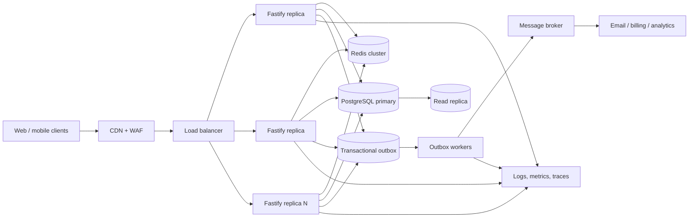
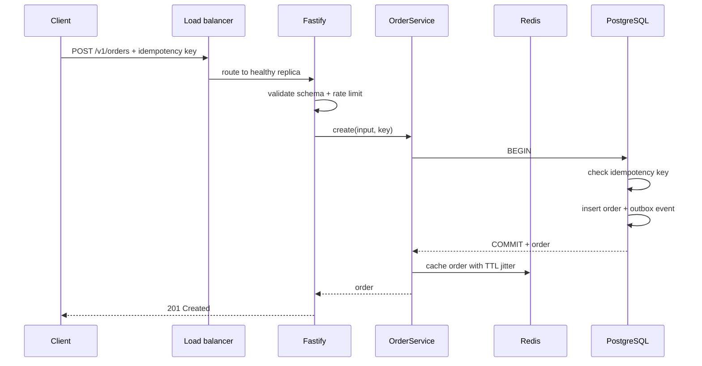
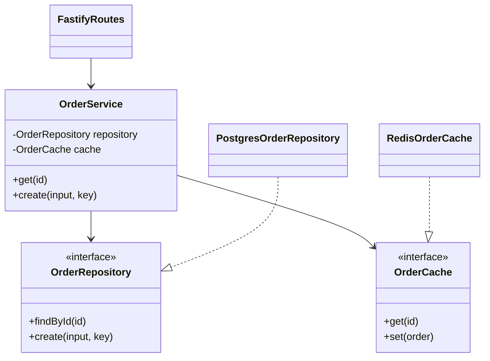
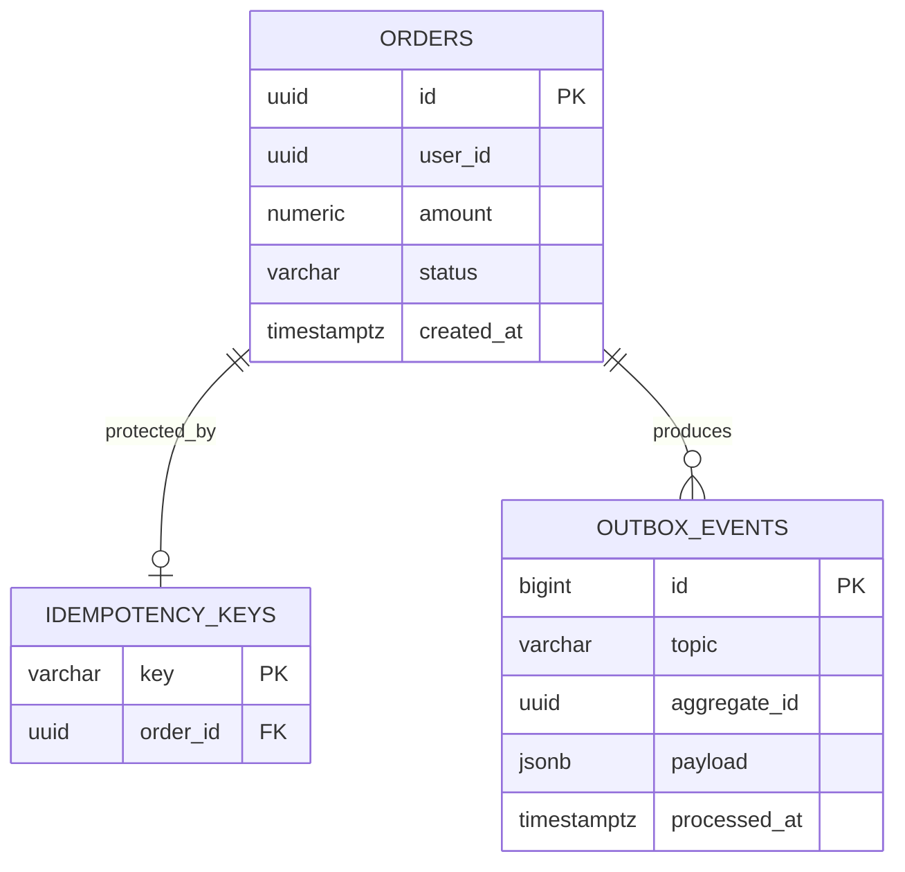
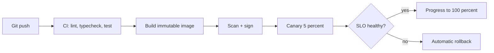

# Production Fastify Reference: Beginner to 2,000 Users

Runnable strict-TypeScript order API plus HLD, LLD, Docker, tests, and load
testing. Start here, then read the code in dependency order:

1. `src/domain.ts`
2. `src/order-service.ts`
3. `src/postgres-order-repository.ts`
4. `src/redis-order-cache.ts`
5. `src/app.ts`
6. `src/infrastructure.ts`
7. `src/server.ts`
8. `src/worker.ts`

## Run locally

```bash
npm ci
npm run typecheck
npm test
npm run build
docker compose up --build
```

Create and read an order:

```bash
curl -X POST http://localhost:8080/v1/orders \
  -H "content-type: application/json" \
  -H "idempotency-key: checkout-10000001" \
  -d '{"userId":"d9428888-34c8-4d8a-9eb8-552c9b3665af","amount":49.99}'

curl http://localhost:8080/v1/orders/ORDER_ID
curl http://localhost:8080/health/live
curl http://localhost:8080/health/ready
```

## HLD: high-level design



Responsibilities:

| Component | Responsibility | Scaling |
|:---|:---|:---|
| CDN/WAF | TLS, filtering, static caching | managed |
| Load balancer | health checks, routing | managed |
| Fastify replicas | stateless validation and orchestration | horizontal |
| Redis | hot reads, rate-limit counters | cluster/shards |
| PostgreSQL | source of truth and transactions | vertical first, replicas later |
| Outbox worker | reliable event publication | horizontal consumers |
| Observability | latency, errors, saturation, traces | managed/clustered |

The app stays stateless. Any healthy replica can serve any request. PostgreSQL
commits the order and outbox event in one transaction, preventing the
“database succeeded but message publish failed” inconsistency.

`src/worker.ts` claims batches with `FOR UPDATE SKIP LOCKED`, so multiple worker
replicas do not claim the same row. Replace its demonstration `publish`
function with a real broker producer and wait for broker acknowledgement before
marking an event processed. Consumers must still be idempotent because
at-least-once delivery can produce duplicates.

## Request flow



## LLD: low-level design



Layer rules:

- Routes understand HTTP, schemas, status codes, and headers.
- Services implement use cases and coordinate dependencies.
- Repositories own SQL and transaction boundaries.
- Domain interfaces point inward; infrastructure implements them.
- `buildApp` accepts dependencies, so tests need no real database or port.

## Data model



Indexes follow queries, not guesses. The API reads orders by primary key and
may list them by `(user_id, created_at DESC)`. The partial outbox index contains
only unpublished rows.

## Beginner-to-advanced map

| Level | Learn in this project |
|:---|:---|
| Beginner | route, request, reply, JSON schema, status code |
| Intermediate | strict types, service classes, interfaces, dependency injection |
| Advanced | pooling, cache-aside, idempotency, transaction, outbox |
| Production | probes, rate limits, timeouts, shutdown, non-root Docker |
| Scale | replicas, backpressure, pool budgets, load tests, SLOs |

## Designing for 2,000 users

“2,000 users” must be defined. This repository tests **2,000 concurrent virtual
users**, each making about one request per second: roughly 2,000 requests/second
before client/network effects. It is much harder than 2,000 registered users.

Capacity estimate using Little’s Law:

```text
concurrency = throughput × response time

at 2,000 RPS and 0.10 s average latency:
active in-flight requests ≈ 2,000 × 0.10 = 200
```

Start with 4–8 replicas and measure. Never choose replica count from user count
alone. Per-replica RPS depends on CPU, payload, cache hit rate, SQL cost,
network, logging, and runtime limits.

### Connection budget

```text
usable DB connections = DB max - admin/migration reserve
pool per replica <= usable connections / maximum replicas

example:
DB max 200 - reserve 40 = 160 usable
8 replicas => maximum pool size 20 each
```

This example defaults to 20. If autoscaling permits 20 replicas, reduce each
pool, introduce PgBouncer, or raise safe database capacity.

### Cache and database behavior

- `GET` checks Redis, then PostgreSQL, then caches for 60–74 seconds.
- TTL jitter avoids thousands of keys expiring simultaneously.
- Writes use parameterized SQL and short transactions.
- Idempotency makes client retries return the original order.
- The outbox allows slow email/billing work outside request latency.
- Add request coalescing for extremely hot missing keys.

### Async and backpressure

Node scales I/O concurrency well but does not make CPU work parallel. Send
image processing, large reports, and expensive calculations to workers.

Bound every resource:

- Request body: 1 MiB
- Request timeout: 10 seconds
- SQL statement timeout: 5 seconds
- PostgreSQL pool: configured per replica
- Rate limit: configured per minute
- Queue consumers: fixed concurrency with retry/backoff

When capacity is exhausted, fail quickly with `429` or `503`; do not allow
unbounded memory, promises, sockets, or queues.

## Load test: 2,000 virtual users

Install [k6](https://grafana.com/docs/k6/latest/set-up/install-k6/), run the API
on production-like infrastructure, then:

```bash
k6 run load/orders.js
```

The scenario ramps gradually to 2,000 VUs, holds for 10 minutes, and requires:

- Error rate below 1%
- p95 latency below 500 ms
- p99 latency below 1 second

Do not run this against a shared production environment without approval.
Monitor during the test:

```text
API: RPS, p50/p95/p99, 4xx/5xx, event-loop lag, CPU, memory
DB: active/waiting connections, slow SQL, locks, CPU, IOPS
Redis: hit ratio, latency, memory, evictions, connections
Platform: replica count, restarts, network, load-balancer errors
```

Passing on a laptop proves only the laptop configuration. A defensible capacity
claim records hardware, image version, dataset size, replica count, pool sizes,
test script, duration, results, and bottleneck observations.

## Production deployment



Required production additions:

- Real OIDC/JWT verification and authorization
- Secret manager, never plaintext environment files
- TLS between services where required
- Migration tool with backward-compatible migrations
- OpenTelemetry traces and RED metrics
- Centralized structured logs with redaction
- Kubernetes HPA/ECS/Cloud Run autoscaling and disruption policy
- Managed PostgreSQL backups, PITR, HA, and restore drills
- Managed Redis HA and eviction policy
- Broker plus outbox publisher and dead-letter queue
- SLO alerts and rehearsed rollback/runbooks

## Verification commands

```bash
npm run typecheck
npm test
npm run build
docker build -t fastify-production-reference .
docker compose config
npm audit --omit=dev --audit-level=high
```

The broader concepts and alternative code patterns remain in
[`../../docs/fastify-typescript-guide.md`](../../docs/fastify-typescript-guide.md).
