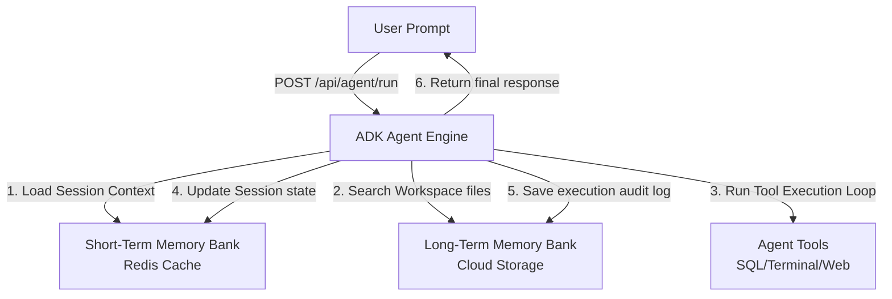

# 🤖 ADK Agent Architecture & Memory Bank Systems

This guide explains the design of our **Agent Development Kit (ADK)** engine, detailing how short-term session memory and long-term workspace storage banks are structured for autonomous AI workloads.

---

## 🏗️ 1. ADK Agent Architecture

The Agent Engine on Cloud Run/ACA uses a model-agnostic runtime that coordinates reasoning loops. It interfaces with two main memory systems to keep conversations logical and retain historic facts:



---

## 🧠 2. Short-Term Memory Bank (Redis Caching)

Short-term memory manages conversational history and transient state variables. It must be read and written in milliseconds to support chat responsiveness.

### Key Operations & Properties:
*   **Technology:** Redis Cache (AWS ElastiCache / Azure Redis / GCP Memorystore).
*   **Data Structure:** JSON array of chat messages (`{ role: "user" | "assistant", content: "text" }`) stored under key: `session:<session-id>:history`.
*   **Locks & Synchronization:** Uses Redis distributed locks (`redlock`) to prevent race conditions when the same user submits concurrent prompts.
*   **Expiration Policy:** Pinned with a Time-To-Live (TTL) of **1 Hour** (`EX 3600`). If a session is inactive for 60 minutes, the short-term state is automatically garbage collected.

---

## 📂 3. Long-Term Memory Bank (Storage Workspaces)

Long-term memory acts as the agent's file system, knowledge repository, and execution audit log.

### Key Operations & Properties:
*   **Technology:** Object Storage (Azure Blob / AWS S3 / GCP Storage Bucket).
*   **Folder Structure:** Workspaces are isolated using the session ID as a directory prefix:
    ```text
    gcs-bucket-name/
    └── <session-id>/
        ├── workspace/            # Shared directory for files the agent downloads or writes
        │   ├── report.csv
        │   └── output.json
        ├── runs/                 # Auditing runs
        │   ├── run-1700000.log   # Detailed logs of tools executed & prompt inputs
        │   └── run-1700500.log
        └── index/                # Vector indexes or static memory documents
            └── facts.json        # Persistent long-term facts learned about the user
    ```
*   **Lifecycle Rules:** Storage buckets are configured with a **7-Day Lifecycle Policy** in Dev/Staging environments (automatically deletes directories to save cost) and indefinite retention with tier-archiving in Production.

---

## 💻 Code Snippet: Loading and Writing to Memory Banks

This code block demonstrates how the ADK agent loads transient context, searches long-term workspace files, and writes execution history during an active request:

```javascript
// Example segment inside /agent-engine/server.js
const { Storage } = require('@google-cloud/storage');
const { createClient } = require('redis');

const storage = new Storage();
const redisClient = createClient();
const bucketName = process.env.AGENT_WORKSPACE_BUCKET;

async function executeAgentADKRun(sessionId, userPrompt) {
  // 1. Fetch Short-Term Memory (Chat History) from Redis
  let chatHistory = [];
  const cachedHistory = await redisClient.get(`session:${sessionId}:history`);
  if (cachedHistory) {
    chatHistory = JSON.parse(cachedHistory);
  }
  
  // Append new user prompt
  chatHistory.push({ role: 'user', content: userPrompt });

  // 2. Query Long-Term Memory (List files in session workspace)
  const [files] = await storage.bucket(bucketName).getFiles({ prefix: `${sessionId}/workspace/` });
  const fileList = files.map(f => f.name);

  // 3. Perform Reasoning loop (Simulated agent output using context + files)
  const agentOutput = `I analyzed your prompt using ${fileList.length} files from long-term memory.`;
  chatHistory.push({ role: 'assistant', content: agentOutput });

  // 4. Save updated Short-Term Memory back to Redis with 1 Hour TTL
  await redisClient.set(`session:${sessionId}:history`, JSON.stringify(chatHistory), { EX: 3600 });

  // 5. Append execution logs to Long-Term Memory bucket
  const runLogPath = `${sessionId}/runs/run-${Date.now()}.log`;
  const runLogContent = `Prompt: ${userPrompt}\nFiles Seen: ${JSON.stringify(fileList)}\nOutput: ${agentOutput}\n`;
  await storage.bucket(bucketName).file(runLogPath).save(runLogContent);

  return agentOutput;
}
```
