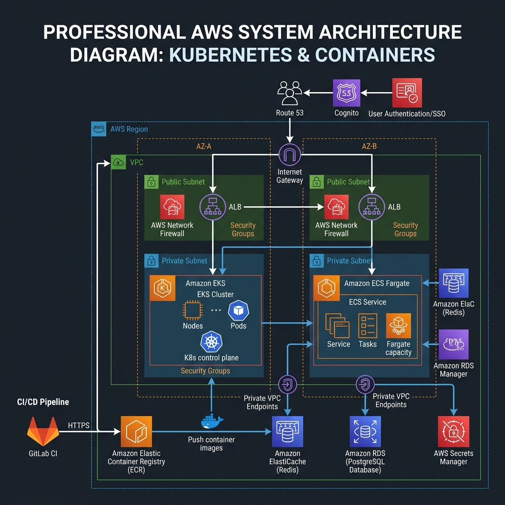
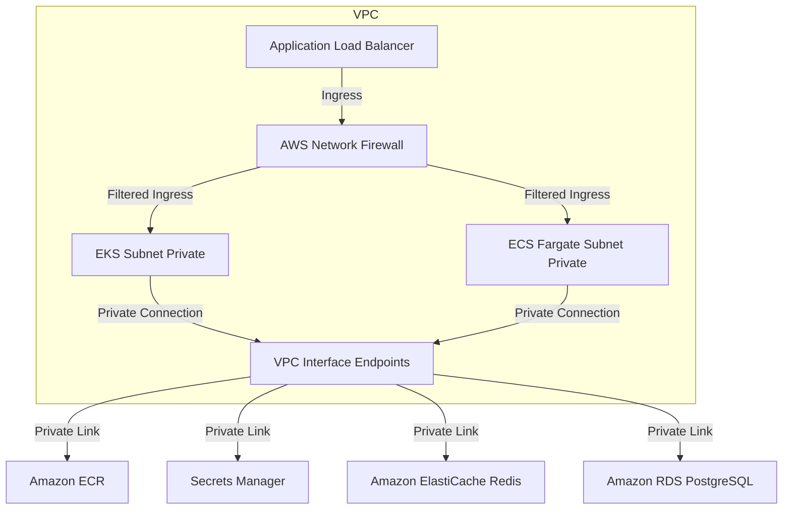

# 🎬 High-Level Design: Amazon Web Services (AWS) Infrastructure
## *MasalaOps Presents: "The Multi-AZ Survival Adventure!"*

> [!NOTE]
> **Director's Note:** In this action-packed thriller, our compute nodes (EKS & ECS Fargate) are replicated across multiple Availability Zones. If a meteor (or a rogue script) strikes Zone A, the show goes on in Zone B and C without missing a single beat!

This document outlines the architecture, networking, security policies, and application hosting strategy for the AWS deployment.

---

## 📐 Architecture Visualisation

Below is the conceptual architecture blueprint for our AWS VPC deployment.

---

## 🌐 Network & Resource Isolation

We implement a multi-AZ VPC layout spanning two Availability Zones (AZs) for high availability, isolating workloads using public and private subnets.

### 1. Subnet Segmentation
*   **Public Subnets (AZ1 & AZ2):** Hosts Internet Gateways, NAT Gateways, and public ALB nodes.
*   **Private Application Subnets (AZ1 & AZ2):** Hosts Elastic Kubernetes Service (EKS) workers, Amazon ECS Fargate tasks, and app instances. No direct public ingress.
*   **Private Database Subnets (AZ1 & AZ2):** Contains RDS PostgreSQL multi-AZ deployment and Amazon ElastiCache Redis nodes.
*   **Transit Gateway / Firewall Subnets:** Dedicated subnets route egress traffic through AWS Network Firewall for domain filtering.

### 2. VPC Interface Endpoints (AWS PrivateLink)
Backend services are isolated from the internet. Private communication is routed inside the VPC using interface endpoints:
*   `com.amazonaws.<region>.ecr.api` & `com.amazonaws.<region>.ecr.dkr` for ECR.
*   `com.amazonaws.<region>.secretsmanager` for secrets storage.
*   `com.amazonaws.<region>.rds` for RDS APIs.

---

## 🔐 SSO: AWS Cognito User Pools

SSO is managed through AWS Cognito. Applications exchange codes for JWT tokens over standard OIDC protocols.

### 1. App Client Settings
*   **UserPool ID:** The unique user pool identifier (e.g., `us-east-1_xxxxxxxxx`).
*   **App Client ID:** App-specific identifier.
*   **Client Secret:** Used for server-side auth validation.
*   **Callback URLs:**
    *   Development: `http://localhost:8080/login/oauth2/code/cognito`
    *   Production: `https://app.example.com/login/oauth2/code/cognito`
*   **Allowed OAuth Flows:** Authorization Code Grant, PKCE.
*   **Allowed OAuth Scopes:** `openid`, `profile`, `email`, `aws.cognito.signin.user.admin`.

### 2. OIDC Flow Integration
Cognito acts as the Identity Provider (IdP). The application parses the JWT tokens (`id_token`, `access_token`) to authenticate the request and map group memberships to IAM roles via AWS Security Token Service (STS).

---

## 🛠️ Compute Use-Cases

1.  **Amazon EKS (Elastic Kubernetes Service):**
    *   *Use Case:* Large-scale microservice platforms requiring fine-grained network policies (Calico), autoscaling based on custom metrics (KEDA/Prometheus), or customized ingress/routing configurations.
    *   *IAM Integration:* IAM Roles for Service Accounts (IRSA) maps AWS IAM credentials to specific K8s service accounts.
2.  **Amazon ECS on AWS Fargate:**
    *   *Use Case:* Serverless containerized APIs and scheduled cron jobs. Fargate manages the underlying OS patching and VM provisioning.
3.  **AWS Lambda:**
    *   *Use Case:* Serverless, event-driven computing triggered by S3 bucket events, SQS queues, or DynamoDB streams. Runs attached to the target private subnet to reach backend DBs.

---

## 📦 Demo Application Deployment Flow
Here is how our containerized demo application (Node.js/Express) runs and communicates inside our private AWS VPC:

1. **Ingress Entry:** Incoming traffic passes the Application Load Balancer (ALB) and AWS Network Firewall.
2. **Compute Target:** App runs inside EKS pods or ECS Fargate tasks inside private app subnets.
3. **SSO Hook:** Authenticates users via AWS Cognito User Pools redirection.
4. **Data Cache:** Connects to Amazon ElastiCache Redis replication group via private VPC endpoints.
5. **Data Storage:** Reads/Writes items to Amazon RDS PostgreSQL multi-AZ instance.

