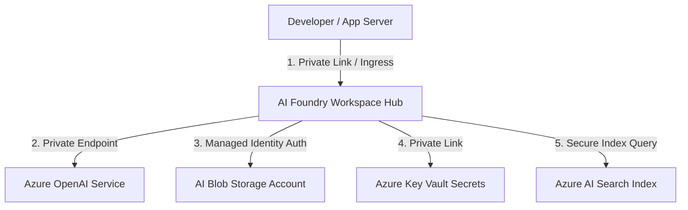
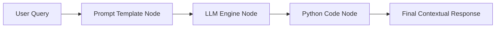

# 🤖 Azure AI Foundry (formerly Azure AI Studio) Master Guide
## *MasalaOps Presents: "The AI Blockbuster!"*

> [!NOTE]
> **Director's Note:** In this high-tech blockbuster, Azure AI Foundry acts as our central brain hub, hosting LLMs (The Stars), managed by Prompt Flow (The Assistant Director), and fully isolated inside private VNets to prevent corporate IP leak dramas!

---

## 🏗️ 1. What is Azure AI Foundry?

**Azure AI Foundry** (formerly Azure AI Studio) is a unified platform for developing, testing, evaluation, and deploying Generative AI applications. It combines model catalogs, vector search indexes, prompt engineering interfaces, and LLM monitoring tools into a single collaborative cloud workspace.

---

## 🎨 2. Conceptual Security Architecture

To prevent data leakage and meet enterprise compliance, AI Foundry workspaces must be locked down using **Private Links** and **Managed Identities**.



### Core Security Principles:
1.  **Network Isolation:** All components (Workspace, OpenAI endpoints, Storage, Key Vault) have public access disabled (`publicNetworkAccess = "Disabled"`). They communicate exclusively via **Private Endpoints** injected into your spoke subnets.
2.  **Zero-Key Authentication:** Applications authenticate to the AI Foundry workspace using **Managed Identity (OIDC)**. API keys are never hardcoded or injected into environmental states.
3.  **Data Protection:** Customer data stays within your virtual network boundary and is never used to train public foundation models.

---

## ⚙️ 3. Deploying LLM Endpoints

Within the AI Foundry Model Catalog, developers can deploy models (like GPT-4o, Llama 3, or Mistral Large) via two methods:

### Option A: Pay-As-You-Go (Shared Capacity)
*   **Billing:** Charged per 1,000 tokens processed.
*   **Limitation:** Shared regional capacity means you can encounter rate limiting (HTTP 429) during peak traffic hours.
*   **Best For:** Development, staging, and lightweight operations.

### Option B: Provisioned Throughput (PTU)
*   **Billing:** Reserved capacity charged hourly based on Provisioned Throughput Units (PTUs).
*   **Benefit:** Guarantees latency and throughput with zero rate limiting.
*   **Best For:** High-volume production workloads.

---

## 🧠 4. Orchestration with Prompt Flow

**Prompt Flow** is a visual orchestration tool within Azure AI Foundry that simplifies building LLM workflows. It links prompts, Python code blocks, vector index lookups, and API nodes into a unified execution graph.



### Prompt Flow Component Nodes:
1.  **LLM Nodes:** Connect directly to your deployed Azure OpenAI endpoints to execute prompts.
2.  **Python Nodes:** Run custom data transformations, parse outputs, and handle API integrations.
3.  **Prompt Nodes:** Manage parameterized templates cleanly separate from application source code.
4.  **Evaluation Nodes:** Run test pipelines to measure accuracy, groundedness, and safety metrics before promoting models to production.

---

## 💻 5. Code Example: Connecting to Azure AI Foundry Models in Node.js (Fastify)

This production-ready sample demonstrates how a Fastify server connects to a deployed Azure OpenAI endpoint (like GPT-4o) using **DefaultAzureCredential** (OIDC Managed Identity token exchange) rather than static keys:

```javascript
// server.js (Azure AI Foundry Integration Example)
const fastify = require('fastify')({ logger: true });
const { DefaultAzureCredential } = require('@azure/identity');
const { OpenAIClient } = require('@azure/openai');

const port = process.env.PORT || 8080;
const endpoint = process.env.AZURE_OPENAI_ENDPOINT; // e.g. "https://my-ai-hub.openai.azure.com/"
const deploymentId = process.env.AZURE_OPENAI_DEPLOYMENT_ID; // e.g. "gpt-4o-prod"

let aiClient;

async function initAIClient() {
  try {
    fastify.log.info(`Initializing Azure OpenAI Client targeting: ${endpoint}`);
    
    // DefaultAzureCredential automatically exchanges the AKS Workload Identity token
    // or system VM token for an Azure AD access token.
    const credential = new DefaultAzureCredential();
    aiClient = new OpenAIClient(endpoint, credential);
    
    fastify.log.info("Azure OpenAI client initialized successfully.");
  } catch (err) {
    fastify.log.error("Failed to initialize AI Client: " + err.message);
    process.exit(1);
  }
}

// REST route to execute chat completions
fastify.post('/api/ai/chat', async (request, reply) => {
  if (!aiClient) return reply.code(500).send({ error: "AI Client uninitialized" });
  
  const { prompt } = request.body || {};
  if (!prompt) return reply.code(400).send({ error: "Missing prompt field" });

  try {
    const messages = [
      { role: "system", content: "You are a helpful AI coding assistant in a DevOps monorepo." },
      { role: "user", content: prompt }
    ];

    fastify.log.info(`Sending prompt to deployment: ${deploymentId}`);
    const result = await aiClient.getChatCompletions(deploymentId, messages, {
      maxTokens: 500,
      temperature: 0.7
    });

    const responseText = result.choices[0].message.content;
    return { response: responseText };
  } catch (err) {
    fastify.log.error("AI Completion failed: " + err.message);
    return reply.code(500).send({ error: "OpenAI endpoint connection failed", details: err.message });
  }
});

const start = async () => {
  await initAIClient();
  try {
    await fastify.listen({ port: port, host: '0.0.0.0' });
    fastify.log.info(`AI Integration server listening on port ${port}`);
  } catch (err) {
    fastify.log.error(err);
    process.exit(1);
  }
};

start();
```

