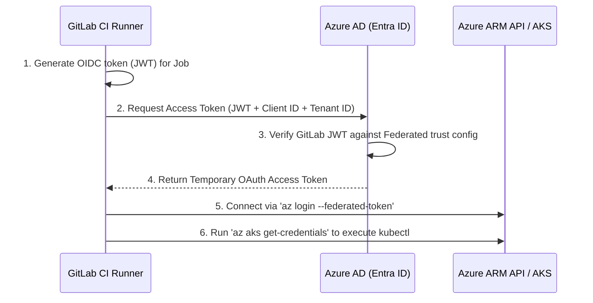
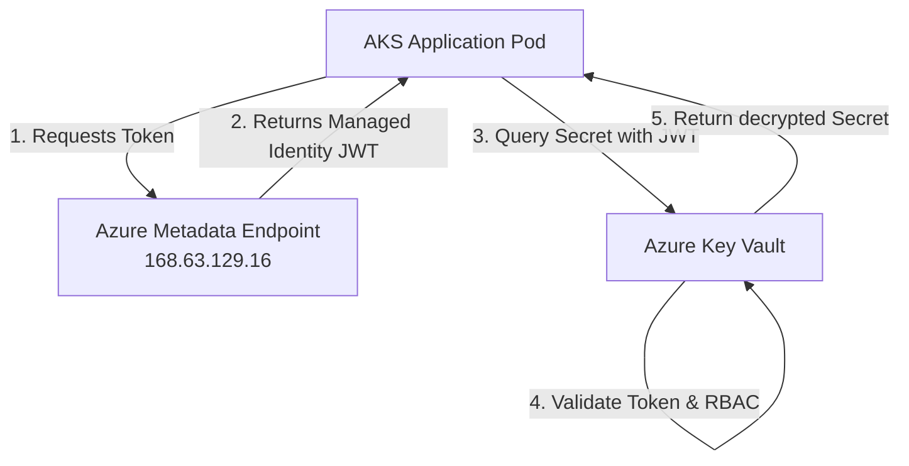

# 🔐 Azure Connections & Key Vault Access Guide

This guide explains how to connect GitLab CI/CD pipelines to Azure Kubernetes Service (AKS) securely using OpenID Connect (OIDC) federated credentials, and details how Managed Identities access Azure Key Vault secrets.

---

## 🤝 1. Connecting GitLab CI/CD to AKS via OIDC (Zero-Secrets)

Instead of saving permanent Service Principal passwords inside GitLab environment variables, we establish a trust relationship using **OpenID Connect (OIDC)** and **Azure Federated Credentials**.



### Step-by-Step Configuration:
1.  **Create App Registration:** In Azure Entra ID, register an Application representing your GitLab CI.
2.  **Configure Federated Credentials:** Under "Certificates & secrets" in the App Registration, add a Federated Credential:
    *   *Issuer:* `https://gitlab.com`
    *   *Subject Identifier (sub):* Matches your repo and branch (e.g. `project_path:biswajitnanda223/senorita-outages:ref_type:branch:ref:main`).
    *   *Audience:* `https://gitlab.com`
3.  **Role Assignment:** Grant the App Registration the **Azure Kubernetes Service Cluster Admin Role** on the AKS resource.
4.  **GitLab Pipeline Script:**
    ```yaml
    deploy-aks:
      image: mcr.microsoft.com/azure-cli:latest
      script:
        # 1. Login using temporary federated token
        - az login --service-principal -u $AZURE_CLIENT_ID -t $AZURE_TENANT_ID --federated-token $CI_JOB_JWT_V2
        # 2. Retrieve AKS credentials into kubeconfig
        - az aks get-credentials --resource-group my-rg --name my-aks-cluster
        # 3. Deploy
        - kubectl apply -f manifests/azure/
    ```

---

## 🔑 2. Azure Key Vault Access Flow with Managed Identity

Applications running on AKS pods or Virtual Machines access **Azure Key Vault** without any hardcoded credentials using **Managed Identities**.



### Access Mechanics:
1.  **Identity Creation:** A Managed Identity (System-Assigned or User-Assigned) is assigned to the AKS Pod (via Workload Identity) or Azure VM.
2.  **Token Request:** The app queries the Azure Instance Metadata Service (IMDS) endpoint (`http://168.63.129.16/metadata/identity/oauth2/token?api-version=2018-02-01&resource=https://vault.azure.net`) to get an access token.
3.  **Authentication & RBAC:** Key Vault receives the token, checks the Entra ID issuer, and verifies if the identity has the **Key Vault Secrets User** role or Access Policy permission.
4.  **In-Memory Secrets Retrieval:** Key Vault returns the secret payload. The secret exists only in the application's RAM, preventing leaks to log collectors or disk drives.
