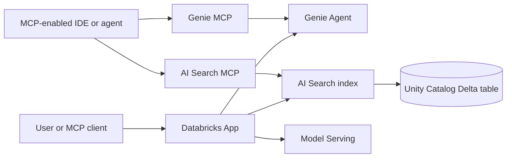

# Databricks Apps, MCP, Genie, and AI Search: End-to-End Guide

This guide connects four pieces into one production-oriented flow:



Databricks **AI Search** is the current product name for Vector Search. Older
SDK names, REST paths, UI labels, and the legacy MCP prefix can still contain
`vector-search`.

## 1. Prerequisites

- Azure Databricks workspace in a region that supports serverless compute.
- Unity Catalog enabled.
- Databricks CLI 0.229.0 or newer, configured with OAuth user-to-machine
  authentication.
- Python 3.11+ for the AI Search examples or Node.js 22.16+ for the Fastify app.
- A SQL pro or serverless warehouse for Genie.
- Permission to create or manage the required App, Genie Agent, Delta table,
  AI Search endpoint, and index.
- Network egress that permits `*.databricksapps.com`.

Configure and verify the CLI:

```bash
databricks auth login --host https://adb-<workspace-id>.<region>.azuredatabricks.net
databricks current-user me
databricks apps list
```

Use the actual workspace URL shown in the browser. Do not put a personal access
token in source code or commit it to an MCP configuration.

## 2. Deploy the Fastify demo as a Databricks App

Databricks Apps runs Node.js applications directly; it does not build or use the
repository Dockerfile. The app must listen on `0.0.0.0` and on the runtime port.
The existing `demo-app/server.js` already binds to `0.0.0.0` and reads `PORT`,
which Databricks sets for Express-compatible Node runtimes.

Create `demo-app/app.yaml`:

```yaml
command:
  - npm
  - start
env:
  - name: CLOUD_PROVIDER
    value: databricks
  - name: ENVIRONMENT
    value: dev
```

Only hardcode non-sensitive values. Add secrets and platform services as App
resources in the UI, then map their resource keys with `valueFrom`.

### Option A: deploy from a workspace folder

Create a custom app named `senorita-demo` in **Compute > Apps**, then:

```bash
databricks sync demo-app \
  /Workspace/Users/<your-email>/senorita-demo

databricks apps deploy senorita-demo \
  --source-code-path /Workspace/Users/<your-email>/senorita-demo
```

For a live development loop, add `--watch` to `databricks sync`, but explicitly
redeploy when runtime configuration or dependencies change.

### Option B: deploy directly from Git

Create or configure the app with this repository:

```bash
databricks apps create senorita-demo --json '{
  "git_repository": {
    "url": "https://github.com/biswajitNanda223/senorita-outages",
    "provider": "gitHub"
  }
}'

databricks apps deploy senorita-demo --json '{
  "git_source": {
    "branch": "main",
    "source_code_path": "demo-app"
  }
}'
```

Private repositories require a Git credential on the App service principal.
Prefer a fixed commit for controlled releases:

```bash
databricks apps deploy senorita-demo --json '{
  "git_source": {
    "commit": "<full-commit-sha>",
    "source_code_path": "demo-app"
  }
}'
```

### Database and Redis warning

The demo starts even when PostgreSQL or Redis is unavailable, but `/health`
returns a failure until both are connected. Configure database/cache access,
credentials, private DNS, and egress before treating the deployment as healthy.
Databricks Apps resources should be used where supported; secrets must be
attached as Secret resources rather than written into `app.yaml`.

After deployment:

```bash
databricks apps get senorita-demo
```

Use the App overview page for its generated
`https://<app-id>.<region>.databricksapps.com` URL, deployment history, runtime
environment, and stdout/stderr logs.

## 3. Build the source table for AI Search

Use one row per retrievable chunk, not one row per entire document. Preserve
metadata needed for filtering and citations.

```sql
CREATE CATALOG IF NOT EXISTS study;
CREATE SCHEMA IF NOT EXISTS study.rag;

CREATE TABLE IF NOT EXISTS study.rag.document_chunks (
  chunk_id STRING NOT NULL,
  document_id STRING NOT NULL,
  content STRING NOT NULL,
  source_url STRING,
  document_type STRING,
  updated_at TIMESTAMP
)
TBLPROPERTIES (delta.enableChangeDataFeed = true);

ALTER TABLE study.rag.document_chunks
ADD CONSTRAINT document_chunks_pk PRIMARY KEY (chunk_id) NOT ENFORCED;
```

Ingestion rules:

- Generate a stable, unique `chunk_id`.
- Keep chunks semantically coherent; test multiple chunk sizes and overlap.
- Store the source URL or document path on every chunk.
- Remove secrets and restricted content before indexing.
- Apply the same Unity Catalog access model to source data and downstream apps.
- Enable Change Data Feed for a standard Delta Sync index.

## 4. Create and populate an AI Search index

Install the current SDK in a Databricks notebook:

```python
%pip install databricks-ai-search
dbutils.library.restartPython()
```

Create a standard endpoint and managed-embedding Delta Sync index:

```python
from databricks.ai_search.client import AISearchClient

client = AISearchClient()
endpoint_name = "study-rag-search"
index_name = "study.rag.document_chunks_index"

client.create_endpoint(
    name=endpoint_name,
    endpoint_type="STANDARD"
)

index = client.create_delta_sync_index(
    endpoint_name=endpoint_name,
    source_table_name="study.rag.document_chunks",
    index_name=index_name,
    pipeline_type="TRIGGERED",
    primary_key="chunk_id",
    embedding_source_column="content",
    embedding_model_endpoint_name="<supported-embedding-endpoint>",
    columns_to_sync=[
        "document_id",
        "content",
        "source_url",
        "document_type",
        "updated_at"
    ]
)

index.sync()
```

Choose an embedding endpoint supported in the workspace and use a compatible
query embedding model. For self-managed embeddings, provide
`embedding_vector_column` and `embedding_dimension` instead. Do not mix vectors
from models with different dimensions or embedding spaces.

Use `TRIGGERED` for controlled, cost-conscious refreshes and call `index.sync()`
after source updates. Use `CONTINUOUS` only when near-real-time refresh justifies
the continuously provisioned sync pipeline.

## 5. Query and evaluate retrieval

```python
index = client.get_index(index_name=index_name)

results = index.similarity_search(
    query_text="How do we route private application egress?",
    columns=[
        "chunk_id",
        "content",
        "source_url",
        "document_type"
    ],
    filters={"document_type": "architecture"},
    num_results=5,
    query_type="HYBRID"
)

print(results)
```

Use `ANN` for semantic similarity, `HYBRID` when exact terms and semantics both
matter, and `FULL_TEXT` for keyword-only retrieval. Treat `num_results` as a
tuning parameter, not a constant.

Before connecting an LLM, create a labeled question set and measure:

- Recall: did the expected source appear in the top results?
- Precision: how many returned chunks were actually relevant?
- Citation coverage: can every answer claim point to a retrieved source?
- Filter correctness: can users retrieve only data they are authorized to see?
- Latency and cost at expected concurrency.

Only after retrieval quality is acceptable should the app assemble context and
call a model-serving endpoint. Tell the model to answer only from supplied
context and to say when the context is insufficient.

## 6. Attach AI Search to a Databricks App

In the App page:

1. Open **App resources**.
2. Select **Add resource > Vector search index**.
3. Select `study.rag.document_chunks_index`.
4. Grant **Can select**.
5. Keep or rename the resource key `vector-search-index`.

Map the resource in `app.yaml`:

```yaml
env:
  - name: AI_SEARCH_INDEX
    valueFrom: vector-search-index
```

Databricks injects the full `catalog.schema.index` name. The App service
principal needs `USE CATALOG`, `USE SCHEMA`, and `SELECT`; adding the resource
can grant these when the configuring user has sufficient `MANAGE` privileges.

## 7. Create and use a Genie Agent

Genie is for natural-language analytics over curated structured data. AI Search
is for retrieving relevant unstructured or semi-structured chunks. They solve
different problems and can be used together.

Create a Genie Agent (formerly commonly called a Genie space) from the
Databricks SQL/Genie UI:

1. Select a pro or serverless SQL warehouse.
2. Add only curated Unity Catalog tables or views.
3. Define business terminology, synonyms, time semantics, joins, and measures.
4. Add representative sample questions and verified SQL.
5. Test ambiguous questions and permission boundaries.
6. Grant users or the App service principal **CAN RUN**.

For example, explicitly define whether “last month” means the previous calendar
month or the trailing 30 days. Prefer governed views that expose business-safe
columns instead of raw operational tables.

Attach it to an App using **Add resource > Genie Agent**, choose **Can run**, and
use the default `genie-space` key:

```yaml
env:
  - name: GENIE_SPACE_ID
    valueFrom: genie-space
```

Python application usage:

```python
import os
from databricks.sdk import WorkspaceClient

w = WorkspaceClient()
space_id = os.environ["GENIE_SPACE_ID"]

reply = w.genie.start_conversation_and_wait(
    space_id=space_id,
    content="What were the top products last quarter?"
)

for attachment in reply.attachments or []:
    print(attachment)

follow_up = w.genie.create_message_and_wait(
    space_id=space_id,
    conversation_id=reply.conversation_id,
    content="Break that down by region."
)
```

For direct REST integration, the stateful flow is:

```text
POST /api/2.0/genie/spaces/{space_id}/start-conversation
GET  /api/2.0/genie/spaces/{space_id}/conversations/{conversation_id}/messages/{message_id}
GET  /api/2.0/genie/spaces/{space_id}/conversations/{conversation_id}/messages/{message_id}/attachments/{attachment_id}/query-result
POST /api/2.0/genie/spaces/{space_id}/conversations/{conversation_id}/messages
```

Poll until the message reaches `COMPLETED`, `FAILED`, `CANCELLED`, or
`QUERY_RESULT_EXPIRED`. The API returns structured query results, not rendered
charts; render visualizations in the application.

## 8. MCP URL patterns

Managed MCP servers use Streamable HTTP. Replace `<workspace-hostname>` with
only the workspace host, without an extra path:

| Purpose | MCP server URL | OAuth scope |
|:---|:---|:---|
| Genie One | `https://<workspace-hostname>/api/2.0/mcp/genie` | `genie` |
| One Genie Agent | `https://<workspace-hostname>/api/2.0/mcp/genie/{genie_space_id}` | `genie` |
| AI Search index | `https://<workspace-hostname>/api/2.0/mcp/ai-search/{catalog}/{schema}/{index_name}` | `ai-search` |
| Databricks SQL | `https://<workspace-hostname>/api/2.0/mcp/sql` | `sql` |
| UC function | `https://<workspace-hostname>/api/2.0/mcp/functions/{catalog}/{schema}/{function_name}` | `unity-catalog` |

The older
`/api/2.0/mcp/vector-search/{catalog}/{schema}/{index_name}` path and
`vector-search` scope still work, but new configurations should use
`ai-search`.

Generic MCP client configuration with a short-lived development PAT:

```json
{
  "mcpServers": {
    "databricks-study-search": {
      "url": "https://<workspace-hostname>/api/2.0/mcp/ai-search/study/rag/document_chunks_index",
      "headers": {
        "Authorization": "Bearer ${DATABRICKS_TOKEN}"
      }
    },
    "databricks-sales-genie": {
      "url": "https://<workspace-hostname>/api/2.0/mcp/genie/<genie-space-id>",
      "headers": {
        "Authorization": "Bearer ${DATABRICKS_TOKEN}"
      }
    }
  }
}
```

Environment-variable interpolation depends on the MCP client. If unsupported,
use that client's credential store. Never commit an expanded token. OAuth is
recommended for production and team usage; PATs are appropriate only for
short-lived individual testing of managed MCP servers. Databricks-hosted custom
MCP servers require OAuth and do not accept PAT authentication.

The caller also needs access to the underlying resource. A valid MCP token does
not bypass Unity Catalog, Genie, warehouse, or workspace permissions.

## 9. End-to-end request routing

Use explicit routing rules:

```text
Question about metrics, totals, trends, or grouped business data
  -> Genie Agent

Question asking what a document, policy, ticket, or runbook says
  -> AI Search

Question requiring both
  -> retrieve policy/context with AI Search
  -> query governed metrics with Genie
  -> combine results with citations and clearly labeled sources
```

Do not let the language model silently choose a write-capable SQL MCP server.
Keep analytics read-only where possible, expose narrow Unity Catalog functions
for controlled actions, and require confirmation for consequential writes.

## 10. Production checklist

- [ ] App binds to `0.0.0.0` and the Databricks-provided port.
- [ ] App logs to stdout/stderr and handles `SIGTERM`.
- [ ] App resources replace hardcoded IDs and credentials.
- [ ] Service principal has only the required UC, Genie, endpoint, and warehouse privileges.
- [ ] Source table has stable chunk IDs, citations, metadata, and Change Data Feed.
- [ ] Index sync mode matches freshness and cost requirements.
- [ ] Retrieval has a labeled evaluation set and measured quality.
- [ ] Genie has curated instructions, joins, measures, sample SQL, and benchmarks.
- [ ] MCP uses OAuth in production and secrets are outside source control.
- [ ] MCP client IPs are allowed when workspace IP access lists are enabled.
- [ ] Logs, usage policies, latency, failures, and spend are monitored.

## Official references

- [Deploy a Databricks App](https://docs.databricks.com/aws/en/dev-tools/databricks-apps/deploy)
- [Databricks Apps environment](https://docs.databricks.com/aws/en/dev-tools/databricks-apps/system-env)
- [Add App resources](https://docs.databricks.com/aws/en/dev-tools/databricks-apps/resources)
- [Create AI Search endpoints and indexes](https://docs.databricks.com/aws/en/ai-search/create-ai-search)
- [Query an AI Search index](https://docs.databricks.com/aws/en/ai-search/query-ai-search)
- [Add an AI Search resource to an App](https://docs.databricks.com/aws/en/dev-tools/databricks-apps/vector-search)
- [Add a Genie Agent resource to an App](https://docs.databricks.com/aws/en/dev-tools/databricks-apps/genie)
- [Use the Genie API](https://docs.databricks.com/aws/en/genie/conversation-api)
- [Managed MCP server URL patterns](https://docs.databricks.com/aws/en/agents/mcp/managed-mcp)
- [Connect MCP clients](https://docs.databricks.com/aws/en/agents/mcp/connect-clients)
