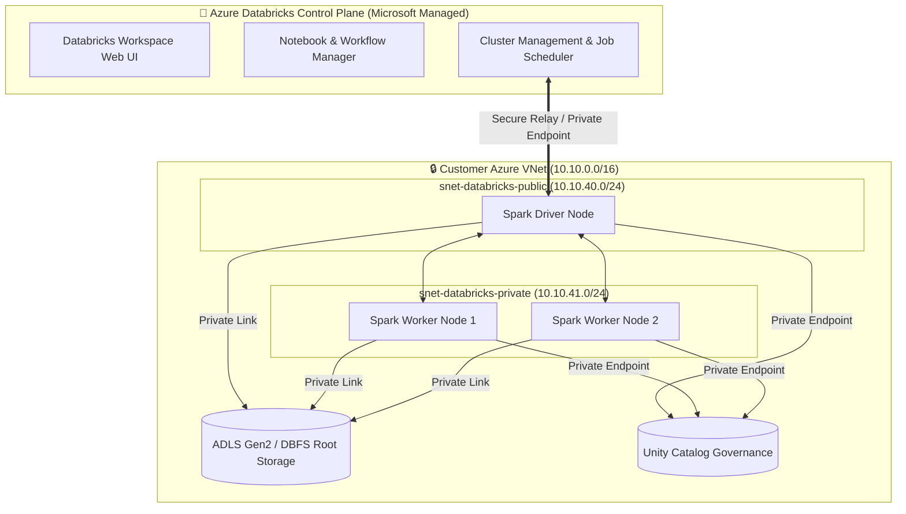
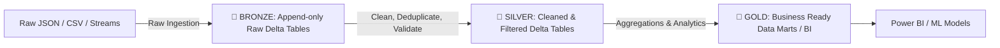

# 🧱 Azure Databricks, Delta Lake & Mosaic AI (GenAI) Master Guide 2026
## *MasalaOps Presents: "The Big Data & GenAI Blockbuster — Delta Lake to LLM RAG Pipelines!"*

> [!NOTE]
> **Director's Note:** Azure Databricks is the grand studio where massive data streams (The Extras) get transformed into refined insights (The Stars), and where Generative AI models (The Superheroes) get trained, indexed, and served at enterprise scale!

---

## 🗺️ Azure Databricks High-Level Architecture (VNet Injection + Unity Catalog)

Azure Databricks operates on a **decoupled Control Plane and Compute Plane** model. To ensure enterprise security, we deploy Databricks using **VNet Injection (No Public IPs / NPIP)**.



---

## 🧱 1. VNet Injection & Security Architecture

By default, Databricks creates worker nodes with public IP addresses. In our secure production environment, we enforce **VNet Injection with Secure Cluster Connectivity (No Public IPs / NPIP)**:

1. **`snet-databricks-public` (`10.10.40.0/24`):** Contains the Spark Driver and host network interfaces. Delegated to `Microsoft.Databricks/workspaces`.
2. **`snet-databricks-private` (`10.10.41.0/24`):** Contains the Spark Worker nodes. Delegated to `Microsoft.Databricks/workspaces`.
3. **No Public IP (NPIP):** Worker nodes communicate back to the Control Plane over secure outbound relays — no inbound public IP addresses are exposed.
4. **Unity Catalog:** Centralized governance across workspaces, enforcing table-level, row-level, and column-level RBAC for data and AI models.

---

## 🥇 2. The Medallion Architecture (Bronze → Silver → Gold)

Databricks processes data using the **Medallion Architecture**, structured into 3 Delta Lake layers:



### PySpark Code: Complete Medallion Pipeline in Databricks
```python
# databricks/medallion_pipeline.py
from pyspark.sql.functions import col, current_timestamp, from_json, to_date
from pyspark.sql.types import StructType, StringType, DoubleType, TimestampType

# 1. BRONZE LAYER: Ingest Raw Streaming Events into Delta Table
schema = StructType() \
    .add("orderId", StringType()) \
    .add("userId", StringType()) \
    .add("amount", DoubleType()) \
    .add("timestamp", StringType())

raw_df = spark.readStream \
    .format("cloudFiles") \
    .option("cloudFiles.format", "json") \
    .schema(schema) \
    .load("/mnt/raw-events/orders/")

bronze_df = raw_df.withColumn("ingested_at", current_timestamp())

# Write to Bronze Delta Table
bronze_df.writeStream \
    .format("delta") \
    .option("checkpointLocation", "/mnt/delta/checkpoints/bronze_orders") \
    .outputMode("append") \
    .table("unity_catalog.sales.bronze_orders")

# 2. SILVER LAYER: Clean, Deduplicate & Parse Dates
silver_df = spark.readStream \
    .table("unity_catalog.sales.bronze_orders") \
    .filter(col("amount") > 0) \
    .dropDuplicates(["orderId"]) \
    .withColumn("order_date", to_date(col("timestamp")))

silver_df.writeStream \
    .format("delta") \
    .option("checkpointLocation", "/mnt/delta/checkpoints/silver_orders") \
    .outputMode("append") \
    .table("unity_catalog.sales.silver_orders")

# 3. GOLD LAYER: Aggregated Daily Revenue Mart
gold_df = spark.read \
    .table("unity_catalog.sales.silver_orders") \
    .groupBy("order_date") \
    .sum("amount") \
    .withColumnRenamed("sum(amount)", "daily_revenue")

gold_df.write \
    .format("delta") \
    .mode("overwrite") \
    .saveAsTable("unity_catalog.sales.gold_daily_revenue")

print("Medallion pipeline executed successfully!")
```

---

## 🤖 3. GenAI & LLM RAG Pipelines in Azure Databricks (2026)

Azure Databricks provides **Mosaic AI** for building, fine-tuning, evaluating, and serving Generative AI models.

```mermaid
graph TD
    Documents[Raw PDF / Docs / Text] -->|1. Ingest & Chunk| PySpark[Databricks PySpark Pipeline]
    PySpark -->|2. Generate Embeddings| EmbedModel[Databricks Foundation Model API\ne.g. bge-large-en]
    EmbedModel -->|3. Store Vectors| VectorSearch[Databricks AI Search Index]
    
    UserQuery[User Natural Language Prompt] -->|4. Query| RAGApp[Fastify / Python RAG Service]
    RAGApp -->|5. AI Search Similarity| VectorSearch
    VectorSearch -->>|6. Relevant Context Chunks| RAGApp
    RAGApp -->|7. Prompt + Context| LLM[Databricks Model Serving\nLlama-3-70B / DeepSeek]
    LLM -->>|8. Grounded Answer| UserQuery
```

### Python Code: Databricks AI Search & RAG Retrieval

> Databricks AI Search is the current name for Vector Search. For index
> creation, App resources, retrieval evaluation, and MCP integration, use the
> [end-to-end guide](apps-mcp-genie-vector-search.md).
```python
# databricks/genai_rag_pipeline.py
import mlflow
from databricks.ai_search.client import AISearchClient

# 1. Initialize the current Databricks AI Search client
search_client = AISearchClient()

# Retrieve an existing AI Search index
endpoint_name = "enterprise-vector-endpoint"
index_name = "unity_catalog.ai_db.enterprise_docs_index"

# Query the AI Search index for the top three relevant chunks
def retrieve_context(query_text: str):
    index = search_client.get_index(index_name=index_name)
    results = index.similarity_search(
        query_text=query_text,
        columns=["doc_id", "content_chunk", "source_url"],
        num_results=3
    )
    
    docs = results.get("result", {}).get("data_array", [])
    context_text = "\n\n".join([doc[1] for doc in docs])
    return context_text

# 2. Track LLM Invocations with MLflow 3.x Tracing
mlflow.set_experiment("/Shared/GenAI_RAG_Experiment")

with mlflow.start_run(run_name="rag_query_execution"):
    user_query = "What is the egress firewall policy for Azure VNet?"
    
    # Log query parameter
    mlflow.log_param("query", user_query)
    
    # Retrieve context via Databricks AI Search
    context = retrieve_context(user_query)
    mlflow.log_text(context, "retrieved_context.txt")
    
    # Format Prompt
    prompt = f"""
    You are an expert Enterprise Cloud Architect. Answer the question using ONLY the context provided below.
    
    Context:
    {context}
    
    Question: {user_query}
    Answer:
    """
    
    # Call Databricks Model Serving Endpoint (e.g. Llama 3 / DeepSeek)
    from databricks.sdk import WorkspaceClient
    from databricks.sdk.service.serving import EndpointCoreParameters
    
    w = WorkspaceClient()
    response = w.serving_endpoints.query(
        name="databricks-llama-3-70b-instruct",
        dataframe_records=[{"prompt": prompt}]
    )
    
    answer = response.predictions[0]
    mlflow.log_metric("response_character_count", len(answer))
    print(f"RAG Response:\n{answer}")
```

---

## 🏗️ 4. Terraform Deployment: Azure Databricks with VNet Injection

```terraform
# Reference example (not yet implemented under terraform/azure/)

# 1. Azure Databricks Workspace with VNet Injection
resource "azurerm_databricks_workspace" "adb" {
  name                        = "adb-enterprise-prod"
  resource_group_name         = azurerm_resource_group.rg.name
  location                    = azurerm_resource_group.rg.location
  sku                         = "premium" # Required for Unity Catalog & VNet Injection
  managed_resource_group_name = "rg-adb-managed-prod"

  custom_parameters {
    no_public_ip                                       = true # NPIP (No Public IPs)
    virtual_network_id                                 = azurerm_virtual_network.vnet.id
    public_subnet_name                                 = azurerm_subnet.databricks_public.name
    private_subnet_name                                = azurerm_subnet.databricks_private.name
    public_subnet_network_security_group_association_id  = azurerm_subnet_network_security_group_association.adb_pub.id
    private_subnet_network_security_group_association_id = azurerm_subnet_network_security_group_association.adb_priv.id
  }

  tags = {
    Environment = "Production"
    ManagedBy   = "Terraform"
  }
}
```

---

## 🎬 MasalaOps Summary

> *"Databricks = Data ka grand studio! Medallion Architecture = Raw script (Bronze) → Refined dialogue (Silver) → Final blockbuster release (Gold)! AI Search + GenAI = Director ki memory jo instant answer deti hai!"*
