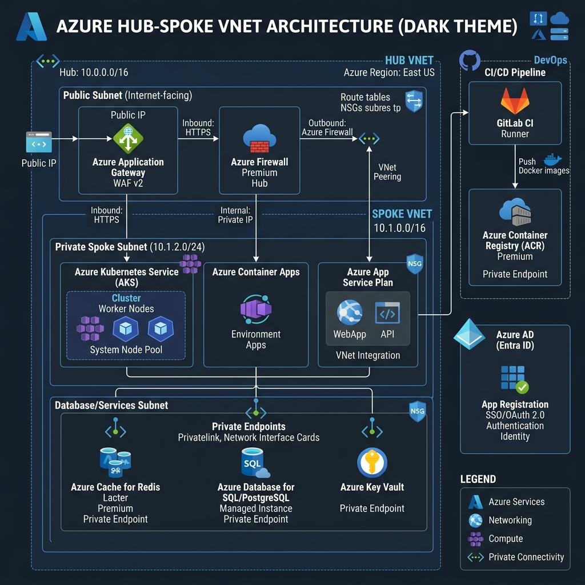
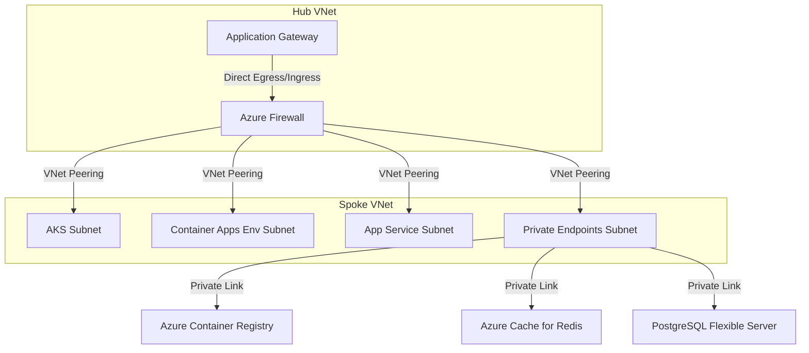
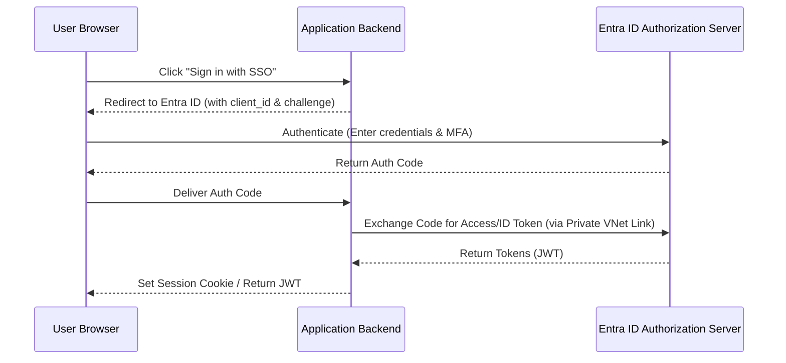
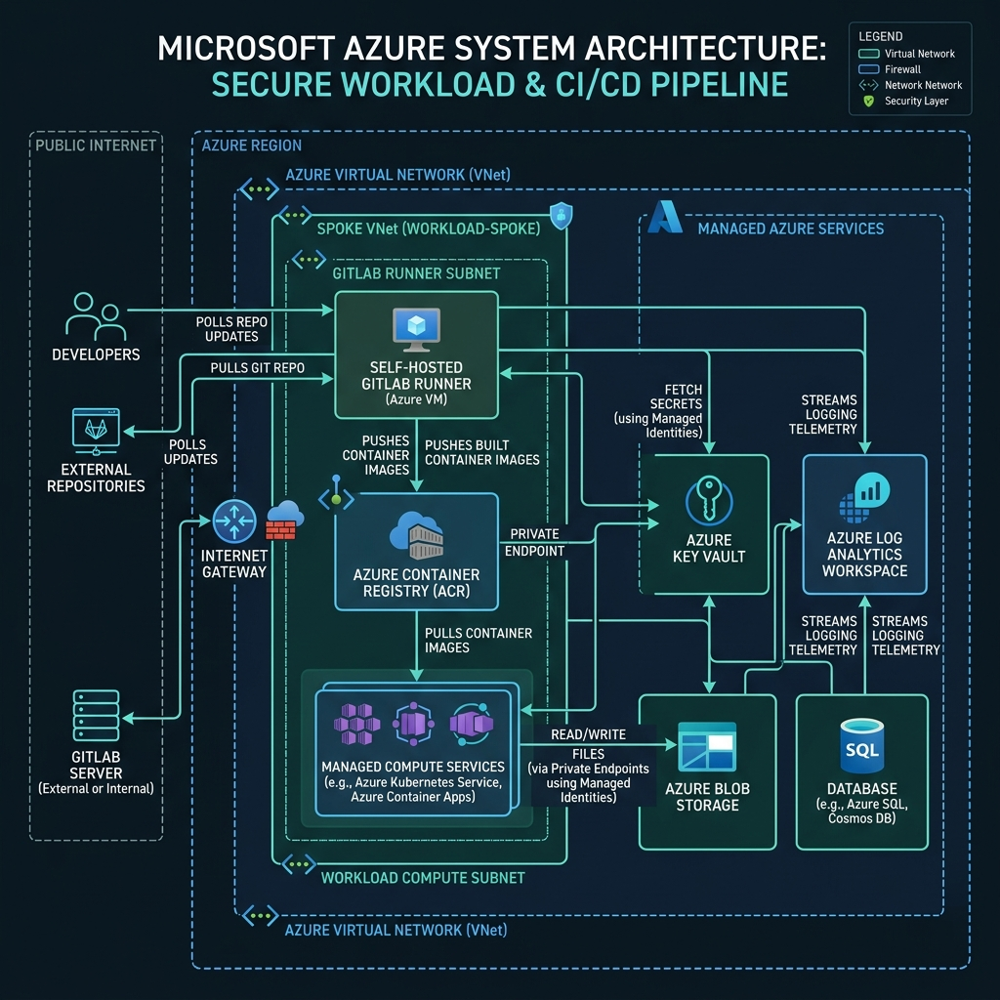
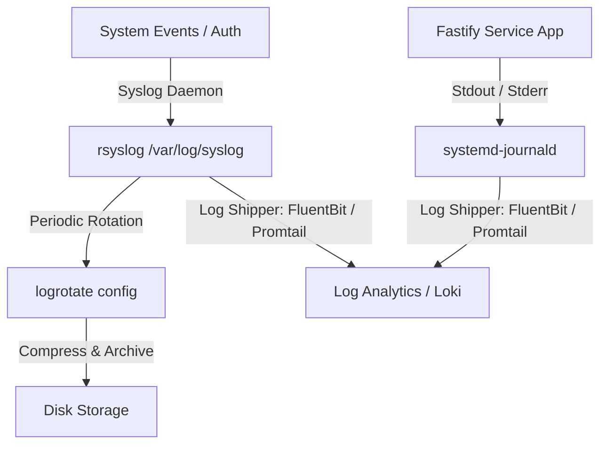
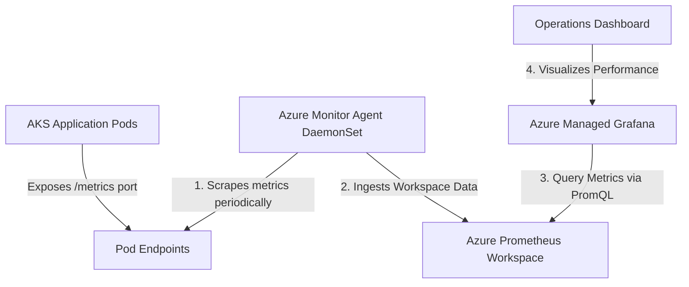

# 🎬 High-Level Design: Microsoft Azure Enterprise Infrastructure
## *MasalaOps Presents: "The Hub-Spoke Action Thriller!"*

> [!NOTE]
> **Director's Note:** In this high-security blockbuster, the Azure Hub-Spoke VNet acts as our impenetrable fortress. Our Kubernetes nodes (The Heroes) are hidden deep inside private subnets, protected by Azure Firewall (The Border Security Force) from rogue internet hackers (The Villains).

This document outlines the architecture, networking, security policies, and application hosting strategy for the Microsoft Azure deployment.

---

## 📐 Architecture Visualisation

Below is the conceptual architecture blueprint for our Azure private deployment.



---

## 🌐 Network & Resource Isolation

We implement a **Hub-Spoke VNet topology** to isolate shared network services (ingress, firewall) from workloads (AKS, Container Apps, App Service).



### 1. Subnet Segmentation
*   **Application Gateway Subnet (`10.0.1.0/24`):** Public-facing reverse proxy with WAF (Web Application Firewall) enabled.
*   **Azure Firewall Subnet (`10.0.2.0/24`):** Centralized egress router filtering outgoing traffic to whitelisted endpoints.
*   **AKS Subnet (`10.1.0.0/20`):** Secure subnet utilizing **Azure CNI (Advanced)** networking. Workloads receive native IPs from the subnet.
*   **Container Apps Environment Subnet (`10.1.16.0/21`):** Subnet allocated for internal Azure Container Apps, hosting internal microservices.
*   **App Service Subnet (`10.1.24.0/24`):** Subnet used strictly for **App Service VNet Integration** to access private databases and caches.
*   **Private Endpoint Subnet (`10.1.30.0/24`):** Hosts Private IP endpoints for PaaS resources (Redis, PostgreSQL, Key Vault, ACR).

### 2. Private Endpoints & Link Services
To prevent exposure of our backend resources to the public internet, public network access is disabled on all PaaS services. They are accessed via **Private Endpoints**:
*   `privatelink.azurecr.io` for ACR.
*   `privatelink.postgres.database.azure.com` for PostgreSQL.
*   `privatelink.redis.cache.windows.net` for Redis.
*   `privatelink.vaultcore.azure.net` for Key Vault.

---

## 🔐 SSO: Entra ID (Azure AD) App Registration

Enterprise Single Sign-On (SSO) is enabled via Microsoft Entra ID. The application leverages OAuth2 / OpenID Connect (OIDC).

### 1. App Registration Settings
*   **Application (Client) ID:** A unique GUID generated upon registration (`e.g., 88888888-4444-4444-4444-121212121212`).
*   **Directory (Tenant) ID:** The Azure tenant GUID.
*   **Redirect URI:** 
    *   Development: `http://localhost:8080/login/oauth2/code/azure`
    *   Production: `https://app.example.com/login/oauth2/code/azure`
*   **API Permissions (Scopes):**
    *   `openid`, `profile`, `email`
    *   `User.Read` (Microsoft Graph API)

### 2. Enterprise Authentication Flow
The application utilizes the **Authorization Code Flow with PKCE (Proof Key for Code Exchange)** for frontend applications:



---

## 🛠️ Compute Use-Cases

We leverage three distinct compute classes depending on workload characteristics:

1.  **Azure Kubernetes Service (AKS):**
    *   *Use Case:* Microservices requiring advanced service mesh orchestration, custom autoscaling (KEDA), or high container density.
    *   *Ingress:* Managed NGINX Ingress Controller routing traffic from App Gateway.
2.  **Azure Container Apps (ACA):**
    *   *Use Case:* Simple, serverless microservices or background event-driven processes.
    *   *Scaling:* Scales down to 0 replicas to save cost when idle. Uses KEDA scales rules internally.
3.  **Azure App Service:**
    *   *Use Case:* Monolithic web frontends or legacy APIs (Spring Boot, .NET Core) needing direct VNet integration and minimal setup.
4.  **Azure Functions:**
    *   *Use Case:* Event-driven processing (e.g., handling messages on Service Bus, file uploads in Blob Storage). Runs with Premium VNet integration to reach private Postgres/Redis.

---

## 📦 Demo Application Deployment Flow
Here is how our containerized demo application (Node.js/Express) runs and communicates inside our private Azure virtual network:


1. **Ingress Entry:** Incoming traffic enters through Application Gateway.
2. **Compute Target:** App runs inside AKS pods or Azure Container Apps inside `snet-aks`/`snet-container-apps`.
3. **SSO Hook:** Authenticates users via Azure Entra ID redirection.
4. **Data Cache:** Connects to Azure Cache for Redis via Private Endpoint (`pe-redis` in `snet-private-endpoints`).
5. **Data Storage:** Reads/Writes items to PostgreSQL Flexible Server via Private DNS mapping.

---

## 🚀 Private VM Runner & Log Analytics Pipeline
To achieve absolute data sovereignty, we deploy a self-hosted GitLab Runner on a private Virtual Machine within `snet-vm`. The runner uses private endpoints to fetch secrets and deploy containers:



### 1. VM Runner Workflow
*   **Trigger:** GitLab CI/CD pushes commit webhook.
*   **Pull:** The runner VM, utilizing Azure Firewall for external access, pulls deployment jobs.
*   **Managed Identity:** The VM runner authenticates to Key Vault (`pe-keyvault`) and Blob Storage (`pe-blob`) utilizing Azure Role-Based Access Control (RBAC) and System-Assigned Managed Identity—eliminating cleartext passwords.
*   **Build & Push:** Container images are built locally and pushed to ACR via private link.

### 2. Log Analytics Diagnostics (Centralized Auditing)
All security and database operations stream logs to Log Analytics Workspace (`law-enterprise-logs-dev`):
*   **AKS Audit Logs:** Tracks api-server executions and deployments.
*   **Key Vault Access Event logs:** Audits secret retrieval calls (`Get`, `List` operations) for threat analysis.
*   **Infrastructure Telemetry:** Aggregated metrics for CPU/Memory and database performance parameters.

---

## 💾 5. Virtual Machine / Server Logging & Retention

For virtual machines (like our private self-hosted VM Runner), maintaining system reliability requires a standardized logging and lifecycle strategy.



### 1. Log Rotation with `logrotate`
To prevent the server's disk space from filling up, the `logrotate` utility automatically rotates, compresses, and purges old logs.

#### Configuration Example (`/etc/logrotate.d/fastify-app`):
```text
/var/log/fastify/*.log {
    daily               # Rotate logs once per day
    rotate 7            # Keep only the last 7 days of logs
    compress            # Compress rotated logs to save disk space (gz)
    delaycompress       # Delay compression until the next rotation cycle
    missingok           # Do not throw error if log file is missing
    notifempty          # Do not rotate empty logs
    create 0640 appuser appgroup # Recreate empty log file with correct ownership
    sharedscripts
    postrotate
        # Reload logging daemon or service after rotation
        systemctl kill -s HUP fastify-app.service
    endscript
}
```

---

## 📊 6. Monitoring with Azure Managed Prometheus & Grafana

Azure provides fully managed cloud-native monitoring for Kubernetes workloads using **Azure Monitor managed service for Prometheus** and **Azure Managed Grafana**.



### 1. Azure Monitor Managed Service for Prometheus
*   **Scraping:** Uses the **Azure Monitor Agent (AMA)** (deployed as a DaemonSet on AKS) to automatically discover and scrape Pod metrics exposed on `/metrics` endpoints.
*   **Storage:** Stores raw metrics data in an isolated **Azure Monitor Workspace**, supporting Prometheus Query Language (PromQL) queries.
*   **Alerting:** Uses Prometheus alert rules to trigger Azure Action Groups (PagerDuty, SMS, Webhooks) when CPU or error rates spike.

### 2. Azure Managed Grafana Integration
*   **Data Source:** Connected directly to the Azure Monitor Workspace.
*   **IAM Roles:** Users or Managed Identities must be assigned the **Monitoring Reader** and **Grafana Admin** roles in Azure RBAC.
*   **Dashboards:** Visualizes real-time metrics (like cluster capacity, pod network traffic, CPU/Memory resource constraints, and database connection pools).


