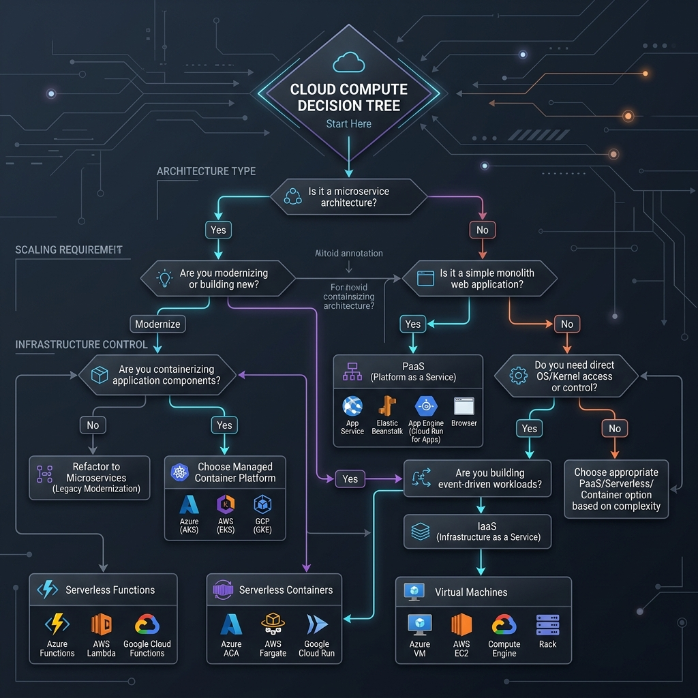

# Cloud Compute Decision Matrix: When to Use What

This guide provides a structured decision framework for choosing the appropriate compute tier across Microsoft Azure, AWS, and GCP. Selecting the right model minimizes operational overhead, ensures proper scalability, and optimizes hosting costs.

---

## 📐 Compute Decision Tree

Below is the decision flowchart guiding the selection process based on workload characteristics:

---

## 📊 Comparative Analysis Matrix

| Metric / Feature | Managed Kubernetes (AKS/EKS/GKE) | Serverless Containers (ACA/Fargate/Cloud Run) | PaaS / App Services (App Service/Beanstalk) | Virtual Machines (VM/EC2/GCE) |
| :--- | :--- | :--- | :--- | :--- |
| **Operational Effort** | High (Cluster configuration, ingress, updates) | Low (No infrastructure management) | Minimal (Fully managed deployment) | Very High (OS patching, networking, scaling) |
| **Scaling Characteristics**| Custom Metrics (KEDA), HPA | Fast scaling, **scales to 0** when idle | Standard autoscaling rules (CPU/RAM) | Slow scaling (VM boot time overhead) |
| **Cost Model** | Pay for VM nodes + cluster fee | Pay per execution time / request count | Pay per service tier (fixed monthly rate) | Pay flat hourly rate per instance |
| **Networking Integration**| Direct CNI, custom mesh | Integrated subnets / private endpoints | VNet integration hooks | Native subnet connectivity |
| **Best Suited For** | Microservice meshes, high container density | Event-driven APIs, sporadic web traffic | Monolithic APIs, simple web sites | Stateful legacy apps, raw kernel access |

---

## 🛠️ Deep Dive: When to Use Which Class

### 1. Managed Kubernetes (AKS / EKS / GKE)
**Choose this tier if:**
*   You have a large microservice ecosystem (e.g. >10 services) that requires service mesh control (Linkerd, Istio).
*   You require fine-grained resource allocations, custom network policies (Calico), or complex daemonset agents.
*   You need advanced event-driven autoscaling based on message queues (KEDA).
*   *Platform selection:* **GKE** offers the best autopilot mode; **AKS** has excellent native Entra ID Workload Identity; **EKS** is robust but requires manual ingress/ALB configurations.

### 2. Serverless Containers (Azure Container Apps / AWS ECS Fargate / GCP Cloud Run)
**Choose this tier if:**
*   You are deploying stateless web APIs, microservices, or queue processing jobs.
*   You want the container scaling benefits without the operational burden of maintaining Kubernetes clusters.
*   **Scale-to-zero** is a priority for cost-savings in non-production environments.
*   *Platform selection:* **GCP Cloud Run** is extremely fast and integrates natively with GCP HTTPS Load Balancers; **Azure Container Apps** runs on K8s/KEDA under the hood, allowing custom scaling rules; **AWS ECS Fargate** is secure and stable, but does not natively scale to 0.

### 3. PaaS / App Services (Azure App Service / AWS Elastic Beanstalk / GCP App Engine)
**Choose this tier if:**
*   You have a traditional web application (e.g. Spring Boot, Rails, Django, Node.js) or static site.
*   You prefer a direct git-based or zip-based deploy without compiling Docker containers.
*   You need built-in SSL certificates, domain bindings, and diagnostic profiling tools.
*   *Platform selection:* **Azure App Service** is the most feature-rich with seamless VNet integration; **AWS Beanstalk** is a wrapper around EC2/Auto-scaling groups; **GCP App Engine** is best suited for classic web apps but is largely succeeded by Cloud Run.

### 4. Virtual Machines (Azure VM / AWS EC2 / Google Compute Engine)
**Choose this tier if:**
*   You are running legacy enterprise software that requires specific kernel versions, custom kernel modules, or direct access to the operating system.
*   You require raw, unvirtualized performance on dedicated hardware.
*   You are deploying self-hosted runners or agents (e.g. GitLab CI Runners) that need local root privileges to run Docker-in-Docker or build scripts.
