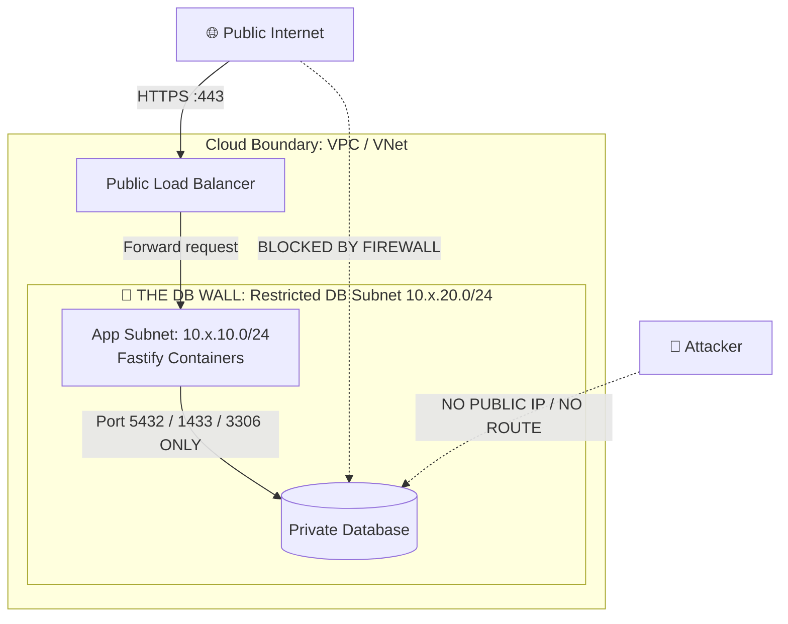
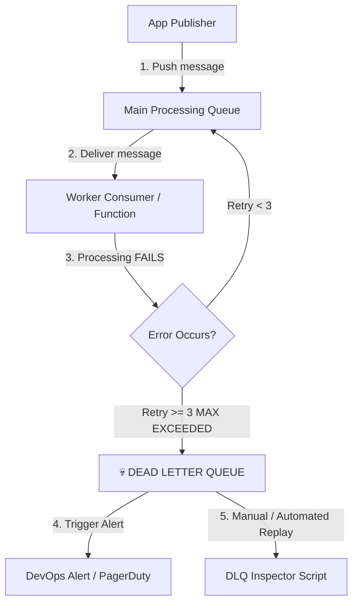
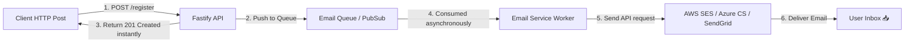
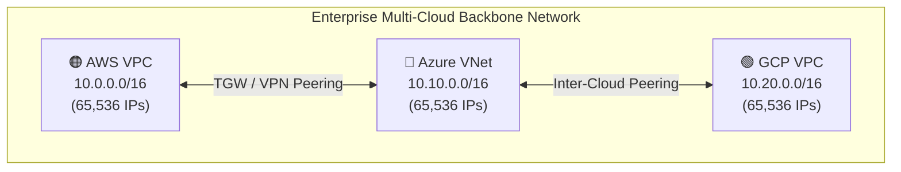

# 🛡️ DB Wall, Dead Letter Queues (DLQ), Email Services & CIDR Subnetting
## *MasalaOps Presents: "The Ultimate Infrastructure Security & Resiliency Manual"*

> [!NOTE]
> **Director's Note:** In this master manual, we tackle the four pillars of enterprise DevOps:
> 1. **The DB Wall** — Keeping databases locked in impenetrable private subnets.
> 2. **Dead Letter Queue (DLQ)** — The safety net that captures broken messages so your pipeline never crashes.
> 3. **Email Messaging Service** — Asynchronous notification pipelines using cloud-native email engines.
> 4. **CIDR & Subnetting** — The mathematical blueprint for non-overlapping IP address spaces across Azure, AWS, and GCP.

---

# 🧱 PART 1: The DB Wall (Database Network Isolation)

The **DB Wall** is an architectural pattern that completely isolates database instances inside dedicated private subnets with zero internet access, allowing connections **only** from authorized application subnets over private IPs.



## 🔒 Cross-Cloud DB Wall Comparison & Terraform Snippets

### 1. Azure DB Wall (Private Endpoint + Network Security Group)
- **Subnet:** Dedicated `snet-db` (`10.10.20.0/24`) with `PrivateEndpointNetworkPolicies = Enabled`.
- **Firewall:** NSG rule blocking ALL inbound traffic except from `snet-app` (`10.10.10.0/24`) on port `5432` / `1433`.
- **Public Access:** Explicitly disabled (`public_network_access_enabled = false`).

```terraform
# Azure DB Wall: Private Endpoint for Azure SQL / Postgres
resource "azurerm_private_endpoint" "db_wall_endpoint" {
  name                = "pe-postgres-db"
  location            = azurerm_resource_group.rg.location
  resource_group_name = azurerm_resource_group.rg.name
  subnet_id           = azurerm_subnet.db_subnet.id # snet-db (10.10.20.0/24)

  private_service_connection {
    name                           = "psc-postgres"
    private_connection_resource_id = azurerm_postgresql_flexible_server.db.id
    subresource_names              = ["postgresqlServer"]
    is_manual_connection           = false
  }
}
```

---

### 2. AWS DB Wall (Isolated DB Subnet Group + Security Group Rules)
- **Subnet:** Private DB Subnets across 2 AZs (`10.0.20.0/24` and `10.0.21.0/24`).
- **Security Group:** Inbound rule allows PostgreSQL port `5432` ONLY where source is `aws_security_group.app_sg.id` (Security Group chaining).

```terraform
# AWS DB Wall: Security Group Chaining (No IP hardcoding!)
resource "aws_security_group" "db_wall_sg" {
  name        = "db-wall-sg"
  vpc_id      = aws_vpc.main.id
  description = "Allows DB access ONLY from App Security Group"

  ingress {
    description     = "PostgreSQL from App Tier"
    from_port       = 5432
    to_port         = 5432
    protocol        = "tcp"
    security_groups = [aws_security_group.app_sg.id] # SG Chaining!
  }

  egress {
    description = "No egress allowed"
    from_port   = 0
    to_port     = 0
    protocol    = "-1"
    cidr_blocks = [] # Completely blocked outbound
  }
}
```

---

### 3. GCP DB Wall (Private Services Access / PSC + Service Account Firewall)
- **Subnet:** Private Service Access peering range (`10.20.20.0/24`).
- **Firewall:** Targets network tag `db-wall` or service account `sa-postgres`.

```terraform
# GCP DB Wall: Cloud SQL with Private IP Only
resource "google_sql_database_instance" "db_wall_instance" {
  name             = "db-wall-postgres"
  database_version = "POSTGRES_15"
  region           = "us-central1"

  settings {
    tier = "db-f1-micro"

    ip_configuration {
      ipv4_enabled    = false # DISABLES PUBLIC IP
      private_network = google_compute_network.vpc.id
    }
  }
}
```

---

# 💀 PART 2: Dead Letter Queue (DLQ) & Poison Pill Management

## What is a Dead Letter Queue (DLQ)?
A **Dead Letter Queue (DLQ)** is a secondary side-car queue that holds messages that cannot be processed successfully after a pre-configured number of retry attempts (e.g. 3 retries).



### Why DLQs Are Essential:
1. **Prevents Poison Pills:** A corrupted or malformed message (e.g., missing mandatory JSON field `userId`) will cause the consumer worker to crash continuously. Without a DLQ, the worker enters an infinite crash loop.
2. **Zero Data Loss:** Failed messages are not deleted; they are parked safely in the DLQ for manual inspection and bug fixes.
3. **Automated Replaying:** Once the bug in the code is fixed, messages from the DLQ can be replayed back into the main queue.

---

## 🛠️ Cross-Cloud DLQ Implementation & Code

### 1. Azure Service Bus DLQ (Auto Dead-Lettering)
Azure Service Bus automatically dead-letters messages when:
- `maxDeliveryCount` (default: 10) is exceeded.
- Message TTL (Time-To-Live) expires.
- Header validation fails.

#### Node.js Code: Reading & Replaying Messages from Azure DLQ
```javascript
// cicd/scripts/azure-dlq-replayer.js
const { ServiceBusClient } = require('@azure/service-bus');

const sbClient = new ServiceBusClient(process.env.SERVICE_BUS_CONNECTION_STRING);

// Access the Dead Letter Queue receiver sub-queue
const receiver = sbClient.createReceiver('orders-queue', {
  subQueueType: 'deadLetter'
});
const sender = sbClient.createSender('orders-queue');

async function processDLQ() {
  console.log('Fetching messages from Dead Letter Queue...');
  const messages = await receiver.receiveMessages(10, { maxWaitTimeInMs: 5000 });

  for (const message of messages) {
    console.log(`[DLQ] DeadLetterReason: ${message.deadLetterReason}`);
    console.log(`[DLQ] DeadLetterErrorDescription: ${message.deadLetterErrorDescription}`);
    console.log(`[DLQ] Payload:`, message.body);

    // Fix payload if necessary, then replay back to main queue
    if (message.body && message.body.orderId) {
      await sender.sendMessages({ body: message.body });
      await receiver.completeMessage(message);
      console.log(`[DLQ] Replayed message ${message.body.orderId} back to main queue!`);
    }
  }
}

processDLQ().catch(console.error);
```

---

### 2. AWS SQS DLQ Setup & Lambda Trigger
- Main Queue: `orders-queue.fifo`
- DLQ: `orders-dlq.fifo` (Redrive Policy: `maxReceiveCount = 3`)

#### AWS SQS Redrive Policy (Terraform)
```terraform
resource "aws_sqs_queue" "dlq" {
  name                        = "orders-dlq.fifo"
  fifo_queue                  = true
  content_based_deduplication = true
}

resource "aws_sqs_queue" "main_queue" {
  name                        = "orders-queue.fifo"
  fifo_queue                  = true
  content_based_deduplication = true

  redrive_policy = jsonencode({
    deadLetterTargetArn = aws_sqs_queue.dlq.arn
    maxReceiveCount     = 3 # After 3 failures, move to DLQ
  })
}
```

---

### 3. GCP Pub/Sub Dead-Letter Policy
```bash
# Create DLQ Topic
gcloud pubsub topics create orders-dlq-topic

# Create Subscription attached to DLQ Topic
gcloud pubsub subscriptions create orders-dlq-sub --topic=orders-dlq-topic

# Update Main Subscription with Dead-Letter Policy
gcloud pubsub subscriptions update orders-main-sub \
    --dead-letter-topic=orders-dlq-topic \
    --max-delivery-attempts=5
```

---

# 📧 PART 3: Email & Messaging Service Integration

To keep APIs fast, email sending **must never happen inside the synchronous HTTP request thread**. Sending emails via SMTP/REST can take 1 to 3 seconds. Doing this synchronously blocks the Fastify worker thread.



---

## 💻 Cross-Cloud Email Service Implementation & Code

### 1. Azure Communication Services (Email)
```javascript
// demo-app/services/azureEmail.js
const { EmailClient } = require('@azure/communication-email');

const emailClient = new EmailClient(process.env.AZURE_COMMUNICATION_CONNECTION_STRING);

async function sendWelcomeEmail(toEmail, userName) {
  const emailMessage = {
    senderAddress: 'DoNotReply@domain.azurecomm.net',
    content: {
      subject: 'Welcome to Senorita Outages!',
      html: `<h1>Welcome, ${userName}!</h1><p>Your account is ready.</p>`
    },
    recipients: {
      to: [{ address: toEmail }]
    }
  };

  const poller = await emailClient.beginSend(emailMessage);
  const result = await poller.pollUntilDone();
  console.log(`[AzureEmail] Sent email to ${toEmail}, status: ${result.status}`);
}

module.exports = { sendWelcomeEmail };
```

---

### 2. Amazon SES (Simple Email Service) with AWS SDK v3
```javascript
// demo-app/services/awsEmail.js
const { SESClient, SendEmailCommand } = require('@aws-sdk/client-ses');

const ses = new SESClient({ region: process.env.AWS_REGION });

async function sendOrderConfirmationEmail(toEmail, orderId, totalAmount) {
  const command = new SendEmailCommand({
    Source: 'orders@yourdomain.com',
    Destination: { ToAddresses: [toEmail] },
    Message: {
      Subject: { Data: `Order Confirmation #${orderId}` },
      Body: {
        Html: { Data: `<h2>Order #${orderId} Confirmed!</h2><p>Total: ₹${totalAmount}</p>` }
      }
    }
  });

  const response = await ses.send(command);
  console.log(`[AWS SES] Email sent! MessageId: ${response.MessageId}`);
}

module.exports = { sendOrderConfirmationEmail };
```

---

### 3. GCP SendGrid / Mailgun Integration
```javascript
// demo-app/services/gcpEmail.js
const sgMail = require('@sendgrid/mail');

sgMail.setApiKey(process.env.SENDGRID_API_KEY);

async function sendAlertEmail(toEmail, alertDetails) {
  const msg = {
    to: toEmail,
    from: 'alerts@yourdomain.com',
    subject: `🚨 CRITICAL ALERT: ${alertDetails.title}`,
    text: alertDetails.description,
    html: `<strong>CRITICAL ALERT:</strong> <p>${alertDetails.description}</p>`
  };

  await sgMail.send(msg);
  console.log(`[SendGrid] Alert email dispatched to ${toEmail}`);
}

module.exports = { sendAlertEmail };
```

---

# 🌐 PART 4: CIDR & Subnetting Deep Dive (All 3 Clouds)

## What is CIDR?
**CIDR (Classless Inter-Domain Routing)** is a method for allocating IP addresses. It uses a prefix mask notation (e.g. `/16`, `/24`) to specify how many IP addresses belong to a network range.

### Understanding Prefix Masks:
| CIDR Mask | Subnet Mask | Available IPs | Common Cloud Use Case |
|:---|:---|:---|:---|
| `/16` | `255.255.0.0` | **65,536** | Entire VPC / VNet Network Boundary |
| `/20` | `255.255.240.0` | **4,096** | Large Kubernetes Pod Subnet (AKS / EKS / GKE) |
| `/24` | `255.255.255.0` | **256** (251 usable*) | Standard Application / Database Subnet |
| `/28` | `255.255.255.240` | **16** (11 usable*) | Isolated Private Endpoint / Transit Subnet |

> **\*Cloud Reserved IPs:** Azure reserves 5 IPs per subnet (`.0` network, `.1` gateway, `.2`/`.3` DNS, `.255` broadcast). AWS reserves 5 IPs. GCP reserves 4 IPs.

---

## 📐 Enterprise Non-Overlapping Multi-Cloud IP Architecture

When building a multi-cloud network connected via VPN or Transit Gateways, **IP address spaces MUST NOT overlap**.



---

### Detailed Subnet Breakdown Table:

```text
====================================================================================
AWS VPC (10.0.0.0/16)
====================================================================================
Subnet Name            CIDR Block       IP Range                 Purpose
------------------------------------------------------------------------------------
Public Subnet AZ-A     10.0.1.0/24      10.0.1.0 - 10.0.1.255    ALB, NAT Gateways
Public Subnet AZ-B     10.0.2.0/24      10.0.2.0 - 10.0.2.255    ALB Redundancy
App Subnet AZ-A        10.0.10.0/24     10.0.10.0 - 10.0.10.255  EKS Worker Pods
App Subnet AZ-B        10.0.11.0/24     10.0.11.0 - 10.0.11.255  EKS Worker Pods
DB Wall Subnet AZ-A    10.0.20.0/24     10.0.20.0 - 10.0.20.255  RDS Postgres (No IGW)
DB Wall Subnet AZ-B    10.0.21.0/24     10.0.21.0 - 10.0.21.255  RDS Multi-AZ Replica

====================================================================================
AZURE VNet (10.10.0.0/16)
====================================================================================
Subnet Name            CIDR Block       IP Range                 Purpose
------------------------------------------------------------------------------------
snet-ingress           10.10.1.0/24     10.10.1.0 - 10.10.1.255  App Gateway (WAF)
snet-aks               10.10.10.0/20    10.10.10.0 - 10.10.25.255 AKS Container Pods
snet-db (DB Wall)      10.10.20.0/24    10.10.20.0 - 10.10.20.255 Azure SQL / Private EP
snet-vm-runner         10.10.30.0/24    10.10.30.0 - 10.10.30.255 Private GitLab Runner

====================================================================================
GCP VPC (10.20.0.0/16 - Global VPC)
====================================================================================
Subnet Name            CIDR Block       IP Range                 Purpose
------------------------------------------------------------------------------------
subnet-us-east-app     10.20.10.0/24    10.20.10.0 - 10.20.10.255 GKE Cluster Nodes
subnet-us-east-db      10.20.20.0/24    10.20.20.0 - 10.20.20.255 Cloud SQL PSC
subnet-europe-app      10.20.30.0/24    10.20.30.0 - 10.20.30.255 EU GKE Region
```

---

## 🎬 MasalaOps Summary

> *"DB Wall = Villain log bahar se andar nahi aa sakte! DLQ = Chhutti par gaya message jo baad mein dubara try karenge! Email Queue = Secretary ko letter de diya, main hero aage badh gaya! CIDR Subnetting = Har cloud state ka apna pincode, overlap hua toh postman confused!"*

> **Translation:**
> - **DB Wall:** Blockade preventing external villains from entering the vault!
> - **DLQ:** A safety box holding failed messages for inspection so the main show doesn't stop!
> - **Email Queue:** Handing a letter to your assistant so the hero moves forward without waiting!
> - **CIDR Subnetting:** Giving each cloud region its own distinct postal code — if ranges overlap, packets get lost!
