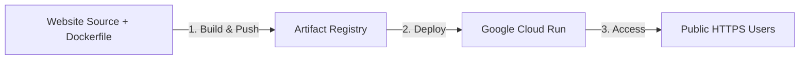

# 🚀 Deploying a Website on Google Cloud Run
## *MasalaOps Presents: "The Cloud Run Blockbuster Release!"*

> [!NOTE]
> **Director's Note:** In this release, Google Cloud Run acts as our serverless theater. It deploys our containerized website (The Hero) in seconds, scales it down to zero when the audience goes home, and ramps it up instantly when traffic surges!

---

## 🏗️ 1. Deployment Workflow Overview

Deploying a website to Cloud Run involves three main stages: Containerizing the website, pushing the image to Google Artifact Registry, and deploying the container.



---

## 💻 2. Step 1: Containerize the Website

You can serve a website on Cloud Run using either **NGINX** (for static HTML/JS sites) or **Fastify** (for dynamic backend-driven sites).

### Option A: Static Website (NGINX Dockerfile)
```dockerfile
# Dockerfile
# Stage 1: Build static assets
FROM node:20-alpine AS builder
WORKDIR /app
COPY package*.json ./
RUN npm ci
COPY . .
RUN npm run build # Outputs to /app/dist

# Stage 2: Serve via NGINX
FROM nginx:alpine
COPY --from=builder /app/dist /usr/share/nginx/html
# NGINX runs on port 80; Cloud Run expects port 8080 by default
COPY nginx.conf /etc/nginx/conf.d/default.conf
EXPOSE 8080
CMD ["nginx", "-g", "daemon off;"]
```

#### NGINX Configuration (`nginx.conf`):
Ensure NGINX listens on port `8080` (Cloud Run's default port):
```text
server {
    listen 8080;
    server_name localhost;

    location / {
        root /usr/share/nginx/html;
        index index.html index.htm;
        try_files $uri $uri/ /index.html;
    }
}
```

---

## 🚀 3. Step 2: Build & Push to Artifact Registry

First, authenticate to Google Cloud and create a Docker repository in **Artifact Registry**:

```bash
# 1. Authenticate with Google Cloud CLI
gcloud auth login

# 2. Set your active project
gcloud config set project enterprise-devops-project

# 3. Create a Docker repository in Artifact Registry
gcloud artifacts repositories create web-repo \
    --repository-format=docker \
    --location=us-central1 \
    --description="Docker repository for enterprise websites"

# 4. Configure Docker credentials for authentication
gcloud auth configure-docker us-central1-docker.pkg.dev
```

Now, build and push your Docker image:
```bash
# Tag format: <region>-docker.pkg.dev/<project-id>/<repo-name>/<image-name>:<tag>
docker build -t us-central1-docker.pkg.dev/enterprise-devops-project/web-repo/my-website:v1.0 .

docker push us-central1-docker.pkg.dev/enterprise-devops-project/web-repo/my-website:v1.0
```

---

## 🌎 4. Step 3: Deploy to Google Cloud Run

Deploy the container image to Cloud Run using a single command:

```bash
gcloud run deploy my-website-service \
    --image=us-central1-docker.pkg.dev/enterprise-devops-project/web-repo/my-website:v1.0 \
    --region=us-central1 \
    --allow-unauthenticated \
    --port=8080 \
    --min-instances=0 \
    --max-instances=10 \
    --memory=512Mi \
    --cpu=1
```

### Key Deployment Parameters:
*   `--allow-unauthenticated`: Makes the website publicly accessible on the internet.
*   `--port=8080`: Instructs Cloud Run to route incoming HTTP requests to port `8080` inside the container.
*   `--min-instances=0`: Enforces scale-to-zero. If there is no traffic, GCP shuts down all running container instances to eliminate billing costs.
*   `--max-instances=10`: Sets the upper scaling boundary to prevent runaway costs during high-traffic spikes.

---

## 🔗 5. Step 4: Custom Domain Mapping

Once deployed, Cloud Run provides a default URL (e.g. `https://my-website-service-xyz.a.run.app`). To link it to your custom domain:

1.  Go to the **Cloud Run Console**.
2.  Click **Manage Custom Domains**.
3.  Click **Add Mapping**, select your service, and enter your domain (e.g., `www.example.com`).
4.  GCP generates DNS records (usually a **CNAME** pointing to `ghs.googlehosted.com.`).
5.  Add these records to your DNS provider (e.g., Cloud DNS, Route 53, or GoDaddy). GCP automatically provisions a free managed **SSL/TLS certificate** once the DNS propagates.
