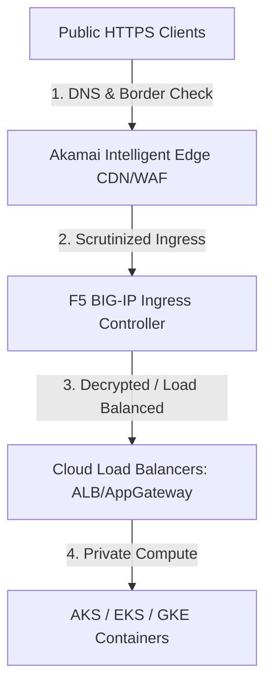
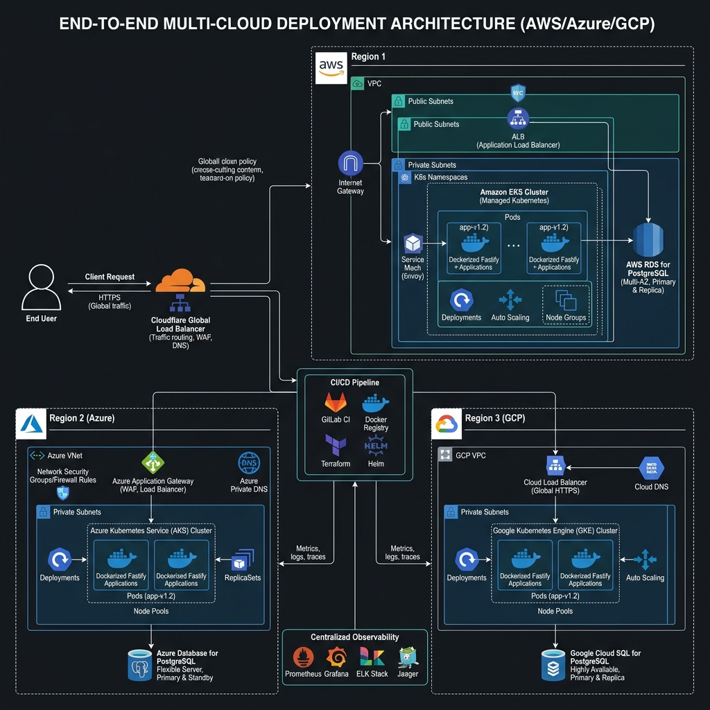

# 🌐 Edge Security (Akamai & F5) & Multi-Cloud Fastify Demo Architecture
## *MasalaOps Presents: "The Global Edge Blockbuster!"*

> [!NOTE]
> **Director's Note:** In this high-scale global blockbuster, **Akamai** is our elite border security force guarding the outer edge. **F5 BIG-IP** is the security gatekeeper at our local datacenter. Together, they guide the traffic securely into AWS, Azure, and GCP hosting our Fastify container heroes!

---

## 🛡️ 1. Edge Security: Why Akamai & F5 Are Critical

In modern cloud-native enterprises, deploying applications across public clouds (AWS/Azure/GCP) leaves the system boundaries exposed. To secure this surface, organizations place **Akamai** and **F5 BIG-IP** in front of cloud load balancers.



### Akamai: The Edge Guard
Operates globally at the Internet **Edge** (closer to the user).
*   **Global Scale & DDoS Protection:** Absorbs massive layer 3/4/7 DDoS attacks before they reach your cloud networks.
*   **Edge WAF & Bot Manager:** Inspects requests at the edge, blocking malicious SQL injections and scrapers.
*   **Content Delivery Network (CDN):** Caches static assets (images, scripts, html) globally, reducing latency and backend container compute loads.

### F5 BIG-IP: The Ingress Gatekeeper
Operates at the **Data Center / Virtual Network Entrance** (inside or peered to your VPC/VNet).
*   **Advanced Ingress Control:** Performs highly granular load balancing, routing traffic based on session cookies, headers, or client certificates.
*   **Hardware / Software SSL Offloading:** Performs cryptographically accelerated SSL decryption, stripping TLS layers before sending clear traffic to internal subnets.
*   **WAF Integration (F5 ASM):** Runs deep packet inspection to police API requests and prevent OWASP Top 10 vulnerabilities.

---

## 🏗️ 2. Multi-Cloud Fastify Demo Project Architecture

This architecture outlines how a Dockerized **Fastify application** is deployed concurrently across AWS, Azure, and GCP, using Akamai and F5 as the unified ingress perimeter.



### Cloud Breakdown:
1.  **AWS Sub-System:**
    *   *Compute:* Fastify container running inside private EKS worker nodes.
    *   *Database:* Amazon RDS PostgreSQL configured in Multi-AZ mode.
2.  **Azure Sub-System:**
    *   *Compute:* Fastify container running inside private AKS node pools.
    *   *Database:* Azure SQL database isolated with Private Endpoints.
3.  **GCP Sub-System:**
    *   *Compute:* Fastify container running inside GKE private nodes.
    *   *Database:* Cloud SQL PostgreSQL peered over Private Service Connect.

---

## 🎨 3. Eraser.io Diagram-as-Code (DSL Scripts)

Paste the following DSL blocks into `https://app.eraser.io` to edit the diagrams dynamically:

### Diagram A: Akamai and F5 Ingress Flow
```text
// Akamai and F5 Ingress Flow
Client [icon: monitor, label: "Client Web Browser"]
Akamai [icon: key, label: "Akamai Edge WAF & CDN"]
F5_BIGIP [icon: key, label: "F5 BIG-IP Ingress Gateway"]
Cloud_Load_Balancer [icon: gcp-load-balancing, label: "Cloud ALB / App Gateway"]
Pods [icon: gcp-cloud-run, label: "Fastify Container Pods"]

Client -> Akamai: Request HTTPS Page
Akamai -> F5_BIGIP: Scrub DDoS & Forward to Datacenter Ingress
F5_BIGIP -> Cloud_Load_Balancer: Offload SSL & Route
Cloud_Load_Balancer -> Pods: Route path request
```

### Diagram B: Multi-Cloud Fastify Demo Architecture
```text
// Multi-Cloud Fastify Demo Architecture
Global_DNS [icon: gcp, label: "Akamai Global Traffic Management (GTM)"]

subgraph AWS_VPC [color: orange]
  EKS_Cluster [icon: gcp-cloud-run, label: "EKS Private Nodes (Fastify)"]
  RDS_Postgres [icon: database, label: "RDS PostgreSQL Multi-AZ"]
end

subgraph Azure_VNet [color: blue]
  AKS_Cluster [icon: gcp-cloud-run, label: "AKS Private Pools (Fastify)"]
  Azure_SQL [icon: database, label: "Azure SQL Private Link"]
end

subgraph GCP_VPC [color: green]
  GKE_Cluster [icon: gcp-cloud-run, label: "GKE Private Subnet (Fastify)"]
  Cloud_SQL [icon: database, label: "Cloud SQL Postgres PSC"]
end

Global_DNS -> EKS_Cluster: Route Traffic (AWS Region)
Global_DNS -> AKS_Cluster: Route Traffic (Azure Region)
Global_DNS -> GKE_Cluster: Route Traffic (GCP Region)

EKS_Cluster -> RDS_Postgres: Read/Write
AKS_Cluster -> Azure_SQL: Read/Write
GKE_Cluster -> Cloud_SQL: Read/Write
```
