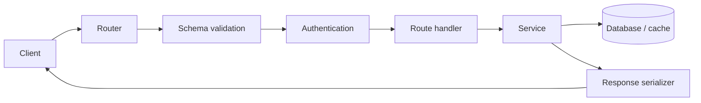
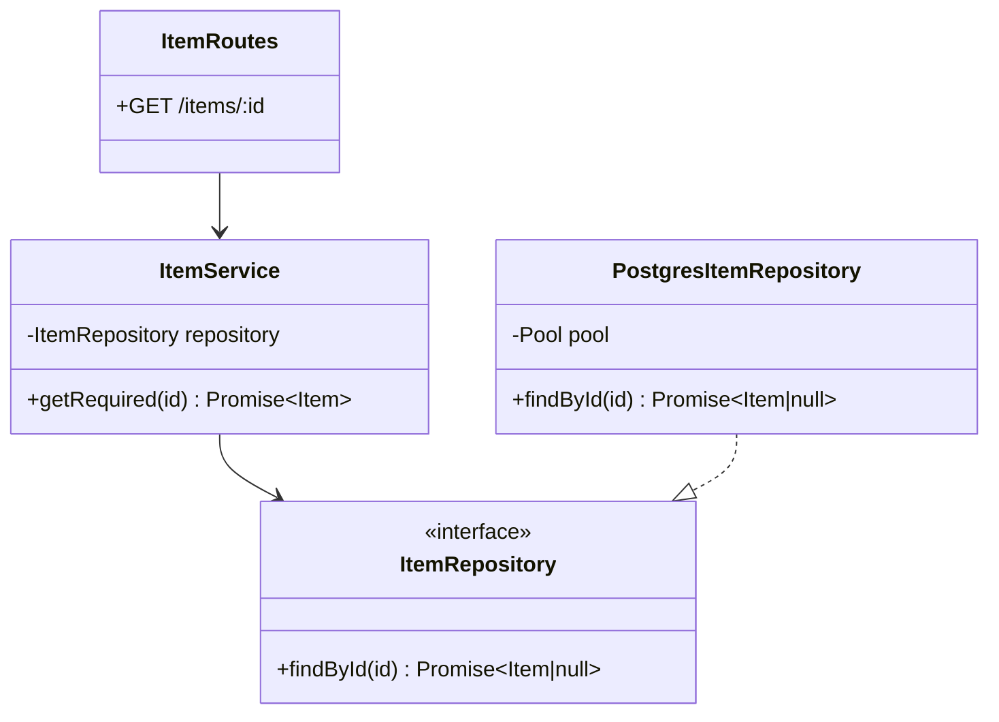
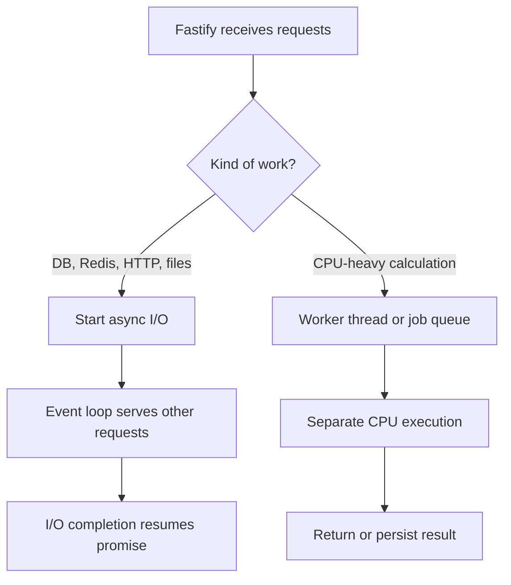
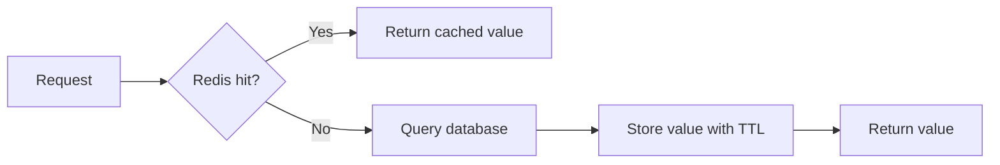
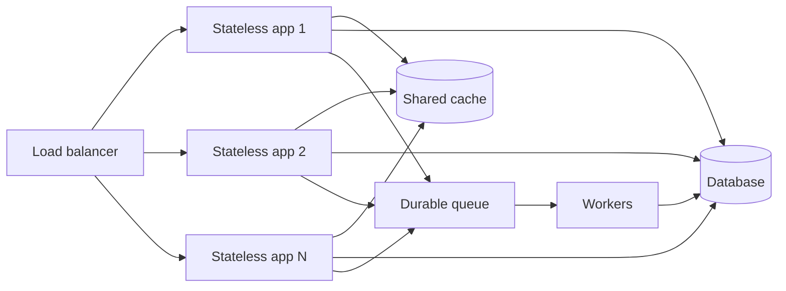
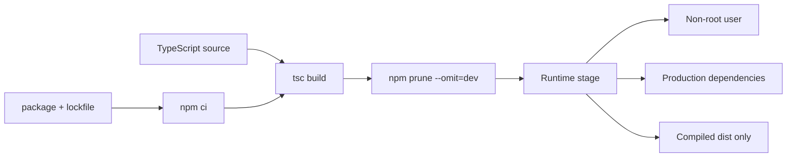
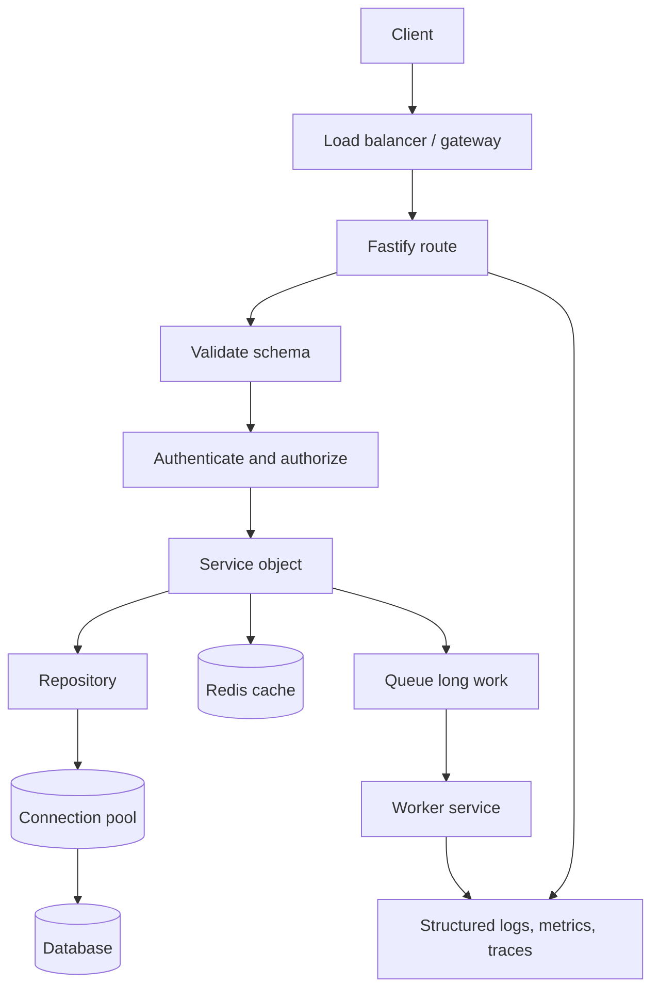

# Fastify + TypeScript: Beginner to Advanced

This guide explains Fastify from first route to production architecture. Examples
use strict TypeScript and match the structure used by `demo-app/`.

## 1. Mental model

Fastify processes one request through a lifecycle:



Fastify gives:

- Router: matches HTTP method and URL.
- Request: headers, params, query, and body.
- Reply: status, headers, and response body.
- Schema: validates input and serializes output.
- Plugin: encapsulates routes or infrastructure.
- Hook: runs at a lifecycle stage.
- Decorator: adds a typed shared capability.

## 2. Strict TypeScript setup

```json
{
  "scripts": {
    "build": "tsc -p tsconfig.json",
    "start": "node dist/server.js",
    "dev": "tsx watch src/server.ts",
    "typecheck": "tsc -p tsconfig.json --noEmit"
  },
  "devDependencies": {
    "@types/node": "^22.15.0",
    "tsx": "^4.19.4",
    "typescript": "^5.8.3"
  }
}
```

Important compiler options:

```json
{
  "compilerOptions": {
    "target": "ES2022",
    "module": "CommonJS",
    "moduleResolution": "Node",
    "rootDir": "src",
    "outDir": "dist",
    "strict": true,
    "esModuleInterop": true,
    "forceConsistentCasingInFileNames": true,
    "skipLibCheck": true,
    "sourceMap": true
  },
  "include": ["src/**/*.ts"]
}
```

`strict` catches missing fields, unsafe `undefined`, wrong request shapes, and
unhandled `unknown` errors before deployment.

## 3. First server

```typescript
import process from 'node:process';
import Fastify from 'fastify';

const app = Fastify({ logger: true });
const port = Number(process.env.PORT ?? 8080);

app.get('/health', async () => ({
  status: 'healthy',
  timestamp: new Date().toISOString()
}));

async function start(): Promise<void> {
  try {
    await app.listen({ host: '0.0.0.0', port });
  } catch (error: unknown) {
    app.log.error(error);
    process.exit(1);
  }
}

void start();
```

Use `0.0.0.0` in containers and managed app runtimes. `localhost` accepts only
traffic originating inside the container.

## 4. Typed route inputs

```typescript
interface ItemParams {
  id: string;
}

interface ItemQuery {
  includeDetails?: boolean;
}

interface CreateItemBody {
  title: string;
  description?: string;
}

app.post<{
  Params: ItemParams;
  Querystring: ItemQuery;
  Body: CreateItemBody;
}>('/items/:id', async (request, reply) => {
  const { id } = request.params;
  const { includeDetails = false } = request.query;
  const { title, description } = request.body;

  return reply.code(201).send({
    id,
    title,
    description,
    includeDetails
  });
});
```

TypeScript types help developers. Runtime schemas protect the server from
untrusted HTTP input. Use both.

## 5. Validation and response schemas

```typescript
app.post<{ Body: CreateItemBody }>('/items', {
  schema: {
    body: {
      type: 'object',
      required: ['title'],
      additionalProperties: false,
      properties: {
        title: { type: 'string', minLength: 1, maxLength: 100 },
        description: { type: 'string', maxLength: 2000 }
      }
    },
    response: {
      201: {
        type: 'object',
        required: ['id', 'title'],
        properties: {
          id: { type: 'string' },
          title: { type: 'string' },
          description: { type: 'string' }
        }
      }
    }
  }
}, async (request, reply) => {
  return reply.code(201).send({
    id: crypto.randomUUID(),
    ...request.body
  });
});
```

Benefits:

- Reject bad requests before handler work.
- Strip unexpected response data through serialization.
- Improve speed with compiled validators/serializers.
- Provide source material for OpenAPI generation.

For large APIs, use TypeBox or a similar type provider so one schema produces
runtime validation and TypeScript inference.

## 6. Routes, services, and repositories

Avoid one giant `server.ts`:

```text
src/
  app.ts                 # create Fastify instance
  server.ts              # process startup and shutdown
  plugins/
    database.ts          # connection lifecycle
    auth.ts              # authentication
  modules/
    items/
      item.schema.ts     # request/response schemas
      item.repository.ts # SQL only
      item.service.ts    # business rules
      item.routes.ts     # HTTP mapping
```

Responsibilities:

```text
route      = HTTP details
service    = business rules
repository = database details
plugin     = shared infrastructure + lifecycle
```

Handlers stay short and testable. Business logic can run without HTTP.

### How objects and classes fit

An **object** groups related data and behavior. An object literal is usually
enough for a small stateless dependency:

```typescript
interface Price {
  subtotal: number;
  tax: number;
  total: number;
}

const priceCalculator = {
  calculate(subtotal: number, taxRate: number): Price {
    const tax = subtotal * taxRate;
    return { subtotal, tax, total: subtotal + tax };
  }
};
```

A **class** is a blueprint for objects. Use one when instances need injected
dependencies, private state, or a clear lifecycle. Do not create classes merely
to imitate Java or C#.

```typescript
interface Item {
  id: string;
  title: string;
}

interface ItemRepository {
  findById(id: string): Promise<Item | null>;
}

class ItemService {
  constructor(private readonly repository: ItemRepository) {}

  async getRequired(id: string): Promise<Item> {
    const item = await this.repository.findById(id);
    if (!item) throw new Error('ITEM_NOT_FOUND');
    return item;
  }
}

const itemService = new ItemService(itemRepository);
```

The interface is the contract, the class implements business behavior, and the
constructed instance is the object used by routes. Constructor injection makes
testing easy because a fake repository can replace the real database:

```typescript
const fakeRepository: ItemRepository = {
  async findById(id) {
    return { id, title: 'Test item' };
  }
};

const service = new ItemService(fakeRepository);
```



Prefer:

- Plain types/interfaces for data shapes.
- Functions for small, stateless transformations.
- Object literals for simple grouped behavior.
- Classes for dependency injection, private state, or managed lifecycle.
- Composition over deep inheritance.

## 7. Plugins and encapsulation

```typescript
import fp from 'fastify-plugin';

declare module 'fastify' {
  interface FastifyInstance {
    itemService: {
      list(): Promise<Array<{ id: string; title: string }>>;
    };
  }
}

export default fp(async (app) => {
  const itemService = {
    async list() {
      return [{ id: '1', title: 'Example' }];
    }
  };

  app.decorate('itemService', itemService);
});
```

Register dependencies before routes:

```typescript
await app.register(itemServicePlugin);
await app.register(itemRoutes, { prefix: '/api' });
```

Fastify encapsulation prevents child-plugin decorators, hooks, and routes from
leaking into unrelated branches.

## 8. Hooks

Common lifecycle hooks:

| Hook | Use |
|:---|:---|
| `onRequest` | correlation IDs, early authentication |
| `preParsing` | transform raw payload |
| `preValidation` | derive data before validation |
| `preHandler` | authorization and request-scoped setup |
| `onSend` | response headers or final transformation |
| `onResponse` | metrics after response is sent |
| `onClose` | close DB, Redis, telemetry |

```typescript
app.addHook('onRequest', async (request) => {
  request.log.info({ requestId: request.id }, 'Request started');
});
```

Do not place slow remote calls in a global hook unless every request needs them.

## 9. Error handling

Caught values are `unknown` under strict TypeScript:

```typescript
const errorMessage = (error: unknown): string =>
  error instanceof Error ? error.message : String(error);
```

Centralize HTTP error mapping:

```typescript
app.setErrorHandler((error, request, reply) => {
  request.log.error({ error }, 'Request failed');

  if (error.validation) {
    return reply.code(400).send({
      code: 'VALIDATION_ERROR',
      message: error.message
    });
  }

  return reply.code(500).send({
    code: 'INTERNAL_ERROR',
    message: 'Unexpected server error'
  });
});
```

Log internal detail. Return stable public error codes. Never return stack traces,
SQL errors, tokens, or secret values.

## 10. Node.js event loop

Node executes JavaScript callbacks on one main thread. Async network and file
operations are delegated; completed work queues callbacks for the event loop.

```text
incoming request
  -> synchronous handler code
  -> await DB/network operation
  -> event loop serves other work
  -> operation completes
  -> handler resumes
```

Good async work:

- Database queries
- Redis commands
- HTTP calls
- Object-storage operations

Bad main-thread work:

- Huge JSON transformations
- Image/video processing
- Large compression jobs
- CPU-heavy cryptography
- Long synchronous loops

Move CPU-heavy work to worker threads, a job queue, or separate compute.

The key distinction is concurrency versus parallelism:



## 11. Loop patterns: choose by semantics

### Sequential loop

Use when order matters, each step depends on the previous step, or the target
system needs strict rate control:

```typescript
for (const item of items) {
  await processItem(item);
}
```

### Parallel loop

Use for a small, independent set:

```typescript
const results = await Promise.all(
  items.map((item) => processItem(item))
);
```

Failure of one promise rejects the whole `Promise.all`. Use
`Promise.allSettled` when all outcomes must be collected:

```typescript
const outcomes = await Promise.allSettled(
  items.map((item) => processItem(item))
);

const failures = outcomes.filter(
  (outcome): outcome is PromiseRejectedResult =>
    outcome.status === 'rejected'
);
```

### Bounded concurrency

Never launch 100,000 DB/API calls at once. Process batches:

```typescript
async function processInBatches<T>(
  items: readonly T[],
  batchSize: number,
  worker: (item: T) => Promise<void>
): Promise<void> {
  for (let start = 0; start < items.length; start += batchSize) {
    const batch = items.slice(start, start + batchSize);
    await Promise.all(batch.map(worker));
  }
}

await processInBatches(items, 10, processItem);
```

For advanced workloads, use a concurrency limiter or queue with retries,
backoff, idempotency keys, and dead-letter handling.

### Do not use `forEach` with `async`

```typescript
// Wrong: caller cannot await callbacks.
items.forEach(async (item) => {
  await processItem(item);
});

// Correct: sequential.
for (const item of items) {
  await processItem(item);
}

// Correct: parallel.
await Promise.all(items.map(processItem));
```

### Transform data declaratively

Prefer clear intent:

```typescript
const activeIds = users
  .filter((user) => user.active)
  .map((user) => user.id);
```

Use one `for...of` loop when multiple chained passes create excessive memory or
when early exit is useful:

```typescript
const activeIds: string[] = [];

for (const user of users) {
  if (!user.active) continue;
  activeIds.push(user.id);
  if (activeIds.length === 100) break;
}
```

## 12. Connections: database, Redis, and HTTP

### Connection lifecycle

Do not open a new physical connection in every handler. Create a bounded pool
once, share it through a Fastify plugin, borrow a connection for each operation,
then return it to the pool.

```mermaid
sequenceDiagram
    participant C as Client
    participant F as Fastify
    participant P as Connection pool
    participant D as PostgreSQL
    C->>F: GET /items/42
    F->>P: pool.query(...)
    P->>D: use available connection
    D-->>P: rows
    P-->>F: result; connection returned
    F-->>C: 200 JSON
```

```typescript
import fp from 'fastify-plugin';
import { Pool } from 'pg';

declare module 'fastify' {
  interface FastifyInstance {
    db: Pool;
  }
}

export default fp(async (app) => {
  const pool = new Pool({
    connectionString: process.env.DATABASE_URL,
    max: 20,
    connectionTimeoutMillis: 5_000,
    idleTimeoutMillis: 30_000
  });

  await pool.query('SELECT 1');
  app.decorate('db', pool);
  app.addHook('onClose', async () => pool.end());
});
```

Pool size is not “as large as possible.” If 20 replicas each open 20
connections, PostgreSQL may receive 400 connections. Budget connections across
all replicas and reserve capacity for migrations and administration.

### Redis cache-aside flow



Use TTL jitter and request coalescing for popular keys so many simultaneous
misses do not create a cache stampede.

### Outbound HTTP connections

Reuse a client/agent with keep-alive. Apply connect and response timeouts,
cancel abandoned requests, retry only safe or idempotent operations, and use
exponential backoff with jitter. A retry without a limit multiplies an outage.

- Create pools/clients once during startup, not per request.
- Use parameterized SQL.
- Add timeouts.
- Keep transactions short.
- Close clients during shutdown.
- Decide cache failure behavior explicitly.
- Prevent cache stampedes for popular missing keys.

```typescript
const result = await pool.query(
  'SELECT id, title FROM items WHERE id = $1',
  [itemId]
);
```

Never concatenate untrusted input into SQL.

## 13. Async design for scalable backends

A scalable request path stays short:



Use request/response for quick work. Use a durable queue for email, report
generation, media processing, large imports, or calls needing long retries:

1. Validate request.
2. Create a job with an idempotency key.
3. Return `202 Accepted` and a job ID.
4. Worker claims the job.
5. Worker retries transient failures with bounded backoff.
6. Store success or failure state.
7. Send poison messages to a dead-letter queue.

Scale safely:

- Keep app instances stateless; store sessions and jobs externally.
- Bound concurrency to protect databases and downstream APIs.
- Put deadlines on every remote operation.
- Propagate request IDs and trace context.
- Use backpressure: reject, delay, or queue excess work.
- Make writes idempotent before enabling retries.
- Paginate large reads and stream large bodies.
- Measure event-loop lag, latency percentiles, queue depth, pool saturation,
  errors, and timeouts.
- Autoscale on meaningful signals; CPU alone misses I/O and queue pressure.

### Timeout and cancellation

```typescript
const controller = new AbortController();
const timeout = setTimeout(() => controller.abort(), 3_000);

try {
  const response = await fetch(url, { signal: controller.signal });
  if (!response.ok) throw new Error(`UPSTREAM_${response.status}`);
} finally {
  clearTimeout(timeout);
}
```

Timeouts prevent a slow dependency from consuming every socket and request
slot. Combine them with a concurrency limit and circuit breaker.

## 14. Testing with `inject`

Build app separately from network startup:

```typescript
export function buildApp() {
  const app = Fastify();
  app.get('/health', async () => ({ status: 'healthy' }));
  return app;
}
```

Test without opening a port:

```typescript
import assert from 'node:assert/strict';
import test from 'node:test';
import { buildApp } from './app';

test('GET /health', async () => {
  const app = buildApp();
  const response = await app.inject({
    method: 'GET',
    url: '/health'
  });

  assert.equal(response.statusCode, 200);
  assert.deepEqual(response.json(), { status: 'healthy' });
  await app.close();
});
```

Test:

- Happy paths
- Validation failures
- Authentication and authorization
- Dependency failure and timeout behavior
- Idempotency
- Shutdown cleanup

## 15. Docker stages for Node.js apps

A production image should compile TypeScript in a builder stage and copy only
runtime dependencies plus `dist/` into the final stage:

```dockerfile
FROM node:20-alpine AS builder
WORKDIR /usr/src/app

COPY package.json package-lock.json ./
RUN npm ci

COPY tsconfig.json ./
COPY src ./src
RUN npm run build && npm prune --omit=dev

FROM node:20-alpine AS runtime
WORKDIR /usr/src/app
ENV NODE_ENV=production

RUN addgroup -g 1001 appgroup \
 && adduser -u 1001 -G appgroup -s /bin/sh -D appuser

COPY --from=builder --chown=appuser:appgroup \
  /usr/src/app/package*.json ./
COPY --from=builder --chown=appuser:appgroup \
  /usr/src/app/node_modules ./node_modules
COPY --from=builder --chown=appuser:appgroup \
  /usr/src/app/dist ./dist

USER appuser
EXPOSE 8080
CMD ["node", "dist/server.js"]
```



Why each stage exists:

| Stage | Contains | Purpose |
|:---|:---|:---|
| Builder | compiler, dev dependencies, source | reproducible compilation |
| Runtime | production dependencies, compiled JS | smaller attack surface and image |

Important details:

- Copy lockfiles before source so dependency layers remain cached.
- Use `npm ci`, not `npm install`, in reproducible builds.
- Compile inside Docker so local `dist/` is never trusted.
- Run as a numeric non-root user.
- Add a `.dockerignore` for `node_modules`, `dist`, `.git`, secrets, and logs.
- Pin the Node major version and scan the final image.
- Do not bake `.env`, credentials, or cloud keys into layers.
- Use liveness for process health and readiness for dependency/startup health.
- Handle `SIGTERM`; the platform needs time for graceful shutdown.

This repository’s production examples:

- [`demo-app/Dockerfile`](../demo-app/Dockerfile)
- [`agent-engine/Dockerfile`](../agent-engine/Dockerfile)
- [`AWS ECS Dockerfile`](../demo-projects/aws-ecs-fargate-app/Dockerfile)
- [`GCP Cloud Run Dockerfile`](../demo-projects/gcp-cloud-run-app/Dockerfile)
- [`Azure Functions Dockerfile`](../demo-projects/azure-function-app/Dockerfile)

## 16. Graceful shutdown

```typescript
async function shutdown(signal: NodeJS.Signals): Promise<void> {
  app.log.info({ signal }, 'Shutting down');
  await app.close();
  await redis.quit();
  await pool.end();
}

process.once('SIGINT', () => void shutdown('SIGINT'));
process.once('SIGTERM', () => void shutdown('SIGTERM'));
```

`app.close()` stops new work and runs `onClose` hooks. Kubernetes and managed
runtimes send `SIGTERM` during replacement or scale-down.

## 17. End-to-end production flow



Build one vertical slice in this order:

1. Define request, response, and error contracts.
2. Add runtime schemas and strict TypeScript types.
3. Implement repository and service interfaces.
4. Inject concrete objects through Fastify plugins.
5. Keep the route limited to HTTP translation.
6. Add timeouts, bounded concurrency, and idempotency.
7. Test the service with fakes and the route with `inject`.
8. Compile in Docker and run the final stage as non-root.
9. Add readiness, graceful shutdown, logs, metrics, and traces.
10. Load-test, tune connection pools, deploy gradually, and verify rollback.

## 18. Production checklist

- [ ] Strict TypeScript typecheck passes.
- [ ] Request and response schemas cover every public route.
- [ ] Authentication and authorization are separate and tested.
- [ ] Logs are structured and exclude sensitive data.
- [ ] DB, cache, and outbound HTTP calls have timeouts.
- [ ] Async loops use deliberate sequential, parallel, or bounded concurrency.
- [ ] CPU-heavy work does not block the event loop.
- [ ] Health endpoints distinguish liveness from dependency readiness.
- [ ] Graceful shutdown closes server and clients.
- [ ] Container runs as non-root and contains compiled output only.
- [ ] Dependencies and images are scanned.
- [ ] Metrics, traces, alerts, retries, and rollback behavior are defined.

## Repository examples

- [`demo-app/src/server.ts`](../demo-app/src/server.ts): PostgreSQL, Redis,
  validation, static UI, error narrowing, shutdown.
- [`agent-engine/src/server.ts`](../agent-engine/src/server.ts): typed agent
  request/session routes, Redis history, GCS tools, OpenTelemetry spans.
- [`demo-projects/aws-ecs-fargate-app`](../demo-projects/aws-ecs-fargate-app):
  minimal AWS container.
- [`demo-projects/gcp-cloud-run-app`](../demo-projects/gcp-cloud-run-app):
  minimal Cloud Run service.
- [`demo-projects/azure-function-app`](../demo-projects/azure-function-app):
  Azure Functions v4 registration wrapping Fastify injection.
