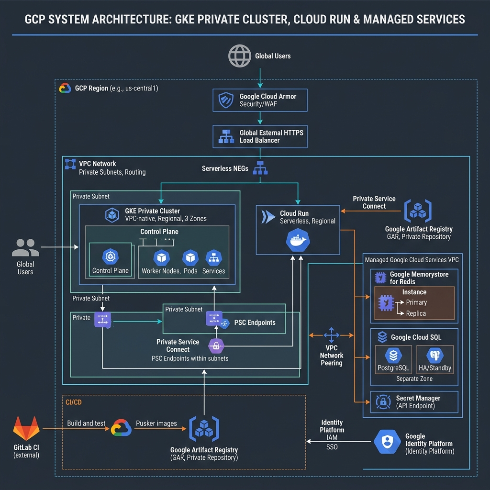
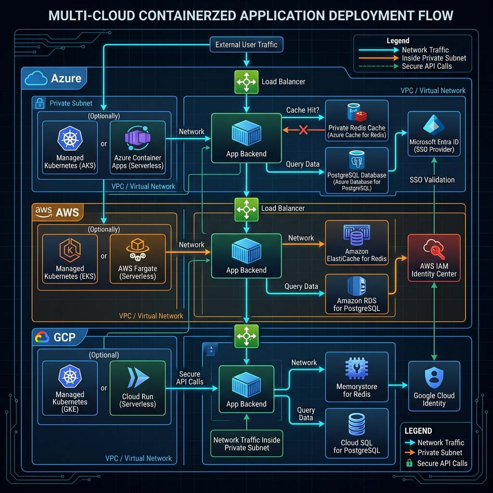

# 🎬 High-Level Design: Google Cloud Platform (GCP) Infrastructure
## *MasalaOps Presents: "The Serverless Romance!"*

> [!NOTE]
> **Director's Note:** In this romantic saga, our Serverless Cloud Run services are bridged to GKE clusters and Cloud SQL databases using Serverless VPC Connectors. An elegant, fast-paced drama featuring OpenTelemetry tracing (The Camera) recording every heartbeat!

This document outlines the architecture, networking, security policies, and application hosting strategy for the GCP deployment.

---

## 📐 Architecture Visualisation

Below is the conceptual architecture blueprint for our Google Cloud VPC deployment.



---

## 🌐 Network & Resource Isolation

We leverage a custom VPC network with Private Google Access enabled, blocking direct ingress and egress routes to the internet.

```mermaid
graph TD
    subgraph VPC Network
        LB[External HTTP(S) Load Balancer] -->|Cloud Armor WAF| GKE[GKE Private Subnet]
        LB -->|Routing Rules| Run[Cloud Run Private]
        GKE & Run -->|Private Service Access| PSC[Private Service Connect]
    end
    PSC -->|Private Endpoint| Memorystore[Memorystore Redis]
    PSC -->|Private IP| CloudSQL[Cloud SQL PostgreSQL]
    GKE & Run -->|Private Access| GAR[Google Artifact Registry]
```

### 1. Subnet Segmentation
*   **GKE Node Subnet (`10.10.0.0/20`):** Secure private cluster nodes. Master nodes exist on a separate Google-managed VPC.
*   **GKE Pod Subnet (`192.168.0.0/18`):** Alias IP range allocating container-level IPs.
*   **GKE Service Subnet (`192.168.64.0/20`):** Alias IP range for K8s service routing.
*   **Serverless VPC Access Subnet (`10.10.16.0/28`):** Required for Cloud Run to route outgoing network calls directly into the VPC.
*   **Proxy-Only Subnet (`10.10.32.0/24`):** Required by Google for regional External Application Load Balancers.

### 2. Private Service Connect & Private Service Access
We use GCP's private peering models to secure data backends:
*   **Private Service Access (PSA):** Custom internal VPC peering to access managed DBs (Cloud SQL) and caching (Memorystore Redis) over internal IPs.
*   **Private Google Access:** Enabled on subnets so instances without public IPs can reach Google API endpoints (e.g. Secret Manager, Artifact Registry, Cloud Storage) securely.

---

## 🔐 SSO: Google Cloud Identity Platform

User authentication is centralized using GCP's Identity Platform (OAuth 2.0 and SAML provider built on Firebase Infrastructure).

### 1. Identity Platform Settings
*   **API Key:** Web client configuration key.
*   **OAuth Client ID & Client Secret:** Generated in Google Cloud APIs & Services credentials panel.
*   **Authorized Redirect Domains:**
    *   `localhost:8080`
    *   `app.example.com`
*   **Provider Scopes:** `openid`, `profile`, `email`.

### 2. User Federation & SSO Flow
Identity Platform allows federating user login to corporate providers (Okta, Azure AD, Ping) or social logins (Google, GitHub). The client application retrieves an ID Token (JWT) directly from Google's endpoint, verifies it on the backend, and registers the session.

---

## 🛠️ Compute Use-Cases

1.  **Google Kubernetes Engine (GKE) Private Cluster:**
    *   *Use Case:* Large container fleets requiring node auto-provisioning, native GKE Gateway API integration, and GKE Sandbox (gVisor) isolation.
    *   *Autoscale:* Integrated with Horizontal Pod Autoscaler (HPA) and GKE Cluster Autoscaler.
2.  **Google Cloud Run:**
    *   *Use Case:* High-performance serverless containers scaling automatically from 0 to thousands of instances in milliseconds. Ideal for lightweight APIs and stateless frontend delivery.
3.  **Cloud Functions (2nd Gen):**
    *   *Use Case:* Lightweight event-driven processing backed by Knative and running on Cloud Run infrastructure under the hood. Supports triggers from Pub/Sub and Cloud Storage.

---

## 📦 Demo Application Deployment Flow
Here is how our containerized demo application (Node.js/Express) runs and communicates inside our private GCP VPC network:



1. **Ingress Entry:** Incoming traffic enters through Global External HTTPS Load Balancer with Cloud Armor WAF.
2. **Compute Target:** App runs inside GKE pods or Cloud Run instances with VPC Access connector.
3. **SSO Hook:** Authenticates users via Google Cloud Identity Platform SSO.
4. **Data Cache:** Connects to Memorystore Redis via Private Service Access.
5. **Data Storage:** Reads/Writes items to Cloud SQL PostgreSQL instance over private IP peering.

