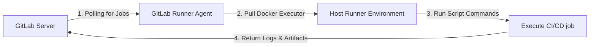

# 🚀 GitLab Runners, Manual Approvals & Multi-Environment Topologies

This guide covers how GitLab CI/CD pipeline workers operate, how to implement manual promotion gates for staging and production deployments, and how to structure multi-environment IaC workspaces.

---

## 🏃 1. How GitLab CI/CD Workers (Runners) Operate

A GitLab Runner is an agent that runs jobs defined in your `.gitlab-ci.yml` pipeline.



### Execution Flow:
1.  **Registration:** The runner registers with the GitLab instance using a registration token.
2.  **Polling:** The runner continuously polls the GitLab API via long-polling for new jobs that match its tags (e.g. `azure`, `aws`, `docker`).
3.  **Execution (Docker Executor):** The runner pulls the specified Docker image (e.g. `hashicorp/terraform` or `docker:stable`), creates a container on the host machine, and runs the script commands within it.
4.  **Logging & Artifacts:** The runner streams command outputs back to GitLab in real-time and uploads artifacts (like test results or Terraform plans).

---

## 🛑 2. Manual Deployment Gates for Staging/Prod

To automate deployments while maintaining human oversight before updating production clusters, we configure **manual gates** in the pipeline.

### GitLab CI/CD Pipeline Configuration Example:
```yaml
stages:
  - build
  - deploy_dev
  - deploy_staging
  - deploy_prod

# Dev deployment happens automatically on commits to main
deploy:dev:
  stage: deploy_dev
  script:
    - echo "Deploying to Dev environment..."
    - kubectl apply -f manifests/dev/
  only:
    - main

# Staging deployment is automatic after dev succeeds
deploy:staging:
  stage: deploy_staging
  script:
    - echo "Deploying to Staging environment..."
    - kubectl apply -f manifests/staging/
  only:
    - main

# Production deployment requires manual approval in the GitLab UI
deploy:production:
  stage: deploy_prod
  script:
    - echo "Deploying to Production environment..."
    - kubectl apply -f manifests/prod/
  when: manual              # <--- This forces a manual play button in the GitLab UI
  allow_failure: false      # Prevents downstream stages from executing until approved
  only:
    - main
```

---

## 📂 3. Multi-Environment Topologies: Workspaces vs. Folders

There are two primary methods for structuring multiple environments (Development, Staging, Production) in Terraform:

### Approach A: Directory-Per-Environment (Recommended)
You create distinct folders for each environment. This keeps state files completely separated and minimizes blast radius.

```text
terraform/
└── environments/
    ├── dev/
    │   ├── main.tf        # References reusable root modules
    │   ├── variables.tf
    │   └── backend.tf     # Configures dev.tfstate remote storage
    ├── staging/
    │   ├── main.tf
    │   ├── variables.tf
    │   └── backend.tf
    └── prod/
        ├── main.tf
        ├── variables.tf
        └── backend.tf
```

### Approach B: Terraform Workspaces
You write a single set of Terraform files and use CLI workspaces to manage states.

*   **Workspaces List:** `dev`, `staging`, `prod`
*   **Switch Workspace:** `terraform workspace select prod`
*   **Code Reference:**
    ```terraform
    resource "google_compute_network" "vpc" {
      name = "vpc-${terraform.workspace}" # dynamically resolves to dev, staging, or prod
    }
    ```

*Tradeoff:* Workspaces are simpler for dry-runs but risky for production, as a single accident can modify the wrong state. Directory-per-environment is much safer for large-scale operations.
