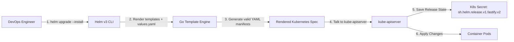

# ☸️ Helm Master Guide: Kubernetes Package Management & Templating
## *MasalaOps Presents: "The Package Manager — One Command to Rule All Manifests!"*

> [!NOTE]
> **Director's Note:** Managing raw Kubernetes YAML files across 10 microservices and 3 environments (dev, staging, prod) is like writing 50 individual movie scripts by hand. **Helm** is our script template engine — you change one variable file (`values.yaml`), and Helm generates and deploys all 50 customized manifests instantly!

---

## 🏗️ 1. What Is Helm & Why Do We Need It?

Without Helm, a single Fastify application requires managing multiple separate YAML files: `deployment.yaml`, `service.yaml`, `ingress.yaml`, `hpa.yaml`, `configmap.yaml`, `secret.yaml`.

```mermaid
graph TD
    subgraph Without_Helm ["❌ Without Helm (Hardcoded YAMLs)"]
        Raw1[deployment-dev.yaml]
        Raw2[deployment-prod.yaml]
        Raw3[service-dev.yaml]
        Raw4[service-prod.yaml]
        Raw1 & Raw2 & Raw3 & Raw4 -->|Manual kubectl apply| Cluster1[Kubernetes Cluster]
    end

    subgraph With_Helm ["✅ With Helm (Dynamic Templating)"]
        Chart[Helm Chart: templates/]
        ValDev[values-dev.yaml]
        ValProd[values-prod.yaml]

        Chart + ValDev -->|helm install -f values-dev.yaml| ClusterDev[Dev Environment]
        Chart + ValProd -->|helm install -f values-prod.yaml| ClusterProd[Production Environment]
    end
```

### Key Advantages of Helm:
1. **Parameterization:** Replaces hardcoded values with Go template variables (e.g. `{{ .Values.replicaCount }}`).
2. **Environment Overrides:** Maintain a single chart and pass environment-specific values (`values-dev.yaml`, `values-prod.yaml`).
3. **Atomic Upgrades & Rollbacks:** If a deployment fails, `helm rollback fastify-app 1` reverts the entire release (Deployment, Service, Ingress) back to the previous revision in seconds.
4. **Versioned Releases:** Every deployment creates a versioned release stored securely as a Kubernetes Secret.

---

## 📦 2. Helm Chart Directory Structure

```text
manifests/helm-charts/fastify-backend/
├── Chart.yaml              # Chart metadata (name, version, appVersion)
├── values.yaml             # Default configuration values
├── values-dev.yaml         # Development override values
├── values-prod.yaml        # Production override values
├── templates/              # Go template Kubernetes manifests
│   ├── _helpers.tpl        # Reusable template helper functions
│   ├── deployment.yaml     # Workload deployment template
│   ├── service.yaml        # ClusterIP / LoadBalancer service template
│   ├── ingress.yaml        # Ingress routing template
│   ├── hpa.yaml            # HorizontalPodAutoscaler template
│   └── NOTES.txt           # Post-installation instructions printed to terminal
```

---

## 🛠️ 3. How Helm Works Under the Hood (Helm v3 Architecture)



* **Client-Only (No Tiller):** Helm v3 communicates directly with the `kube-apiserver` using your local `kubeconfig` and RBAC permissions. Tiller was removed in v3 for maximum cluster security.
* **Release Storage:** Helm stores release history directly inside the cluster as versioned Secret objects (`sh.helm.release.v1.<release-name>.v<revision>`).

---

## 💻 4. Command Reference Cheat Sheet

```bash
# 1. Lint the Helm Chart for syntax errors
helm lint manifests/helm-charts/fastify-backend

# 2. Dry-run template rendering (see generated YAML without applying to cluster)
helm template fastify-release manifests/helm-charts/fastify-backend \
  -f manifests/helm-charts/fastify-backend/values-prod.yaml

# 3. Install or Upgrade a release (idempotent command)
helm upgrade --install fastify-backend manifests/helm-charts/fastify-backend \
  --namespace production \
  --create-namespace \
  -f manifests/helm-charts/fastify-backend/values-prod.yaml

# 4. View release history
helm history fastify-backend -n production

# 5. Rollback to revision 1
helm rollback fastify-backend 1 -n production

# 6. Uninstall a release and purge resources
helm uninstall fastify-backend -n production
```
