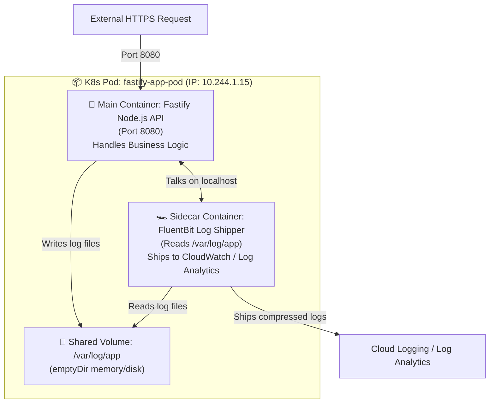
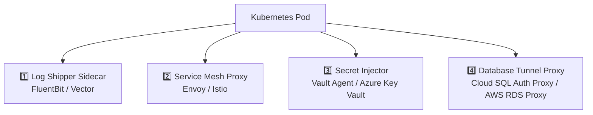

# 🚗 Kubernetes Sidecar Pattern Deep Dive
## *MasalaOps Presents: "The Sidecar Companion — The Hero's Trusted Partner!"*

> [!NOTE]
> **Director's Note:** In a classic action film, the hero drives the motorcycle while their trusted companion sits in the **sidecar** handling navigation, radio communications, and defense. In Kubernetes, the **Main Container** handles business logic (Fastify API), while the **Sidecar Container** handles auxiliary tasks (logging, mTLS encryption, secret fetching) without cluttering the main app code!

---

## 🏗️ 1. What Is the Sidecar Pattern & Why Do We Need It?

The **Sidecar Pattern** deploys a secondary container alongside the main application container **inside the exact same Pod**.



### Why Sidecar Pattern > Monolithic Container?
1. **Single Responsibility Principle (SRP):** The Fastify developers focus ONLY on API business logic. The DevOps team maintains the FluentBit sidecar config independently.
2. **Language Agnostic:** The sidecar can ship logs, inject secrets, or encrypt traffic for Node.js, Go, Python, Java, or C++ apps without changing a single line of app code.
3. **Shared Pod Boundaries:** Because both containers share the **same Network Namespace** (`localhost`) and **Storage Volumes**, they communicate with zero latency.

---

## 🌐 2. How Sidecars Function Inside a Pod

Inside a single Kubernetes Pod:
* **Shared Network IP:** Both containers share `10.244.1.15`. The sidecar can connect to the main app over `localhost:8080`.
* **Shared IPC / Shared Memory:** Containers can communicate via inter-process memory if configured.
* **Shared Volumes:** An `emptyDir` volume mounted in both containers allows the main app to write files and the sidecar to read them instantly.

---

## 🌟 3. Top 4 Real-World Sidecar Use Cases



### 1️⃣ Log Shipper Sidecar (FluentBit)
- *Problem:* Fastify writes logs to a local file `/var/log/app/access.log`.
- *Sidecar:* FluentBit container reads `/var/log/app/access.log`, parses JSON, decorates with K8s pod labels, and ships to Azure Log Analytics / CloudWatch / Cloud Logging.

### 2️⃣ Service Mesh Proxy Sidecar (Envoy / Istio)
- *Problem:* Need mTLS encryption between all microservices without changing app code.
- *Sidecar:* Envoy proxy intercepts all incoming/outgoing network traffic, enforces mTLS, collects metrics, and performs automatic retries.

### 3️⃣ Secret Injector Sidecar (HashiCorp Vault Agent)
- *Problem:* Don't want to store DB passwords in K8s Secrets.
- *Sidecar:* Vault Agent runs as a sidecar, authenticates to Vault via Kubernetes SA, fetches dynamic DB credentials, and writes them to shared memory `/vault/secrets/db-creds.json`.

### 4️⃣ Database Tunnel Proxy (Cloud SQL Auth Proxy)
- *Problem:* Connecting securely to GCP Cloud SQL over private TLS.
- *Sidecar:* Cloud SQL Auth Proxy sidecar runs on `localhost:5432`. Fastify connects to `localhost:5432` with zero SSL code; the sidecar encrypts and proxies traffic to Cloud SQL.

---

## 💻 4. Real Kubernetes Manifest: Main Container + FluentBit Sidecar

```yaml
# manifests/kubernetes-templates/pod-with-sidecar.yaml
apiVersion: apps/v1
kind: Deployment
metadata:
  name: fastify-with-sidecar
  namespace: production
spec:
  replicas: 2
  selector:
    matchLabels:
      app: fastify-logging
  template:
    metadata:
      labels:
        app: fastify-logging
    spec:
      # Shared Storage Volume between containers
      volumes:
        - name: shared-logs
          emptyDir: {}

      containers:
        # 1. MAIN CONTAINER: Fastify API
        - name: fastify-main-app
          image: us-central1-docker.pkg.dev/enterprise-devops-project/web-repo/fastify-app:v2.0.0
          ports:
            - containerPort: 8080
          env:
            - name: LOG_FILE_PATH
              value: "/var/log/app/api.log"
          volumeMounts:
            - name: shared-logs
              mountPath: /var/log/app
          resources:
            limits:
              cpu: 500m
              memory: 512Mi

        # 2. SIDECAR CONTAINER: FluentBit Log Shipper
        - name: fluentbit-sidecar
          image: fluent/fluent-bit:2.2-alpine
          volumeMounts:
            - name: shared-logs
              mountPath: /var/log/app
          resources:
            limits:
              cpu: 100m
              memory: 128Mi
```

---

The complete, directly validatable example is available at
[`manifests/kubernetes-templates/pod-with-sidecar.yaml`](../manifests/kubernetes-templates/pod-with-sidecar.yaml).
It includes the Fluent Bit configuration, resource requests and limits, health
probes, a shared log volume, and the application container.

Apply it after replacing the example application image:

```bash
kubectl apply -f manifests/kubernetes-templates/namespace.yaml
kubectl apply -f manifests/kubernetes-templates/pod-with-sidecar.yaml
kubectl logs -n enterprise-apps deployment/fastify-with-sidecar -c fluent-bit -f
```

> [!IMPORTANT]
> The application must actually write files to `LOG_FILE_PATH`. If it only logs
> to stdout/stderr, use the cluster's node-level log collector instead of adding
> a per-Pod log-shipping sidecar.

---

## 🚀 5. Kubernetes-Native Sidecar Containers

Historically, K8s did not distinguish between main containers and sidecar containers. If the main container finished early, the sidecar would keep running indefinitely, preventing job completion.

Kubernetes introduced restartable init containers as an alpha feature in v1.28,
enabled the feature by default in v1.29, and graduated it to stable in v1.33.
A native sidecar is declared under `initContainers` with the container-level
`restartPolicy: Always`:

```yaml
spec:
  initContainers:
    # Native K8s Sidecar: Starts BEFORE main app container and stays running!
    - name: vault-secret-sidecar
      image: hashicorp/vault:1.15.2
      restartPolicy: Always # <--- Marks this initContainer as a Native Sidecar!
      command: ["vault", "agent", "-config=/etc/vault/vault-agent-config.hcl"]
      volumeMounts:
        - name: vault-secrets
          mountPath: /vault/secrets

  containers:
    - name: main-app
      image: fastify-app:v2.0.0
```

### Advantages of Native Sidecars:
- Starts **before** the main container (ensuring secrets/tunnels are ready before app boots).
- Shuts down **after** the main application containers terminate.
- Restarts independently and does not prevent a Kubernetes Job from completing.

For clusters older than v1.29, verify the `SidecarContainers` feature gate or use
the legacy multi-container pattern under `containers`. See the
[official Kubernetes sidecar documentation](https://kubernetes.io/docs/concepts/workloads/pods/sidecar-containers/).

---

## 🎬 MasalaOps Summary

> *"Main Container = Movie ka hero jo dialogue bolta hai! Sidecar Container = Hero ka dost jo gaadi chalata hai, camera sambhalta hai, aur hero ke kapde press karta hai — bina script (code) badle!"*
