# 📨 Messaging, Event Streaming & NoSQL Databases: All Clouds
## *MasalaOps Presents: "The Asynchronous Drama — Messages That Never Block!"*

> [!NOTE]
> **Director's Note:** In synchronous systems, the Hero (Fastify API) waits for every actor to finish before continuing — like a director waiting for every extra to be ready before saying "Action!" In event-driven systems, the Hero fires a message into a queue and moves on immediately. The queue delivers the message to consumers when they are ready. This is the entire philosophy of **asynchronous, decoupled architecture.**

---

## 🗺️ Cross-Cloud Service Equivalency Map

| Concept | Azure | AWS | GCP |
|:---|:---|:---|:---|
| **Message Queue (guaranteed delivery)** | Azure Service Bus | Amazon SQS | Cloud Pub/Sub |
| **Event Streaming (real-time, replay)** | Azure Event Hub | Amazon Kinesis | Cloud Pub/Sub / Dataflow |
| **Event Routing (pub/sub fanout)** | Azure Event Grid | Amazon EventBridge | Eventarc / Pub/Sub |
| **NoSQL Database (document store)** | Azure Cosmos DB | Amazon DynamoDB | Cloud Firestore / Bigtable |

---

## 🏗️ 1. End-to-End Architecture in This Monorepo

Our Fastify backend (`/demo-app`) publishes events to messaging layers when key actions happen. Downstream serverless functions (`/demo-projects/`) consume those events asynchronously.

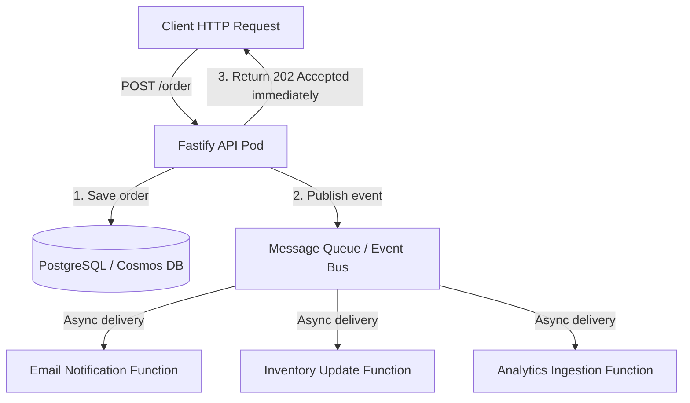

> [!TIP]
> **Why return `202 Accepted` immediately?** The API does not wait for emails or inventory updates. These are slow side-effects. By pushing them to a queue and returning instantly, the API stays fast and the user does not wait.

---

# 🔵 AZURE: Service Bus + Event Hub + Event Grid + Cosmos DB

---

## 📬 Azure Service Bus — Reliable Message Queue

**What it is:** An enterprise-grade message broker guaranteeing at-least-once delivery. Used when you need guaranteed processing of every single message — no drops allowed.

**When to use:**
- Order processing (every order MUST be processed exactly once)
- Invoice generation (each invoice MUST reach the billing system)
- Task queues between microservices

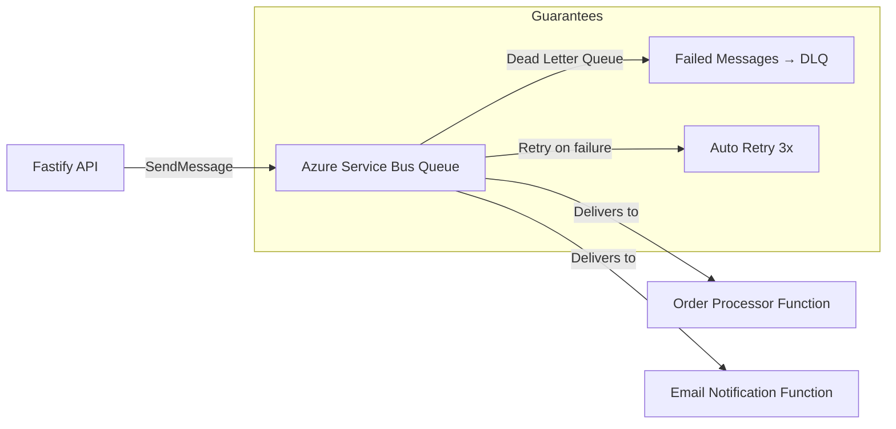

### Code: Fastify → Publish to Service Bus
```javascript
// demo-app/services/serviceBus.js
const { ServiceBusClient } = require('@azure/service-bus');

const client = new ServiceBusClient(process.env.SERVICE_BUS_CONNECTION_STRING);
const sender = client.createSender('orders-queue');

async function publishOrderEvent(order) {
  const message = {
    body: {
      orderId: order.id,
      userId: order.userId,
      amount: order.totalAmount,
      currency: order.currency,
      eventType: 'order.created',
      timestamp: new Date().toISOString()
    },
    contentType: 'application/json',
    subject: 'order.created',
    messageId: order.id // Ensures idempotent processing
  };

  await sender.sendMessages(message);
  console.log(`[ServiceBus] Published order event: ${order.id}`);
}

module.exports = { publishOrderEvent };
```

### Code: Fastify Route that Publishes Event
```javascript
// demo-app/src/server.ts (route addition)
const { publishOrderEvent } = require('./services/serviceBus');

fastify.post('/api/orders', async (request, reply) => {
  const { userId, items } = request.body;

  // 1. Save order to PostgreSQL
  const result = await pool.query(
    'INSERT INTO orders (user_id, status, created_at) VALUES ($1, $2, NOW()) RETURNING id',
    [userId, 'pending']
  );
  const order = { id: result.rows[0].id, userId, totalAmount: 150.00, currency: 'INR' };

  // 2. Publish event to Service Bus (fire and forget)
  await publishOrderEvent(order);

  // 3. Return immediately — do NOT wait for email/inventory updates
  return reply.status(202).send({
    message: 'Order accepted and queued for processing',
    orderId: order.id
  });
});
```

### Code: Azure Function Consumer (Service Bus Trigger)
```javascript
// demo-projects/azure-function-app/service-bus-consumer/index.js
module.exports = async function (context, orderMessage) {
  context.log('Service Bus message received:', orderMessage);

  const { orderId, userId, amount, eventType } = orderMessage;

  if (eventType !== 'order.created') {
    context.log('Unknown event type — ignoring');
    return;
  }

  // Simulate sending an email notification
  context.log(`Sending order confirmation email to user: ${userId}`);
  context.log(`Order ${orderId} for amount ${amount} INR confirmed!`);

  // Output binding → write to Cosmos DB
  context.bindings.cosmosOutput = {
    id: orderId,
    userId,
    amount,
    processedAt: new Date().toISOString(),
    status: 'confirmed'
  };
};
```

#### `function.json` (Service Bus Trigger + Cosmos DB Output):
```json
{
  "bindings": [
    {
      "name": "orderMessage",
      "type": "serviceBusTrigger",
      "direction": "in",
      "queueName": "orders-queue",
      "connection": "SERVICE_BUS_CONNECTION_STRING"
    },
    {
      "name": "cosmosOutput",
      "type": "cosmosDB",
      "direction": "out",
      "databaseName": "enterprise-db",
      "collectionName": "processed-orders",
      "connectionStringSetting": "COSMOS_CONNECTION_STRING",
      "createIfNotExists": true
    }
  ]
}
```

---

## ⚡ Azure Event Hub — Real-Time Event Streaming (Kafka-Compatible)

**What it is:** A high-throughput event streaming platform capable of ingesting millions of events per second. Unlike Service Bus (queue — each message consumed once), Event Hub retains events for up to 90 days and allows **multiple consumer groups** to independently replay the stream.

**When to use:**
- IoT telemetry ingestion (millions of sensor readings per second)
- Application log aggregation and real-time analytics
- Clickstream analysis (every page view on a website)

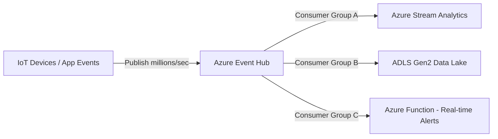

### Code: Fastify → Publish Telemetry to Event Hub
```javascript
// demo-app/services/eventHub.js
const { EventHubProducerClient } = require('@azure/event-hubs');

const producer = new EventHubProducerClient(
  process.env.EVENT_HUB_CONNECTION_STRING,
  process.env.EVENT_HUB_NAME
);

async function publishTelemetryBatch(events) {
  const batch = await producer.createBatch();

  for (const event of events) {
    const added = batch.tryAdd({
      body: event,
      properties: { eventType: 'telemetry', source: 'fastify-api' }
    });
    if (!added) {
      console.warn('[EventHub] Batch full — sending current batch');
      await producer.sendBatch(batch);
    }
  }

  await producer.sendBatch(batch);
  console.log(`[EventHub] Published ${events.length} telemetry events`);
}

module.exports = { publishTelemetryBatch };
```

---

## 📡 Azure Event Grid — Event Routing & Fanout

**What it is:** A serverless event routing service. When something happens in Azure (a Blob is uploaded, a VM is created, a custom event is emitted), Event Grid routes the event to one or many subscriber endpoints (functions, webhooks, Service Bus).

**When to use:**
- React to Azure resource changes (e.g. when a user uploads an avatar to Blob Storage → trigger resize function)
- Decouple microservices using a pub/sub fanout pattern
- Route events from one service to many consumers simultaneously

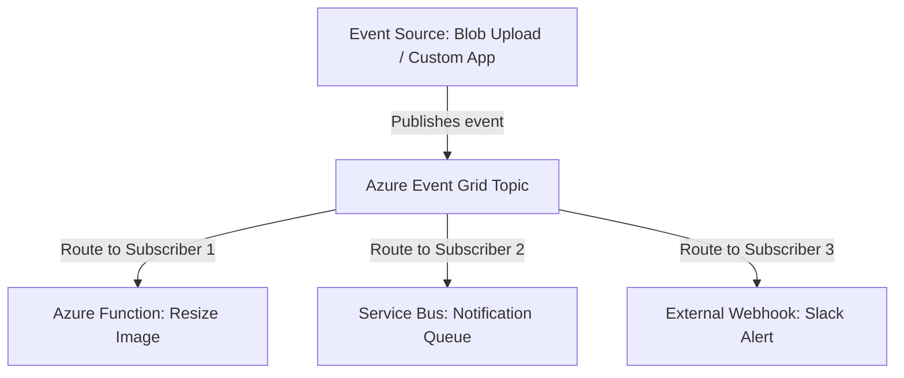

### Code: Fastify → Publish Custom Event to Event Grid
```javascript
// demo-app/services/eventGrid.js
const { EventGridPublisherClient, AzureKeyCredential } = require('@azure/eventgrid');

const client = new EventGridPublisherClient(
  process.env.EVENT_GRID_ENDPOINT,
  'EventGrid',
  new AzureKeyCredential(process.env.EVENT_GRID_KEY)
);

async function publishUserEvent(userId, eventType, data) {
  await client.send([{
    eventType,
    subject: `users/${userId}`,
    dataVersion: '1.0',
    data: { userId, ...data, timestamp: new Date().toISOString() }
  }]);
  console.log(`[EventGrid] Published event: ${eventType} for user: ${userId}`);
}

module.exports = { publishUserEvent };
```

---

## 🌌 Azure Cosmos DB — Globally Distributed NoSQL Database

**What it is:** A fully managed, multi-model, globally distributed database with <10ms read latency guaranteed. Supports JSON document model (MongoDB API), key-value (Table API), and graph (Gremlin API).

**When to use:**
- User profiles and session documents (variable schema per user)
- Product catalog (different attributes per category)
- IoT device state storage (high write throughput required)
- Any data that needs global multi-region writes

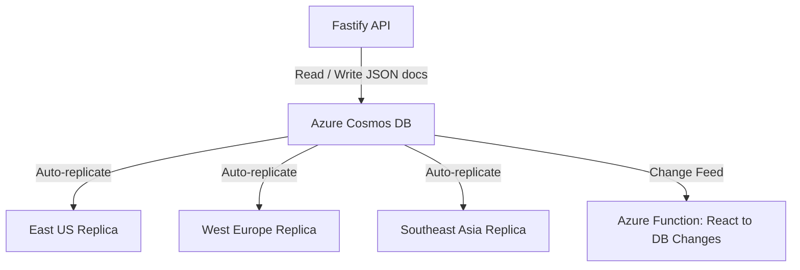

### Code: Fastify → Read/Write Cosmos DB Documents
```javascript
// demo-app/services/cosmosDB.js
const { CosmosClient } = require('@azure/cosmos');

const client = new CosmosClient(process.env.COSMOS_CONNECTION_STRING);
const container = client.database('enterprise-db').container('user-profiles');

// Write a user profile document
async function upsertUserProfile(userId, profile) {
  const { resource } = await container.items.upsert({
    id: userId, // Cosmos DB document ID
    userId,
    ...profile,
    updatedAt: new Date().toISOString()
  });
  console.log(`[CosmosDB] Upserted profile for user: ${userId}`);
  return resource;
}

// Read a user profile document
async function getUserProfile(userId) {
  const { resource } = await container.item(userId, userId).read();
  return resource;
}

// Query documents with SQL-like syntax
async function getActiveUsers() {
  const query = {
    query: 'SELECT * FROM c WHERE c.status = @status ORDER BY c.lastLogin DESC',
    parameters: [{ name: '@status', value: 'active' }]
  };
  const { resources } = await container.items.query(query).fetchAll();
  return resources;
}

module.exports = { upsertUserProfile, getUserProfile, getActiveUsers };
```

---

# 🟠 AWS: SQS + Kinesis + EventBridge + DynamoDB

---

## 📬 Amazon SQS — Simple Queue Service

**What it is:** AWS's managed message queue. Provides standard queues (best-effort ordering) and FIFO queues (guaranteed ordering + exactly-once processing).

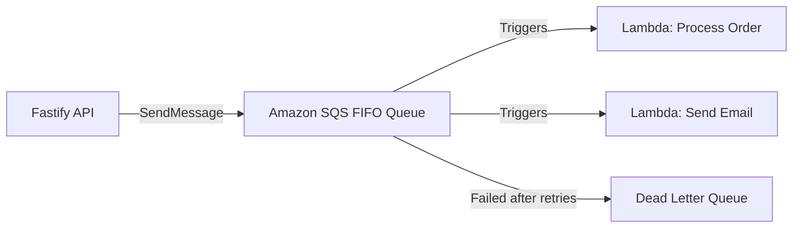

### Code: Fastify → Publish to SQS
```javascript
// demo-app/services/sqs.js
const { SQSClient, SendMessageCommand } = require('@aws-sdk/client-sqs');

// Uses IAM role attached to EKS pod (IRSA) — no static credentials!
const sqs = new SQSClient({ region: process.env.AWS_REGION });

async function publishToSQS(queueUrl, messageBody, deduplicationId) {
  const command = new SendMessageCommand({
    QueueUrl: queueUrl,
    MessageBody: JSON.stringify(messageBody),
    MessageGroupId: 'orders',         // Required for FIFO queues
    MessageDeduplicationId: deduplicationId // Prevents duplicate processing
  });

  const response = await sqs.send(command);
  console.log(`[SQS] Message sent. MessageId: ${response.MessageId}`);
  return response.MessageId;
}

module.exports = { publishToSQS };
```

---

## ⚡ Amazon Kinesis — Real-Time Data Streaming

**What it is:** AWS's managed event streaming platform (equivalent to Kafka / Azure Event Hub). Retains records for up to 365 days and supports multiple consumers reading the same stream independently.

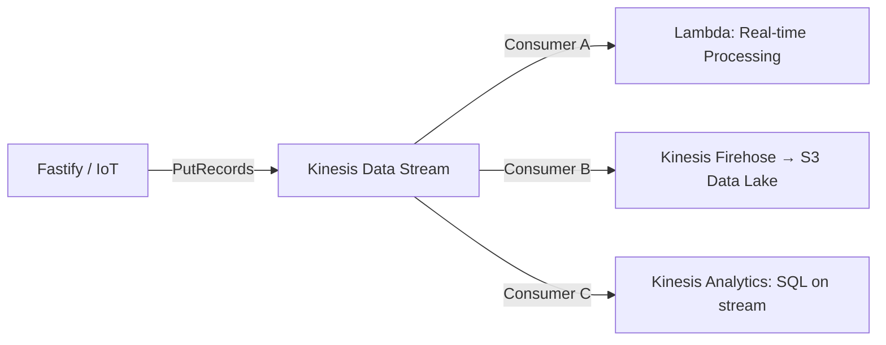

### Code: Fastify → Publish to Kinesis
```javascript
// demo-app/services/kinesis.js
const { KinesisClient, PutRecordCommand } = require('@aws-sdk/client-kinesis');

const kinesis = new KinesisClient({ region: process.env.AWS_REGION });

async function publishToKinesis(streamName, data, partitionKey) {
  const command = new PutRecordCommand({
    StreamName: streamName,
    Data: Buffer.from(JSON.stringify(data)),
    PartitionKey: partitionKey // Routes to consistent shard for ordering
  });

  const response = await kinesis.send(command);
  console.log(`[Kinesis] Record published. ShardId: ${response.ShardId}`);
  return response.SequenceNumber;
}

module.exports = { publishToKinesis };
```

---

## 📡 Amazon EventBridge — Serverless Event Bus

**What it is:** AWS's event routing service. Routes events from AWS services or custom applications to targets (Lambda, SQS, Step Functions) based on filtering rules.

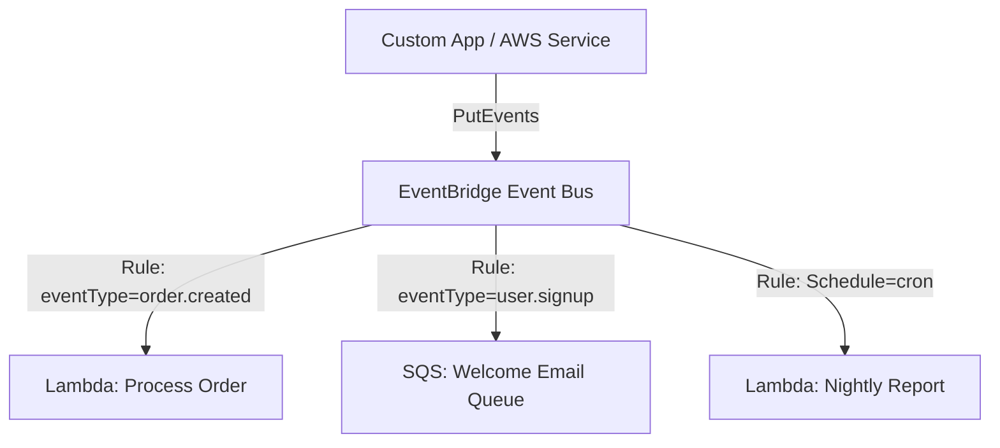

### Code: Fastify → Publish to EventBridge
```javascript
// demo-app/services/eventBridge.js
const { EventBridgeClient, PutEventsCommand } = require('@aws-sdk/client-eventbridge');

const eb = new EventBridgeClient({ region: process.env.AWS_REGION });

async function publishEvent(source, detailType, detail) {
  const command = new PutEventsCommand({
    Entries: [{
      EventBusName: process.env.EVENT_BUS_NAME,
      Source: source,                // e.g. 'com.senorita.orders'
      DetailType: detailType,        // e.g. 'OrderCreated'
      Detail: JSON.stringify(detail),
      Time: new Date()
    }]
  });

  const response = await eb.send(command);
  console.log(`[EventBridge] Event published. FailedEntryCount: ${response.FailedEntryCount}`);
}

module.exports = { publishEvent };
```

---

## 🗄️ Amazon DynamoDB — Serverless NoSQL Key-Value & Document Store

**What it is:** AWS's fully managed, serverless NoSQL database. Provides single-digit millisecond performance at any scale. No servers to provision or manage.

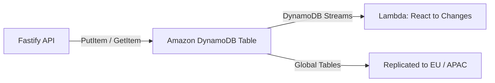

### Code: Fastify → Read/Write DynamoDB
```javascript
// demo-app/services/dynamoDB.js
const { DynamoDBClient } = require('@aws-sdk/client-dynamodb');
const { DynamoDBDocumentClient, PutCommand, GetCommand, QueryCommand } = require('@aws-sdk/lib-dynamodb');

const ddbClient = new DynamoDBClient({ region: process.env.AWS_REGION });
const ddb = DynamoDBDocumentClient.from(ddbClient);

// Write item to DynamoDB
async function putUserSession(userId, sessionData) {
  await ddb.send(new PutCommand({
    TableName: 'user-sessions',
    Item: {
      PK: `USER#${userId}`,               // Partition key
      SK: `SESSION#${sessionData.id}`,    // Sort key
      ...sessionData,
      ttl: Math.floor(Date.now() / 1000) + 86400 // Auto-expire in 24hrs
    }
  }));
  console.log(`[DynamoDB] Session stored for user: ${userId}`);
}

// Read item from DynamoDB
async function getUserSession(userId, sessionId) {
  const { Item } = await ddb.send(new GetCommand({
    TableName: 'user-sessions',
    Key: {
      PK: `USER#${userId}`,
      SK: `SESSION#${sessionId}`
    }
  }));
  return Item;
}

// Query all sessions for a user
async function getAllUserSessions(userId) {
  const { Items } = await ddb.send(new QueryCommand({
    TableName: 'user-sessions',
    KeyConditionExpression: 'PK = :pk AND begins_with(SK, :sk)',
    ExpressionAttributeValues: {
      ':pk': `USER#${userId}`,
      ':sk': 'SESSION#'
    }
  }));
  return Items;
}

module.exports = { putUserSession, getUserSession, getAllUserSessions };
```

---

# 🟢 GCP: Pub/Sub + Dataflow + Eventarc + Firestore

---

## 📬 Google Cloud Pub/Sub — Unified Messaging & Streaming

**What it is:** GCP's unified messaging service. Acts as both a queue (Service Bus / SQS equivalent) AND a streaming platform (Event Hub / Kinesis equivalent) in a single service.

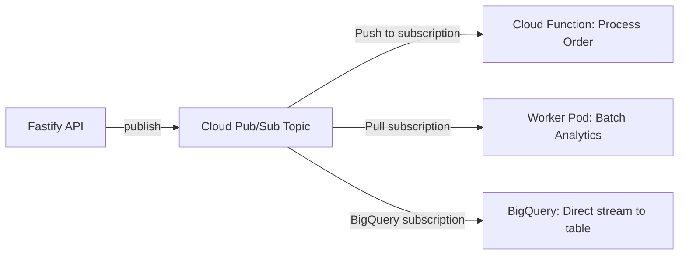

### Code: Fastify → Publish to Pub/Sub
```javascript
// demo-app/services/pubsub.js
const { PubSub } = require('@google-cloud/pubsub');

// Uses Application Default Credentials (ADC) — no keys needed in GKE!
const pubsub = new PubSub({ projectId: process.env.GCP_PROJECT_ID });

async function publishMessage(topicName, data, attributes = {}) {
  const topic = pubsub.topic(topicName);
  const messageBuffer = Buffer.from(JSON.stringify(data));

  const messageId = await topic.publishMessage({
    data: messageBuffer,
    attributes: {
      eventType: attributes.eventType || 'generic',
      source: 'fastify-api',
      ...attributes
    }
  });

  console.log(`[PubSub] Published message ${messageId} to topic: ${topicName}`);
  return messageId;
}

module.exports = { publishMessage };
```

### Code: GCP Cloud Function → Pub/Sub Consumer
```javascript
// demo-projects/gcp-cloud-run-app/pubsub-consumer/index.js
exports.processOrderMessage = async (message, context) => {
  // Pub/Sub messages are base64-encoded
  const data = JSON.parse(
    Buffer.from(message.data, 'base64').toString('utf8')
  );

  console.log('Received order event:', data);

  const { orderId, userId, amount, eventType } = data;

  if (eventType === 'order.created') {
    // Process the order — update Firestore, send notification, etc.
    console.log(`Processing order ${orderId} for user ${userId} — amount: ₹${amount}`);
  }
};
```

---

## ⚡ Google Cloud Dataflow — Real-Time & Batch Stream Processing

**What it is:** GCP's fully managed Apache Beam runner for transforming, enriching, and routing large-scale streaming data. Used downstream from Pub/Sub when you need complex stream transformations.

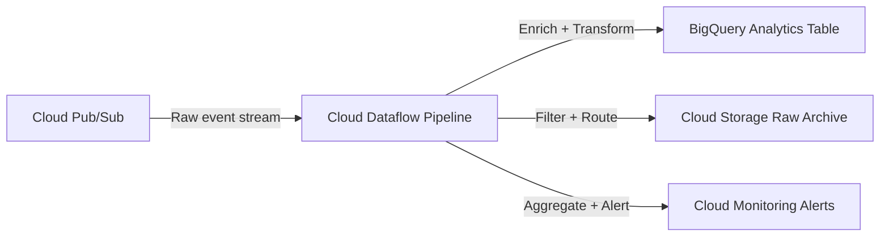

---

## 📡 Google Eventarc — Event Routing Service

**What it is:** GCP's event routing service. Routes events from GCP services (Cloud Storage, Pub/Sub, Audit Logs) to Cloud Run services, Cloud Functions, or Workflows.

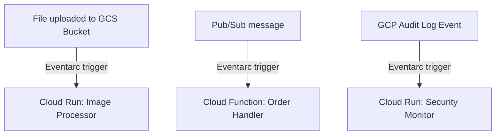

### Terraform: Eventarc Trigger for GCS → Cloud Run
```terraform
# manifests/gcp equivalent in Terraform
resource "google_eventarc_trigger" "image_upload_trigger" {
  name     = "image-upload-trigger"
  location = "us-central1"

  matching_criteria {
    attribute = "type"
    value     = "google.cloud.storage.object.v1.finalized"
  }

  matching_criteria {
    attribute = "bucket"
    value     = google_storage_bucket.uploads.name
  }

  destination {
    cloud_run_service {
      service = google_cloud_run_service.image_processor.name
      region  = "us-central1"
    }
  }

  service_account = google_service_account.eventarc_sa.email
}
```

---

## 🔥 Google Cloud Firestore — Serverless Document Database

**What it is:** GCP's fully managed serverless document database. Stores data as JSON-like documents in collections. Offers real-time change listeners — clients get instant updates when data changes.

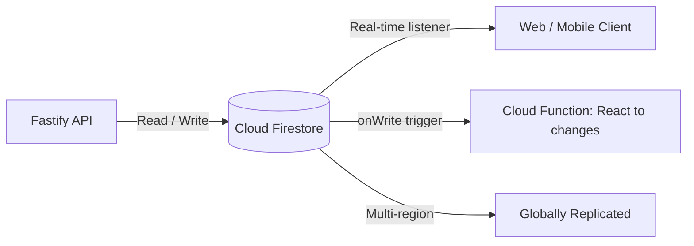

### Code: Fastify → Read/Write Firestore
```javascript
// demo-app/services/firestore.js
const { Firestore, FieldValue } = require('@google-cloud/firestore');

// Uses ADC automatically — no credentials file needed in GKE
const db = new Firestore({ projectId: process.env.GCP_PROJECT_ID });

// Write a document
async function createUserProfile(userId, profileData) {
  const ref = db.collection('users').doc(userId);
  await ref.set({
    ...profileData,
    createdAt: FieldValue.serverTimestamp(),
    updatedAt: FieldValue.serverTimestamp()
  });
  console.log(`[Firestore] Created profile for user: ${userId}`);
}

// Read a document
async function getUserProfile(userId) {
  const doc = await db.collection('users').doc(userId).get();
  if (!doc.exists) return null;
  return { id: doc.id, ...doc.data() };
}

// Query documents
async function getRecentOrders(userId, limit = 10) {
  const snapshot = await db.collection('orders')
    .where('userId', '==', userId)
    .orderBy('createdAt', 'desc')
    .limit(limit)
    .get();

  return snapshot.docs.map(doc => ({ id: doc.id, ...doc.data() }));
}

// Atomic increment (safe for concurrent updates)
async function incrementOrderCount(userId) {
  const ref = db.collection('users').doc(userId);
  await ref.update({ orderCount: FieldValue.increment(1) });
}

module.exports = { createUserProfile, getUserProfile, getRecentOrders, incrementOrderCount };
```

---

## 📊 When to Use Queue vs Stream vs Event Router vs NoSQL

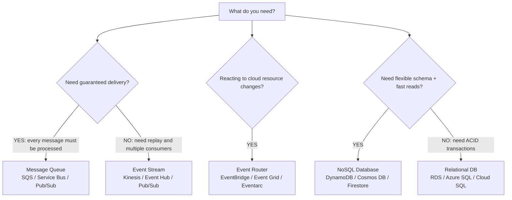

| Scenario | Best Choice | Why |
|:---|:---|:---|
| Every order email must be sent exactly once | SQS FIFO / Service Bus | Guaranteed delivery + deduplication |
| 1M IoT sensor readings per second | Kinesis / Event Hub | High-throughput streaming |
| User avatar uploaded → trigger resize | EventBridge / Event Grid | React to cloud storage events |
| Store user session with 24hr TTL | DynamoDB | TTL support + single-digit ms reads |
| Product catalog with variable attributes | Cosmos DB / Firestore | Flexible JSON schema per document |

---

## 🎬 MasalaOps Summary

> *"Queue matlab — ek line hai, line mein aao, number aane par kaam karo. Stream matlab — radio ki tarah, jo bhi sun'na chahta hai sun sakta hai. Event Grid/Bridge matlab — secretary hai, jo kehta hai: 'Sir, koi file upload hua hai, tumhe call karna tha.'"*

> **Translation:** *"Queue = a waiting line, process one at a time. Stream = like a radio broadcast, multiple listeners independently. Event Grid/Bridge = a secretary who says: 'Sir, someone uploaded a file — you asked to be notified.'"*
