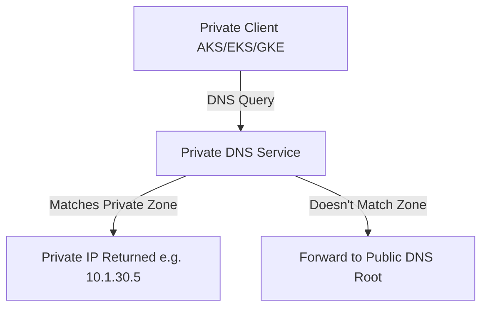

# Network Security, Domain Whitelisting, and DNS Architecture

This document describes the networking, security, firewall rules, domain egress filtering, and DNS mapping strategies across our multi-cloud deployment environments.

---

## 🔒 Egress Firewall & Domain Whitelisting

Egress filtering prevents data exfiltration and blocks communication with unauthorized target servers. If a server is compromised, it cannot connect back to a command-and-control server unless the domain is whitelisted.

### 1. Azure Firewall Egress Policies
Azure Firewall is deployed in the Hub VNet. All spoke networks route default traffic (`0.0.0.0/0`) to the firewall's internal IP.
*   **Whitelisted Application Rules (HTTP/HTTPS):**
    *   `*.gitlab.com` (GitLab CI runners, API connections)
    *   `login.microsoftonline.com` (Entra ID SSO authentication)
    *   `*.azurecr.io` (Pusher/Puller registry connections)
    *   `registry-1.docker.io` & `production.cloudflare.docker.com` (External dependencies)
    *   `*.postgres.database.azure.com` (Managed PostgreSQL Flexible connectivity)
*   **Network Rules (L3/L4):**
    *   TCP/UDP 53 (Internal Private DNS resolution via `168.63.129.16`)
    *   TCP 123 (NTP time synchronization)

### 2. AWS Network Firewall Egress Rules
AWS Network Firewall is inserted on the route path between private subnets and the NAT Gateway. It uses Suricata-compatible rules to filter traffic.
*   **Stateful Egress Policy (Domain Rules):**
    *   `*.amazonaws.com` (AWS APIs and ECR)
    *   `*.gitlab.com`
    *   `*.docker.com` (If third-party public base images are required)
    *   `cognito-idp.<region>.amazonaws.com` (Cognito Identity)

### 3. GCP Cloud NAT & Cloud Armor
*   **Cloud NAT:** Outbound connections are mapped to deterministic static IP blocks (using Cloud NAT). Private instances have zero public IPs.
*   **Cloud Armor:** Protects public HTTPS Load Balancers against DDoS, SQL injection, and cross-site scripting (XSS). Configured with OWASP Top 10 pre-configured rules.

---

## 🌐 Private DNS Mapping & Split-Horizon DNS

To resolve internal database, registry, and microservice hostnames securely without leaking information to the public web, we configure private DNS resolution inside each network zone.

### 1. DNS Mapping Table

| Cloud | DNS Zone Name | Target Endpoint | Internal Resolve IP (Example) |
| :--- | :--- | :--- | :--- |
| **Azure** | `privatelink.azurecr.io` | ACR | `10.1.30.4` |
| **Azure** | `privatelink.postgres.database.azure.com` | PostgreSQL Database | `10.1.30.5` |
| **Azure** | `privatelink.redis.cache.windows.net` | Redis Cache | `10.1.30.6` |
| **AWS** | `ecr.api.<region>.amazonaws.com` | ECR API | `10.0.10.55` |
| **AWS** | `db.private.internal` | RDS Postgres Instance | `10.0.20.12` |
| **GCP** | `private.googleapis.com` | Google Cloud API VIP | `199.36.153.8/29` |
| **GCP** | `sql.private.internal` | Cloud SQL IP | `10.10.100.3` |

### 2. DNS Infrastructure Settings
*   **Azure:** Linked Virtual Networks resolve records using Azure Private DNS Zones. A DNS link is created between the spoke VNets and the DNS zones.
*   **AWS Route 53:** Private Hosted Zones are associated directly with our application VPCs. Standard DNS queries within the VPC automatically route to the VPC Resolver (`168.254.169.253`).
*   **GCP Cloud DNS:** Private DNS zones route names specifically for subnets. We establish a peering zone or forwarding configuration to resolve corporate active directory names if hybrid VPN connections are established.

---

## 🔒 DevOps Registry Synchronization

To securely pull and push images, GitLab CI utilizes a sync runner:
1.  GitLab Runner is whitelisted on the firewall or is deployed directly inside the VNet/VPC (Self-hosted runner pattern).
2.  The Sync Runner logs into target Registries (ACR, ECR, GAR) using cloud secrets or OIDC.
3.  Registry Firewall settings:
    *   **Azure ACR:** Firewall is set to "Disabled" (Secure Access) with exceptions allowed only for "Trusted Microsoft Services" and the Private Endpoint.
    *   **AWS ECR:** VPC Endpoint Policies restrict access to ECR APIs only to specific local VPC clients.
    *   **GCP GAR:** IAM controls dictate who can write to GAR repositories, enforced via private Google API pathways.
