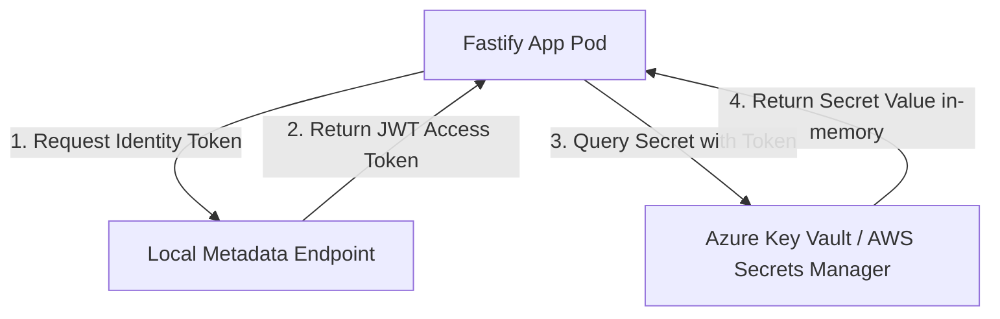

# 🔑 Real-World Secrets Management: Managed Identities & IAM Roles

This guide explains why classic build-time secret injection is insecure, and details how to implement production-grade, zero-credential runtime secrets fetching using Cloud SDKs and Managed Identities.

---

## 🚫 The Security Anti-Pattern: Build-Time or Deploy-Time Injection

Many developers inject sensitive database passwords, API keys, and certificates during the CI/CD build process or as static environment variables in deployment manifests.

### Why this is insecure:
1.  **Leaked Images:** If secrets are baked into a Docker image, anyone with access to your container registry (ACR/ECR/GAR) can pull the image, run `docker history`, and extract the keys.
2.  **Exposed Manifests:** Storing secrets in plain text within Git repos or even base64 encoded Kubernetes secret YAMLs is easily compromised.
3.  **No Rotation:** If a secret changes, you must build, tag, and redeploy the entire application stack.

---

## 🛡️ The Secure Pattern: Runtime Secret Retrieval with Managed Identity

Instead of passing credentials to the application, we assign a **Managed Identity (Azure)** or **IAM Role (AWS/GCP)** to the computing resource (VM, AKS Pod, Cloud Run instance). At startup, the application requests an access token from the local cloud metadata endpoint and queries Key Vault directly in-memory.



### Real-Life Benefits:
*   **Zero Credentials:** No password or API key is stored in the code, environment variables, or config files.
*   **OIDC Trust:** Authentication is based on cryptographic trust between the cloud provider and the container host (e.g. AKS Service Account token exchange).
*   **Easy Rotation:** If you rotate a database password in Key Vault, the application fetches the new value on restart (or periodically) without code updates.

---

## 💻 Code Example: Dynamic Key Vault Retrieval in Node.js (Fastify)

This snippet demonstrates how a Fastify backend fetches a database password dynamically from Azure Key Vault at startup using `@azure/identity` and `@azure/keyvault-secrets`.

```javascript
// server.js (Runtime Secret Retrieval Example)
const fastify = require('fastify')({ logger: true });
const { DefaultAzureCredential } = require('@azure/identity');
const { SecretClient } = require('@azure/keyvault-secrets');
const { Pool } = require('pg');

const port = process.env.PORT || 8080;
const vaultName = process.env.KEYVAULT_NAME; // e.g. "kv-enterprise-prod"
const vaultUrl = `https://${vaultName}.vault.azure.net`;

let dbPool;

// Function to fetch secret dynamically before starting the server
async function initializeDatabase() {
  if (process.env.NODE_ENV === 'development') {
    fastify.log.info('Running in dev mode. Using local env secrets...');
    dbPool = new Pool({
      connectionString: process.env.DATABASE_URL
    });
    return;
  }

  try {
    fastify.log.info(`Connecting to Key Vault at ${vaultUrl}...`);
    
    // DefaultAzureCredential automatically looks for System-Assigned Managed Identity,
    // User-Assigned Managed Identity, or local environment credentials.
    const credential = new DefaultAzureCredential();
    const client = new SecretClient(vaultUrl, credential);

    fastify.log.info('Retrieving Database Password from Key Vault...');
    const secret = await client.getSecret('database-password');
    const dbPassword = secret.value;

    dbPool = new Pool({
      host: process.env.DB_HOST,
      user: process.env.DB_USER,
      password: dbPassword,
      database: process.env.DB_NAME,
      port: 5432,
      ssl: { rejectUnauthorized: false }
    });
    
    fastify.log.info('Database connection pool configured via Key Vault.');
  } catch (err) {
    fastify.log.error('Key Vault Secret Retrieval failed: ' + err.message);
    process.exit(1);
  }
}

// Routes
fastify.get('/health', async (request, reply) => {
  if (!dbPool) return reply.code(500).send({ status: 'uninitialized' });
  const result = await dbPool.query('SELECT 1');
  return { status: 'healthy', db: result.rows.length > 0 ? 'connected' : 'error' };
});

const start = async () => {
  await initializeDatabase();
  try {
    await fastify.listen({ port: port, host: '0.0.0.0' });
    fastify.log.info(`Server listening on port ${port}`);
  } catch (err) {
    fastify.log.error(err);
    process.exit(1);
  }
};

start();
```
