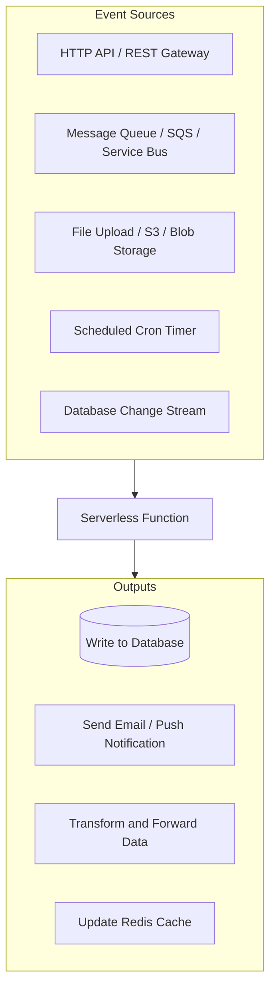
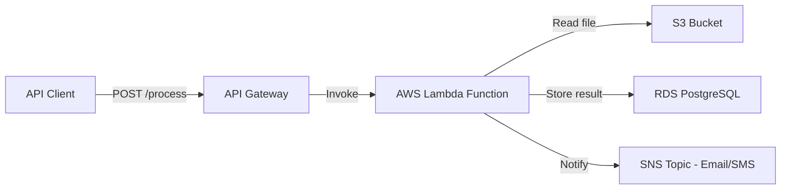
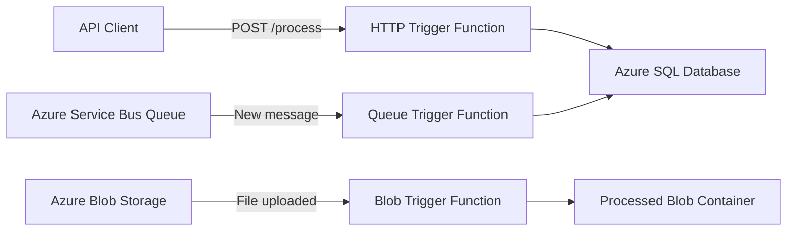
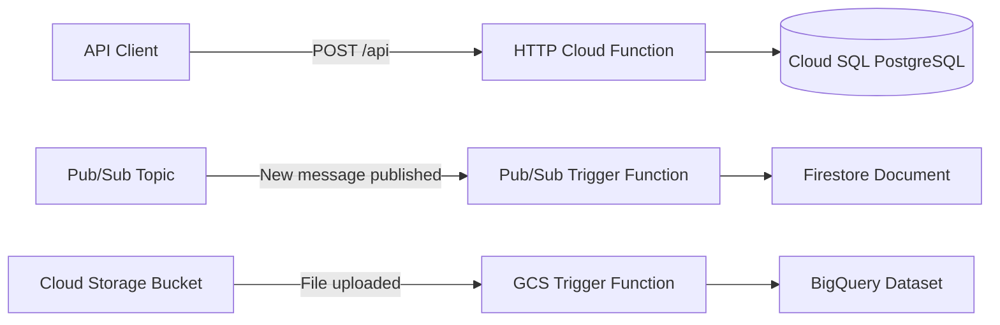

# ⚡ Serverless Functions: AWS Lambda, Azure Functions & GCP Cloud Functions
## *MasalaOps Presents: "The Invisible Hero — Functions that Run Without Servers!"*

> [!NOTE]
> **Director's Note:** In this blockbuster, our serverless functions are the **junior heroes** — they appear when called, do their job in milliseconds, and vanish without any server to manage or pay for 24/7. The audience (users) never knows they exist — but the show cannot run without them!

---

## 🤔 What Are Serverless Functions & When To Use Them?

Serverless functions are **event-triggered, stateless compute units** that:
- Run only when invoked (pay per invocation, not per hour)
- Auto-scale from 0 to millions of requests
- Require zero server management (no patching, no OS, no Kubernetes setup)

### 🎯 Real-World Use Cases (Why Not Always Use Kubernetes):

| Use Case | Why Function > Container |
|:---|:---|
| Process S3/Blob file uploads | Runs only when file arrives — no idle cost |
| Scheduled cron jobs (nightly reports) | Runs for 30 seconds at midnight, costs fractions of a cent |
| Database cleanup tasks | Fire-and-forget, no persistent server needed |
| Webhook receivers (GitHub, Stripe) | Sporadic traffic — containers would sit idle 99% of the time |
| Image resizing / PDF generation | CPU burst for 2 seconds, then done |
| Auth token validation at the edge | Ultra-low-latency, global distribution needed |

---

## 🌐 Trigger Architecture (All Clouds)



---

## 🟠 Part 1: AWS Lambda

### How It Works:


### ✅ Use Case 1: HTTP API Handler
Process incoming webhook requests from Stripe payment gateway, validate the payload, and save to RDS PostgreSQL.

```javascript
// lambda/stripe-webhook-handler/index.js
const { Pool } = require('pg');

// DB connection pool (reused across warm invocations)
const pool = new Pool({
  host: process.env.DB_HOST,
  database: process.env.DB_NAME,
  user: process.env.DB_USER,
  password: process.env.DB_PASSWORD,
  ssl: { rejectUnauthorized: false }
});

exports.handler = async (event) => {
  console.log('Stripe Webhook received:', event.body);

  try {
    const payload = JSON.parse(event.body);

    // Only process successful payment events
    if (payload.type !== 'payment_intent.succeeded') {
      return { statusCode: 200, body: 'Event ignored' };
    }

    const { amount, currency, id } = payload.data.object;

    // Persist payment record to RDS
    await pool.query(
      'INSERT INTO payments (stripe_id, amount, currency, created_at) VALUES ($1, $2, $3, NOW())',
      [id, amount, currency]
    );

    return {
      statusCode: 200,
      body: JSON.stringify({ message: 'Payment recorded successfully' })
    };

  } catch (error) {
    console.error('Handler error:', error);
    return { statusCode: 500, body: 'Internal error' };
  }
};
```

### ✅ Use Case 2: S3 File Upload Trigger
Automatically resize images when uploaded to an S3 bucket.

```javascript
// lambda/image-resizer/index.js
const AWS = require('aws-sdk');
const sharp = require('sharp');

const s3 = new AWS.S3();

exports.handler = async (event) => {
  // Extract bucket name and uploaded file key from S3 event
  const bucket = event.Records[0].s3.bucket.name;
  const key = decodeURIComponent(event.Records[0].s3.object.key);

  console.log(`Processing file: ${key} from bucket: ${bucket}`);

  // Download original image from S3
  const original = await s3.getObject({ Bucket: bucket, Key: key }).promise();

  // Resize using sharp library
  const resized = await sharp(original.Body)
    .resize(800, 600, { fit: 'inside' })
    .jpeg({ quality: 85 })
    .toBuffer();

  // Upload resized version to thumbnails/ prefix
  await s3.putObject({
    Bucket: bucket,
    Key: `thumbnails/${key}`,
    Body: resized,
    ContentType: 'image/jpeg'
  }).promise();

  console.log(`Resized thumbnail saved: thumbnails/${key}`);
  return { statusCode: 200 };
};
```

### ✅ Use Case 3: Scheduled Nightly Cleanup (CloudWatch Events)
```javascript
// lambda/db-cleanup/index.js
const { Pool } = require('pg');

const pool = new Pool({ host: process.env.DB_HOST, database: process.env.DB_NAME });

// Triggered by EventBridge cron: cron(0 2 * * ? *) → runs at 2 AM UTC daily
exports.handler = async () => {
  console.log('Running nightly database cleanup...');

  const result = await pool.query(
    "DELETE FROM sessions WHERE created_at < NOW() - INTERVAL '30 days' RETURNING id"
  );

  console.log(`Deleted ${result.rowCount} expired sessions`);
  return { deleted: result.rowCount };
};
```

### AWS Lambda Terraform Deployment:
```terraform
resource "aws_lambda_function" "stripe_webhook" {
  function_name = "stripe-webhook-handler"
  runtime       = "nodejs20.x"
  handler       = "index.handler"
  role          = aws_iam_role.lambda_exec.arn
  filename      = "lambda.zip"

  environment {
    variables = {
      DB_HOST = aws_db_instance.postgres.address
      DB_NAME = "enterprise_db"
      DB_USER = "appuser"
      # Password injected from AWS Secrets Manager at runtime
    }
  }

  vpc_config {
    subnet_ids         = [aws_subnet.private_a.id]
    security_group_ids = [aws_security_group.lambda_sg.id]
  }
}
```

---

## 🔵 Part 2: Azure Functions

### How It Works:


### ✅ Use Case 1: HTTP Trigger (REST API Handler)
```javascript
// azure-functions/http-api/index.js
const { DefaultAzureCredential } = require('@azure/identity');
const { SecretClient } = require('@azure/keyvault-secrets');

module.exports = async function (context, req) {
  context.log('HTTP trigger received:', req.body);

  const { name, email } = req.body;

  if (!name || !email) {
    context.res = {
      status: 400,
      body: { error: 'name and email are required fields' }
    };
    return;
  }

  // Use Managed Identity to fetch DB credentials — zero static secrets!
  const credential = new DefaultAzureCredential();
  const vaultClient = new SecretClient(
    `https://${process.env.KEYVAULT_NAME}.vault.azure.net`,
    credential
  );

  const dbPassword = await vaultClient.getSecret('db-password');
  context.log('DB password fetched from Key Vault via Managed Identity');

  // Process user registration...
  context.res = {
    status: 200,
    body: { message: `User ${name} registered successfully` }
  };
};
```

#### `function.json` (HTTP Trigger Config):
```json
{
  "bindings": [
    {
      "authLevel": "function",
      "type": "httpTrigger",
      "direction": "in",
      "name": "req",
      "methods": ["post"]
    },
    {
      "type": "http",
      "direction": "out",
      "name": "res"
    }
  ]
}
```

### ✅ Use Case 2: Blob Storage Trigger (Auto-Process Uploaded Files)
```javascript
// azure-functions/blob-trigger/index.js
module.exports = async function (context, myBlob) {
  context.log('Blob trigger fired!');
  context.log('Blob name:', context.bindingData.name);
  context.log('Blob size:', myBlob.length, 'bytes');

  // Transform file contents (e.g. parse CSV and validate rows)
  const content = myBlob.toString('utf8');
  const rows = content.split('\n').filter(row => row.trim());

  context.log(`Parsed ${rows.length} rows from CSV`);

  // Write processed output to output binding (another blob container)
  context.bindings.outputBlob = JSON.stringify({
    processedAt: new Date().toISOString(),
    rowCount: rows.length,
    rows: rows.slice(0, 5) // Sample first 5 rows
  });
};
```

#### `function.json` (Blob Trigger Config):
```json
{
  "bindings": [
    {
      "name": "myBlob",
      "type": "blobTrigger",
      "direction": "in",
      "path": "uploads/{name}",
      "connection": "AzureWebJobsStorage"
    },
    {
      "name": "outputBlob",
      "type": "blob",
      "direction": "out",
      "path": "processed/{name}.json",
      "connection": "AzureWebJobsStorage"
    }
  ]
}
```

### ✅ Use Case 3: Timer Trigger (Scheduled Cron Job)
```javascript
// azure-functions/timer-cleanup/index.js
const sql = require('mssql');

// Cron: "0 0 2 * * *" → runs every day at 2 AM
module.exports = async function (context, timer) {
  context.log('Timer trigger fired at:', new Date().toISOString());

  if (timer.isPastDue) {
    context.log('Timer is running late — was past due!');
  }

  const pool = await sql.connect(process.env.SQL_CONNECTION_STRING);
  const result = await pool.request().query(
    "DELETE FROM Sessions WHERE CreatedAt < DATEADD(day, -30, GETDATE())"
  );

  context.log(`Cleanup complete. Deleted rows: ${result.rowsAffected[0]}`);
};
```

---

## 🟢 Part 3: GCP Cloud Functions

### How It Works:


### ✅ Use Case 1: HTTP Cloud Function (REST Endpoint)
```javascript
// gcp-functions/http-handler/index.js
const { Firestore } = require('@google-cloud/firestore');

const db = new Firestore();

// GCP automatically provides Application Default Credentials — no keys needed!
exports.registerUser = async (req, res) => {
  if (req.method !== 'POST') {
    return res.status(405).send('Method Not Allowed');
  }

  const { name, email } = req.body;

  if (!name || !email) {
    return res.status(400).json({ error: 'name and email are required' });
  }

  try {
    // Write user document to Firestore
    const docRef = await db.collection('users').add({
      name,
      email,
      registeredAt: Firestore.Timestamp.now()
    });

    console.log(`User registered with ID: ${docRef.id}`);
    res.status(201).json({ id: docRef.id, message: 'User registered!' });

  } catch (error) {
    console.error('Firestore error:', error);
    res.status(500).json({ error: 'Internal server error' });
  }
};
```

### ✅ Use Case 2: Pub/Sub Trigger (Message Queue Consumer)
Process order events published to a Pub/Sub topic and route them to BigQuery for analytics.
```javascript
// gcp-functions/pubsub-consumer/index.js
const { BigQuery } = require('@google-cloud/bigquery');

const bigquery = new BigQuery();

exports.processOrderEvent = async (message, context) => {
  // Pub/Sub messages are base64 encoded
  const rawData = message.data
    ? Buffer.from(message.data, 'base64').toString('utf8')
    : '{}';

  const orderEvent = JSON.parse(rawData);
  console.log('Processing order event:', orderEvent);

  const { orderId, userId, amount, currency } = orderEvent;

  // Insert analytics row into BigQuery
  await bigquery
    .dataset('analytics')
    .table('order_events')
    .insert([{
      order_id: orderId,
      user_id: userId,
      amount,
      currency,
      processed_at: new Date().toISOString()
    }]);

  console.log(`Order ${orderId} inserted into BigQuery analytics table`);
};
```

### ✅ Use Case 3: GCS Trigger (Process Uploaded CSV Files)
```javascript
// gcp-functions/gcs-trigger/index.js
const { Storage } = require('@google-cloud/storage');
const { BigQuery } = require('@google-cloud/bigquery');

const storage = new Storage();
const bigquery = new BigQuery();

// Triggered automatically when a file is uploaded to a GCS bucket
exports.processUploadedCSV = async (file, context) => {
  console.log(`File uploaded: ${file.name} to bucket: ${file.bucket}`);

  // Only process CSV files
  if (!file.name.endsWith('.csv')) {
    console.log('Not a CSV — skipping');
    return;
  }

  // Download file from GCS
  const [contents] = await storage
    .bucket(file.bucket)
    .file(file.name)
    .download();

  const rows = contents.toString().split('\n').filter(r => r.trim());
  console.log(`Parsed ${rows.length} rows from ${file.name}`);

  // Load processed data into BigQuery
  await bigquery
    .dataset('uploads')
    .table('csv_imports')
    .insert(rows.map((row, i) => ({
      row_number: i + 1,
      content: row,
      source_file: file.name,
      imported_at: new Date().toISOString()
    })));

  console.log(`Successfully imported ${rows.length} rows into BigQuery`);
};
```

### GCP Cloud Function Terraform Deployment:
```terraform
resource "google_cloudfunctions_function" "register_user" {
  name        = "register-user-http"
  description = "HTTP function to register users into Firestore"
  runtime     = "nodejs20"

  available_memory_mb   = 256
  source_archive_bucket = google_storage_bucket.functions_bucket.name
  source_archive_object = google_storage_bucket_object.function_zip.name
  trigger_http          = true
  entry_point           = "registerUser"
  max_instances         = 10

  environment_variables = {
    PROJECT_ID = var.project_id
  }
}

# IAM — allow unauthenticated HTTP invocations (public API)
resource "google_cloudfunctions_function_iam_member" "public_invoker" {
  cloud_function = google_cloudfunctions_function.register_user.name
  role           = "roles/cloudfunctions.invoker"
  member         = "allUsers"
}
```

---

## 📊 Cross-Cloud Comparison Table

| Feature | AWS Lambda | Azure Functions | GCP Cloud Functions |
|:---|:---|:---|:---|
| **Max Timeout** | 15 minutes | 10 minutes (Consumption) | 60 minutes (Gen 2) |
| **Max Memory** | 10,240 MB | 1.5 GB (Consumption) | 32 GB (Gen 2) |
| **Cold Start** | ~100-500ms | ~200-800ms | ~100-400ms |
| **HTTP Trigger** | API Gateway + Lambda URL | HTTP Trigger binding | Direct HTTP invocation |
| **Queue Trigger** | SQS / SNS | Service Bus / Storage Queue | Pub/Sub |
| **Storage Trigger** | S3 Event Notifications | Blob Storage Trigger | GCS Object Finalize |
| **Timer/Cron** | EventBridge Scheduler | Timer Trigger (NCRONTAB) | Cloud Scheduler |
| **Secrets Access** | AWS Secrets Manager / SSM | Key Vault (Managed Identity) | Secret Manager (ADC) |
| **VPC Support** | VPC Config (subnet+SG) | VNet Integration (Premium plan) | VPC Connector |

---

## 🎬 MasalaOps Summary

> *"Lambda, Functions, Cloud Functions — teen alag naam, ek hi kaam: 'Jab bulao tab aao, kaam karo, aur bill sirf use ka do!'"*

> **Translation:** *Three different names, one same job: "Come when called, do the work, and only charge for what you use!"*

**Use serverless functions for event-driven, short-lived, and bursty workloads. Use containers (K8s) for long-running, stateful, and always-on services!**
