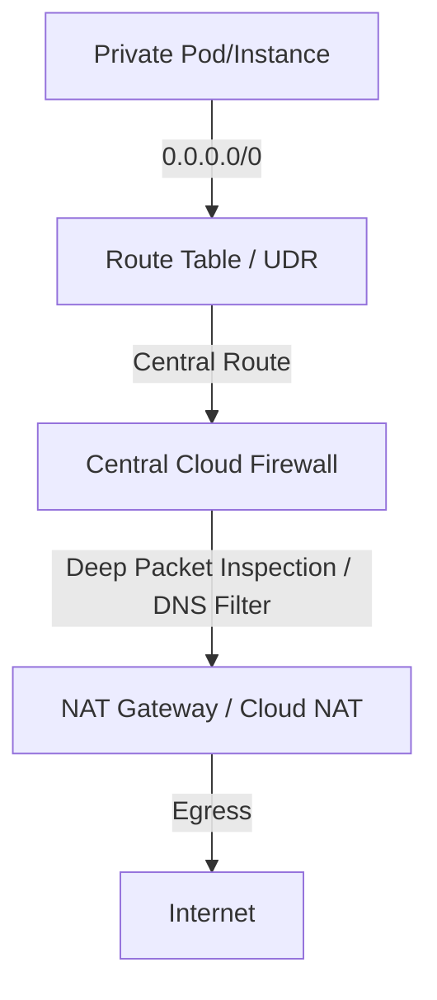

# 🛡️ Virtual Private Clouds & Cloud Firewalls Deep Dive

This document details why Virtual Private Clouds (VPC) are fundamental to security, how Layer 4 and Layer 7 Load Balancers operate, and how cloud firewalls police traffic to protect critical backend systems.

---

## ❓ 1. Why Do We Need a VPC/VNet?

Without a **Virtual Private Cloud (VPC)** or **Virtual Network (VNet)**, every resource you provision (virtual machines, databases, Kubernetes nodes) would be assigned a public IP address and exposed directly to the public internet. This makes them vulnerable to distributed denial-of-service (DDoS) attacks, brute-force access attempts, and network scanning.

### Core Benefits of VPC/VNet Isolation:
1.  **Network Isolation:** You define private RFC 1918 address spaces (e.g., `10.0.0.0/16`) where nodes can talk to each other securely without traffic exiting to the public internet.
2.  **Custom Subnets & Access Control:** You can divide the network into **Public Subnets** (where load balancers sit) and **Private Subnets** (where application servers and databases are kept).
3.  **Strict Security Posture:** By using Security Groups and Network Access Control Lists (NACLs), you can block all inbound traffic by default, only allowing connections from verified internal sources.
4.  **Secure PaaS Integration:** Instead of connecting to database APIs via their public endpoints, a VPC injects them into your local subnet via Private Endpoints (Private Link/PSC), securing them completely.

---

## ⚖️ 2. Load Balancers: Layer 4 vs. Layer 7

Load Balancers route client traffic to backend compute instances. The choice between **Network Load Balancers (Layer 4)** and **Application Load Balancers (Layer 7)** depends on your application's requirements.

### Application Load Balancer (ALB - Layer 7)
Operates at the **Application Layer** of the OSI model. It is content-aware and inspects HTTP/HTTPS headers, URLs, cookies, and payloads.
*   **Path-Based Routing:** Routes traffic to different services based on the URL path (e.g., `/api` goes to API Service, `/images` goes to Storage).
*   **Host-Based Routing:** Routes traffic based on the domain name (e.g., `api.example.com` vs. `app.example.com`).
*   **TLS Termination:** Offloads SSL decryption from backend servers, reducing their workload.
*   **Use Case:** Microservices, web applications, and routing APIs.

### Network Load Balancer (NLB - Layer 4)
Operates at the **Transport Layer** (TCP/UDP/TLS). It is *not* content-aware; it only looks at IP addresses and port numbers.
*   **High Throughput & Low Latency:** Routes packets in microseconds. Can handle millions of requests per second.
*   **Static IP Addresses:** Offers static public IP addresses per Availability Zone, which can be whitelisted by external firewalls.
*   **Protocol Flexibility:** Handles any TCP/UDP traffic (like database connections, syslog streaming, RTMP video).
*   **Use Case:** Database clustering, game servers, high-performance streaming networks.

---

## 🧱 3. Internal Cloud Firewalls & Egress Routing

To prevent data exfiltration and restrict compromised instances from contacting malicious command-and-control servers, egress traffic is routed through cloud firewalls.

### 1. Azure Firewall (Centralized Inspection)
*   VNets use User-Defined Routes (UDRs) to send all outbound traffic (`0.0.0.0/0`) to the **Azure Firewall** IP.
*   The firewall performs Deep Packet Inspection (DPI), monitors FQDNs (Fully Qualified Domain Names), and restricts VM traffic to specific allowed endpoints.

### 2. AWS Network Firewall (Intrusion Detection)
*   A managed firewall service placed at the boundary of your VPC.
*   Uses Snort/Suricata rules to detect malicious network signatures, prevent SQL injection, and drop packets to suspicious IP ranges.

### 3. GCP Cloud NAT & Cloud Armor
*   **Cloud NAT:** Allows GKE nodes in private subnets without public IPs to download patches/packages securely. It blocks all inbound connections.
*   **Cloud Armor:** A Layer 7 firewall (WAF) placed in front of external HTTPS Load Balancers to defend Cloud Run or GKE clusters from DDoS, OWASP Top 10 exploits, and geo-ip attacks.
