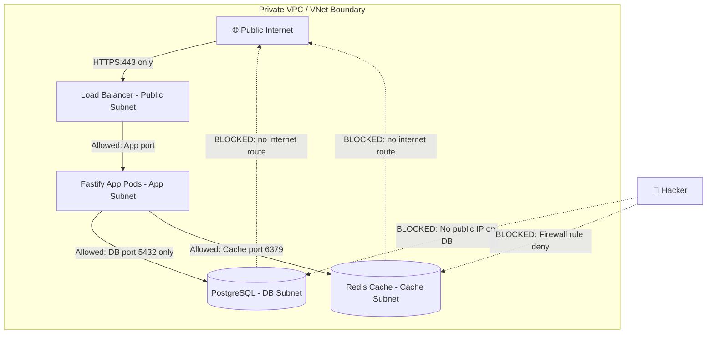
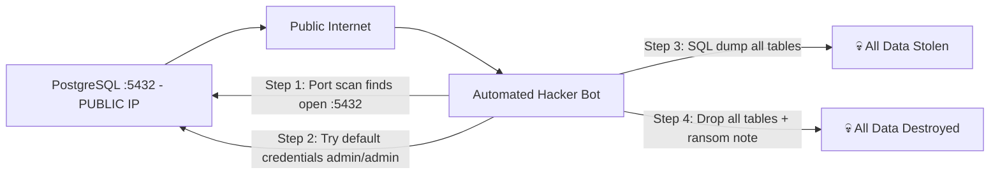
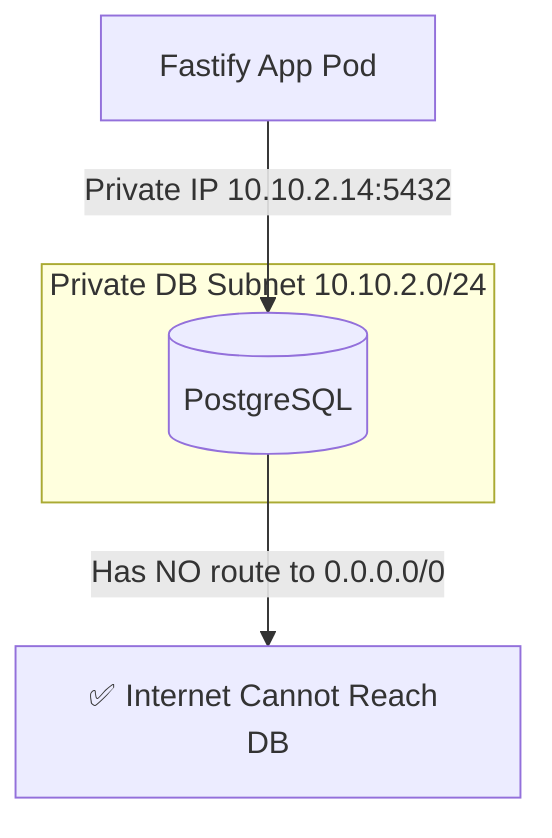
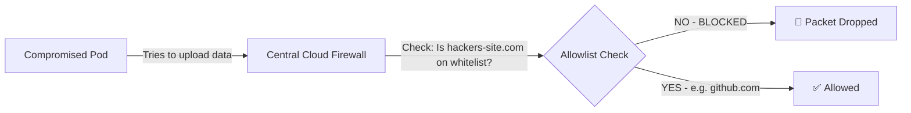

# 🎬 Virtual Private Cloud (VPC) Mapping Guide: AWS, Azure, and GCP
## *MasalaOps Presents: "The Cloud Borders Action Blockbuster!"*

> [!NOTE]
> **Director's Note:** In this global blockbuster, we compare how the three cloud giant empires (AWS, Azure, and GCP) build their virtual borders, subnets, and gates. Our heroes must cross these clouds securely using Private Endpoints and peered networks while dodging the hacker villains.

A comprehensive breakdown of how private isolated networking works across the three major cloud providers: **AWS VPC**, **Azure VNet**, and **GCP VPC**.

### 🔗 Advanced Networking References:
*   [docs/vpc-and-firewalls.md](file:///c:/personal Projects/Deployment/docs/vpc-and-firewalls.md) - Why we need VPCs, Layer 4 vs Layer 7 Load Balancers, and Cloud Firewalls egress routing.
*   [docs/azure-connection-guide.md](file:///c:/personal Projects/Deployment/docs/azure-connection-guide.md) - Secure GitLab to AKS connection via OIDC and Key Vault Managed Identity.
*   [docs/azure-ai-foundry/README.md](file:///c:/personal Projects/Deployment/docs/azure-ai-foundry/README.md) - Securing Azure AI Foundry workspaces using Private Endpoints.
*   [docs/kubernetes-and-docker/README.md](file:///c:/personal Projects/Deployment/docs/kubernetes-and-docker/README.md) - Kubernetes internal routing, ClusterIP, NodePort, LoadBalancer, and Ingress controllers.

---

## 🗺️ Core Concept Equivalency Table

| Conceptual Component | AWS | Microsoft Azure | Google Cloud Platform (GCP) |
| :--- | :--- | :--- | :--- |
| **Private IP Network** | VPC (Virtual Private Cloud) | VNet (Virtual Network) | VPC (Global VPC Network) |
| **Network Boundaries** | Regional (Requires peering) | Regional (VNet Peering) | Global (Subnets are Regional) |
| **Subnet Types** | Public (has IGW route) / Private | Subnet (Routing defined by UDRs/NAT) | Subnet (Regional subnets) |
| **Internet Egress Gateway** | Internet Gateway (IGW) | Internet Gateway (Implicit) / NAT Gateway | Cloud NAT |
| **Route Controls** | Route Tables | Route Tables & User Defined Routes (UDR) | VPC Routes |
| **Stateful Firewall** | Security Groups (Instance level) | Network Security Groups (NSG) | VPC Firewall Rules (Tags/SAs) |
| **Stateless Firewall** | Network ACLs (Subnet level) | *N/A* (NSGs are stateful) | *N/A* (Hierarchical rules stateful) |
| **Private Service Links** | Interface / Gateway Endpoints (PrivateLink) | Private Endpoints (Private Link) | Private Service Connect (PSC) |
| **VPC-to-VPC Links** | VPC Peering / Transit Gateway | VNet Peering / Virtual WAN | VPC Network Peering / Shared VPC |

---

## 🏗️ 1. Amazon Web Services (AWS) VPC

In AWS, a **Virtual Private Cloud (VPC)** is locked to a single AWS region. It is subdivided into Availability Zones (AZs) using subnets.

```text
AWS Region
└── VPC (e.g., 10.0.0.0/16)
    ├── Subnet AZ-A (10.0.1.0/24) ── Route Table ── Internet Gateway (Public Subnet)
    └── Subnet AZ-B (10.0.2.0/24) ── Route Table ── NAT Gateway (Private Subnet)
```

### Key Operations:
*   **Public vs. Private Subnets:** A subnet is "public" if its route table has a route `0.0.0.0/0` pointing to an **Internet Gateway (IGW)**. Otherwise, it is "private" and routes egress through a **NAT Gateway** located in a public subnet.
*   **Security Groups vs. NACLs:**
    *   *Security Groups (Stateful):* Applied to network interfaces (ENIs). If you allow inbound traffic on port 80, outbound response is automatically allowed.
    *   *Network ACLs (Stateless):* Applied at the subnet boundary. You must explicitly write both ingress and egress rules.
*   **VPC Endpoints (PrivateLink):** Allow ECS/EKS pods to securely talk to AWS systems (like S3 or SSM) over private channels, bypassing the public internet.

---

## 🔒 2. Microsoft Azure VNet

Azure uses **Virtual Networks (VNets)** instead of VPCs. Similar to AWS, VNets are regional.

```text
Azure Region
└── VNet (e.g., 10.0.0.0/16)
    ├── snet-web (10.0.1.0/24) ── Route Table (UDR) ── Azure Firewall / NAT Gateway
    └── snet-db  (10.0.2.0/24) ── Private Endpoint ── Private Link Database
```

### Key Operations:
*   **Subnet Routing:** Subnets have no public/private flag. Outgoing internet traffic is handled automatically by Azure unless overridden by:
    *   A **NAT Gateway** bound to the subnet for dedicated outbound IP addresses.
    *   **User Defined Routes (UDRs)** in a Route Table that send all traffic (`0.0.0.0/0`) through a centralized **Azure Firewall** in a Hub VNet.
*   **Network Security Groups (NSGs):** Stateful firewalls applied directly to subnets or individual Network Interfaces (NICs).
*   **Private Endpoints:** Azure's mechanism to inject private IP addresses of PaaS services (like Key Vault, Azure Redis, Azure SQL) directly into your private VNet subnets.

---

## 🌍 3. Google Cloud Platform (GCP) VPC

GCP's networking architecture is radically different: **VPCs are Global, not Regional.**

```text
GCP Global VPC
├── Subnet Region-A (US-East) ── Cloud NAT (Egress Gateway)
└── Subnet Region-B (Europe-West) ── Private Service Connect (PSC Database Link)
```

### Key Operations:
*   **Global Scope:** You create a single VPC network, and then declare regional subnets within it (e.g., one subnet in `us-central1` and another in `europe-west1`). These subnets can communicate with each other privately out-of-the-box without peering!
*   **Shared VPC:** Allows an organization to dedicate a single VPC network in a host project, and let other "service projects" deploy VMs and GKE clusters directly into its subnets, keeping network controls centralized.
*   **Private Service Connect (PSC):** GCP's system for mapping external managed databases (like Cloud SQL) or third-party APIs directly onto internal VPC IP addresses.
*   **Firewall Targets:** GCP applies firewall rules using network **Tags** or **Service Accounts** assigned to VMs, instead of classic security group wrappers.

---

## 🤔 4. Why Do We Actually Need a VPC / VNet?

Without a VPC/VNet, every resource you deploy in the cloud — virtual machines, containers, databases — would get a **raw public IP address** exposed directly to the internet. This is catastrophic for security.

### 5 Critical Reasons We Use Private Networks:

#### 1. 🎯 Zero Public Exposure — Invisible to Hackers
Hackers run automated port scanners 24/7 across the entire public IP range. The moment they detect open database ports, bots immediately begin brute-force attacks. A private VPC/VNet removes your resources from the internet's "map" entirely.

**Ports Targeted by Automated Bots:**
| Port | Service | Risk if Public |
|:---|:---|:---|
| `:5432` | PostgreSQL | SQL brute force + data exfiltration |
| `:3306` | MySQL / MariaDB | Credential stuffing attacks |
| `:1433` | SQL Server | RCE exploits via CVEs |
| `:27017` | MongoDB | Ransomware (MongoDB is #1 ransomware target) |
| `:6379` | Redis | Zero-auth data dump by default |
| `:22` | SSH | Cryptominer installation |

---

#### 2. 🧱 Network Segmentation — Blast Radius Containment
Even if a frontend container is compromised, a properly segmented VPC limits the attacker's movement. Each subnet is an isolated blast zone.



*   **Public Subnet:** Only load balancers live here. They accept `:443` from the internet and forward only to the private app subnet.
*   **App Subnet:** Fastify pods live here. They can only reach the DB subnet on port `5432`. No other traffic is allowed out.
*   **DB Subnet:** Databases live here with **zero route to the internet**. They only accept connections from the App subnet CIDR.

---

#### 3. 🗄️ Why Databases Must NEVER Have a Public IP

> [!CAUTION]
> **A database with a public IP is not a misconfiguration — it is a ticking time bomb.** In 2017, over 28,000 publicly exposed MongoDB databases were wiped by ransomware bots within 24 hours of a researcher publishing the list.

**What happens when a DB has a public IP:**



**The VPC/VNet fix — Private Subnet with No Internet Route:**



The database has **no public IP** and its subnet route table has **no internet gateway route**. Even if someone knew the private IP (`10.10.2.14`), it is unreachable from anywhere outside the VPC boundary.

---

#### 4. 🚨 Egress Control — Preventing Data Exfiltration
If an app container is compromised, the attacker may try to upload (exfiltrate) your entire customer database to their external server. Without egress control, nothing stops them.

With VPC/VNet firewalls, **all outbound traffic routes through a Central Cloud Firewall** with DNS-based allowlists. Only specific approved destinations (like GitHub for package updates) are permitted. Everything else is silently dropped.



---

#### 5. 🔗 Private Link — Managed Services Without Internet Exposure
Cloud-managed databases (AWS RDS, Azure SQL, GCP Cloud SQL) and Key Vaults are technically accessible via public endpoints by default. We disable this and use **Private Endpoints / Private Service Connect**, which inject a private IP from our subnet directly into the managed service.

Your app connects to `10.10.2.20` (private IP) instead of `mydb.database.azure.com` (public DNS). The connection never leaves the cloud provider's internal backbone network.

---

## 🎬 MasalaOps Summary

> *"Public database matlab — tum apna safe khol ke rakh do aur key bhi andar hi chhod do! VPC/VNet matlab — safe toh hai, lock bhi hai, aur building ka address bhi kisi ko pata nahi!"*

> **Translation:** *A public database is like leaving your safe open with the key inside! VPC/VNet means the safe is locked, guarded, and nobody even knows the building's address.*

**The VPC/VNet is not optional — it is the entire building that keeps your databases, secrets, and workloads alive and unhacked! 💪**
