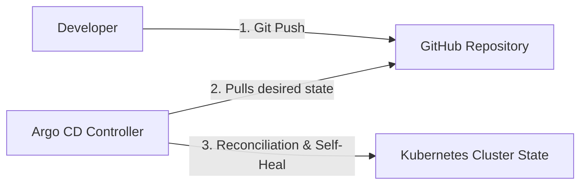

# ☸️ GitOps Deployment with Argo CD
## *MasalaOps Presents: "The Pull-Based Romance!"*

> [!NOTE]
> **Director's Note:** In this GitOps saga, **Argo CD** acts as our dedicated assistant director. Instead of us pushing commands, Argo CD sits in the cluster, watches our Git repository (The Script), and automatically updates the Kubernetes state (The Action) to match it perfectly!

---

## 🏗️ 1. What is Argo CD & GitOps?

**GitOps** is a set of practices where the desired state of your infrastructure and applications is stored in Git. **Argo CD** is a declarative, GitOps continuous delivery tool for Kubernetes.

### Push-Based (Classic CI/CD) vs. Pull-Based (Argo CD GitOps):
*   **Push-Based (GitLab Runner):** The CI pipeline runs a script that executes `kubectl apply -f manifests/`. 
    *   *Risk:* Requires storing cluster credentials (`kubeconfig`) inside GitLab variables. If the cluster drifts (someone manually edits a service), GitLab does not know.
*   **Pull-Based (Argo CD):** Argo CD runs inside the Kubernetes cluster. It polls Git every 3 minutes. When it detects a change, it pulls the manifests and reconciles the cluster state.
    *   *Benefit:* Zero cluster credentials stored outside the cluster boundary. Automatic **drift detection** overrides manual changes, keeping Git as the single source of truth.



---

## 🚀 2. Getting Started & Installation

To deploy our Fastify backend workload using Argo CD, follow these steps:

### Step 1: Install Argo CD on your cluster
Run these commands targeting your AKS/EKS/GKE cluster:
```bash
# 1. Create a dedicated namespace
kubectl create namespace argocd

# 2. Apply the official Argo CD installation manifests
kubectl apply -n argocd -f https://raw.githubusercontent.com/argoproj/argo-cd/stable/manifests/install.yaml
```

### Step 2: Access the Argo CD API Server
By default, the server is not exposed publicly. You can port-forward to access the UI:
```bash
kubectl port-forward svc/argocd-server -n argocd 8080:443
```
Open `https://localhost:8080` in your browser.
*   *Username:* `admin`
*   *Password:* Get the auto-generated secret:
    ```bash
    kubectl -n argocd get secret argocd-initial-admin-secret -o jsonpath="{.data.password}" | base64 --decode
    ```

### Step 3: Apply Project & Application Configs
Register our custom security boundaries and sync configuration:
```bash
# 1. Apply the project boundary (AppProject)
kubectl apply -f manifests/argocd/appproject.yaml

# 2. Apply the Application sync configuration
kubectl apply -f manifests/argocd/application.yaml
```

Once applied, Argo CD will automatically pull templates from `/manifests/kubernetes-templates` and deploy them into the `production` namespace.
