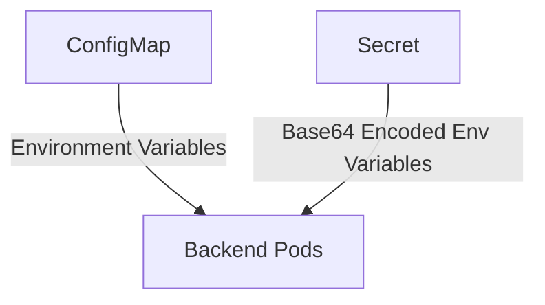
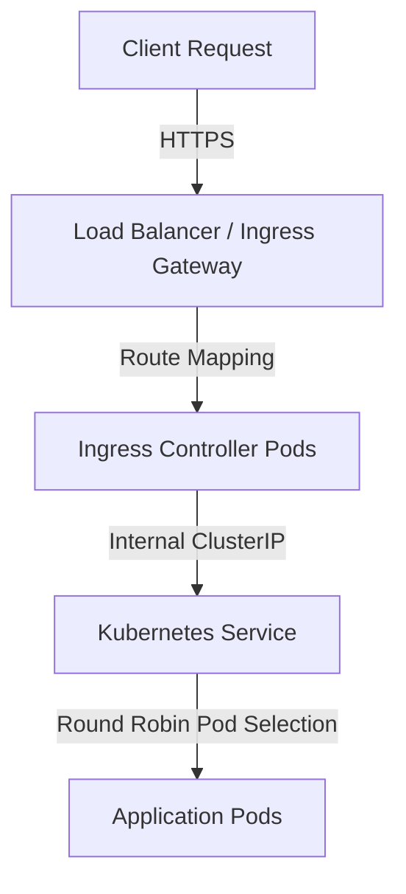

# ☸️ Kubernetes Standarized Manifest Templates

This folder provides a complete blueprint for deploying enterprise container workloads securely inside isolated Kubernetes environments.

---

## 🔒 Configuration & State Management

Workload configurations are split into non-sensitive settings (ConfigMaps) and sensitive credentials (Secrets).



### 1. ConfigMaps (`configmap.yaml`)
Stores database hosts, cache configurations, ports, and feature flags. Managed transparently and updated without code changes.

### 2. Secrets (`secret.yaml` with Base64 Encoding)
Sensitive parameters must be Base64 encoded before inclusion in the manifest.
*   **To Encode Credentials (CLI):**
    ```bash
    echo -n 'my_password' | base64
    # Output: bXlfcGFzc3dvcmQ=
    ```
*   **To Decode Credentials (CLI):**
    ```bash
    echo -n 'bXlfcGFzc3dvcmQ=' | base64 --decode
    # Output: my_password
    ```

---

## 🌐 Private VPC Ingress & Load Balancer Routing

To maintain a zero-trust architecture, computing nodes and databases are placed inside private subnets without public IP addresses. Ingress traffic is routed securely via a layered Load Balancer network:



### Step-by-Step Egress/Ingress Flow:
1.  **Ingress Entrypoint (Application Gateway / ALB):** 
    *   Exposes a single public IP at the network perimeter.
    *   Integrates Web Application Firewalls (Azure WAF / AWS Cloud Armor) to inspect incoming request headers.
2.  **Private Network Peering (VPC Subnets):**
    *   The Load Balancer targets the private cluster subnet (`snet-aks` or GKE subnets).
    *   Traffic is forwarded to the Kubernetes Nodes on an internal port (`NodePort`) allocated to the **Ingress Controller** (e.g. NGINX Ingress).
3.  **Path-Based Ingress Routing (`ingress.yaml`):**
    *   The Ingress Controller inspects the incoming Host name (`app.enterprise.private.internal`) and path (e.g., `/`).
    *   It routes requests directly to the target **Service IP** (`ClusterIP`).
4.  **ClusterIP Load Balancing (`service.yaml`):**
    *   The Service acts as an internal load balancer. It matches Pod selectors (`app: enterprise-backend`) and forwards HTTP requests across active healthy backend replicas.
